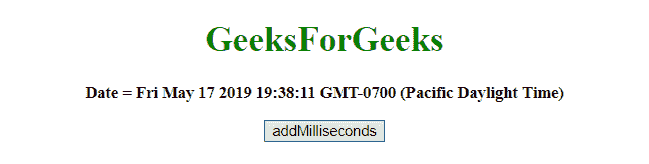
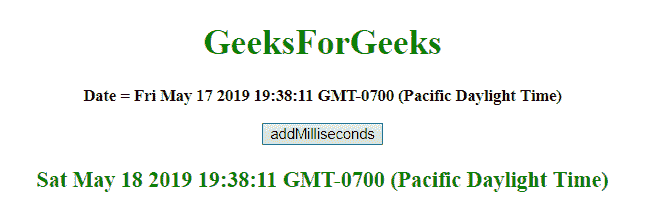
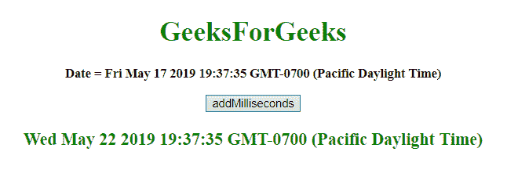

# JavaScript |向日期对象添加天数(毫秒)

> 原文:[https://www . geesforgeks . org/JavaScript-添加以毫秒为单位的日期对象/](https://www.geeksforgeeks.org/javascript-adding-days-in-milliseconds-to-date-object/)

给定一个日期，任务是以毫秒为单位添加天数。要在 JavaScript 中添加以毫秒为单位的日期对象，可以使用下面列出的一些方法:

*   **JavaScript getMilliseconds() Method:** This method returns the milliseconds (from 0 to 999) of the provided date and time.

    **语法:**

    ```
    Date.getMilliseconds()

    ```

    **返回值:**返回一个数字，从 0 到 009，代表毫秒。

*   **JavaScript setmillises()方法:**此方法设置日期对象的毫秒数。
    **语法:**

    ```
    Date.setMilliseconds(millisec)

    ```

    **参数:**接受单参数**毫秒**，这是必需的。它指定表示毫秒的整数值。期望值是 0-999，但也允许其他值。

    **注意:**参数接受除其范围之外的值，这些值的工作原理如下:

    *   millisec = -1，表示前一秒的最后一毫秒，其他参数也一样。
    *   如果毫秒作为 1000 传递，则意味着下一秒的第一毫秒，其他参数也是如此。

    **返回值:**返回一个数字，表示日期对象和 1970 年 1 月 1 日午夜之间的毫秒数。

*   **JavaScript getTime() method:** This method returns the number of milliseconds between midnight of January 1, 1970, and the specified date.

    **语法:**

    ```
    Date.getTime()
    ```

    **返回值:**返回一个数字，代表 1970 年 1 月 1 日午夜以来的毫秒数。

*   **JavaScript setTime()方法:**此方法通过将定义的毫秒数加/减到 1970 年 1 月 1 日午夜/从午夜开始设置日期和时间。

    **语法:**

    ```
    Date.setTime(millisec)
    ```

    **参数:**接受单参数**毫秒**，这是必需的。它指定在 1970 年 1 月 1 日午夜要加/减的毫秒数

    **返回值:**返回日期对象到 1970 年 1 月 1 日午夜之间的毫秒数。

    **示例 1:** 本示例通过使用 **setTime()** 和 **getTime()方法**将**今天的 var**以毫秒为单位增加了 1 天。

    ```
    <!DOCTYPE HTML> 
    <html> 
        <head> 
            <title> 
                JavaScript | Adding days in milliseconds to Date object
            </title>
        </head> 

        <body style = "text-align:center;"> 

            <h1 style = "color:green;" > 
                GeeksForGeeks 
            </h1>

            <p id = "GFG_UP" style = "font-size: 15px; font-weight: bold;">
            </p>

            <button onclick = "gfg_Run()"> 
                addMilliseconds
            </button>

            <p id = "GFG_DOWN" style = 
                "color:green; font-size: 20px; font-weight: bold;">
            </p>

            <script>
                var el_up = document.getElementById("GFG_UP");
                var el_down = document.getElementById("GFG_DOWN");
                var today = new Date();
                el_up.innerHTML = "Date = " + today;

                Date.prototype.addMillisecs = function(d) { 
                    this.setTime(this.getTime() + (d)); 
                    return this; 
                }

                function gfg_Run() {
                    var a = new Date();
                    var d = 1;
                    a.addMillisecs(d*24*60*60*1000);
                    el_down.innerHTML = a;
                }         
            </script> 
        </body> 
    </html>                    
    ```

    **输出:**

    *   **点击按钮前:**
        
    *   **点击按钮后:**
        

    **示例 2:** 本示例通过使用**setmillises()**和**getmillises()方法**将 5 天(以毫秒为单位)添加到今天的**var**中。

    ```
    <!DOCTYPE HTML> 
    <html> 
        <head> 
            <title> 
                JavaScript | Adding days in milliseconds to Date object
            </title>
        </head> 

        <body style = "text-align:center;"> 

            <h1 style = "color:green;" > 
                GeeksForGeeks 
            </h1>

            <p id = "GFG_UP" style = "font-size: 15px; font-weight: bold;">
            </p>

            <button onclick = "gfg_Run()"> 
                addMilliseconds
            </button>

            <p id = "GFG_DOWN" style =
                "color:green; font-size: 20px; font-weight: bold;">
            </p>

            <script>
                var el_up = document.getElementById("GFG_UP");
                var el_down = document.getElementById("GFG_DOWN");
                var today = new Date();
                el_up.innerHTML = "Date = " + today;

                Date.prototype.addMillisecs= function(s) {
                    this.setMilliseconds(this.getMilliseconds()+s);
                    return this;
                }

                function gfg_Run() {
                    var a = new Date();
                    var d = 5;
                    a.addMillisecs(d*24*60*60*1000);
                    el_down.innerHTML = a;
                }         
            </script> 
        </body> 
    </html>                    
    ```

    **输出:**

    *   **点击按钮前:**
        
    *   **点击按钮后:**
        