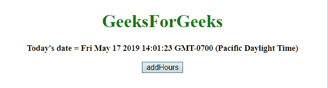
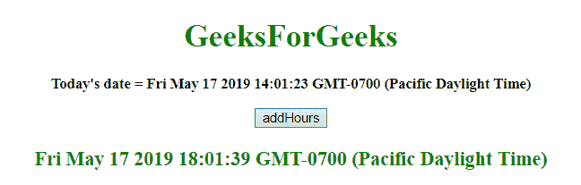
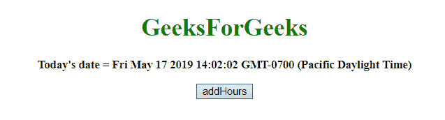
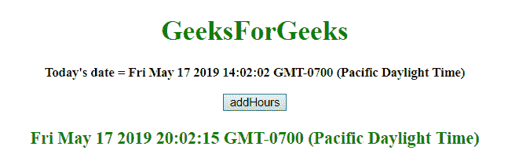

# JavaScript |向日期对象添加小时数

> 原文:[https://www . geeksforgeeks . org/JavaScript-添加最新小时对象/](https://www.geeksforgeeks.org/javascript-adding-hours-to-the-date-object/)

给定一个日期，任务是增加时间。为了增加 javascript 中的小时数，我们将讨论一些技术。首先要知道的几个方法。

*   **JavaScript getHours() Method**
    This method returns the hour (from 0 to 23) of the provided date and time.
    **Syntax:**

    ```
    Date.getHours()

    ```

    **返回值:**
    返回一个数字，从 0 到 23，代表小时。

*   **JavaScript setHours()方法**
    该方法设置日期对象的小时。
    我们还可以设置分、秒、毫秒。
    **语法:**

    ```
    Date.setHours(hour, min, sec, millisec)

    ```

    **参数:**

    *   **小时:**此参数为必填项。它指定表示小时的整数。预期值为 0-23，但也允许其他值。
    *   **分钟:**此参数为可选。它指定表示分钟的整数。预期值为 0-59，但也允许其他值。
    *   **秒:**此参数可选。它指定表示秒的整数。预期值为 0-59，但也允许其他值。
    *   **毫秒:**此参数为可选。它指定表示毫秒的整数。预期值为 0-999，但也允许其他值。

    **注意:**
    之前的 4 个参数除了范围之外都接受数值，这些数值的调整方式类似。

    *   hour = -1，表示前一天的最后一个小时，其他参数相同。
    *   如果 min passed 为 60，则表示下一小时的第一分钟，其他参数也相同。

    **返回值:**
    返回一个数字，表示日期对象到 1970 年 1 月 1 日午夜之间的毫秒数。

*   **JavaScript getTime() method**
    This method returns the number of milliseconds between midnight of January 1, 1970, and the specified date.
    **Syntax:**

    ```
    Date.getTime()

    ```

    **返回值:**
    返回一个数字，代表 1970 年 1 月 1 日午夜以来的毫秒数。

*   **JavaScript setTime()方法**
    该方法通过将定义的毫秒数加/减到/从 1970 年 1 月 1 日午夜开始来设置日期和时间。
    **语法:**

    ```
    Date.setTime(millisec)

    ```

    **参数:**

    *   **毫秒:**这个参数是必需的。它指定要加/减的毫秒数，1970 年 1 月 1 日午夜

    **返回值:**
    它返回，表示日期对象和 1970 年 1 月 1 日午夜之间的毫秒数。

    **例 1:** 本例通过使用 **setTime()和 getTime()方法**，将**16 日**增加 4 小时。

    ```
    <!DOCTYPE HTML>
    <html>

    <head>
        <title>
            JavaScript 
          | Adding hours to Date object.
        </title>
    </head>

    <body style="text-align:center;" 
          id="body">
        <h1 style="color:green;">  
                GeeksForGeeks  
            </h1>
        <p id="GFG_UP" 
           style="font-size: 15px;
                  font-weight: bold;">
        </p>
        <button onclick="gfg_Run()">
            addHours
        </button>
        <p id="GFG_DOWN" 
           style="color:green; 
                  font-size: 20px; 
                  font-weight: bold;">
        </p>
        <script>
            var el_up = 
                document.getElementById("GFG_UP");

            var el_down = 
                document.getElementById("GFG_DOWN");
            var today = new Date();
            el_up.innerHTML = "Today's date = " + today;
            Date.prototype.addHours = function(h) {
                this.setTime(this.getTime() +
                             (h * 60 * 60 * 1000));
                return this;
            }

            function gfg_Run() {
                var a = new Date();
                a.addHours(4);
                el_down.innerHTML = a;
            }
        </script>
    </body>

    </html>
    ```

    **输出:**

    *   **点击按钮前:**
        
    *   **点击按钮后:**
        

    **例 2:** 本例通过使用 **setHours()和 getHours()方法**，将**16 日**增加 6 小时。

    ```
    <!DOCTYPE HTML>
    <html>

    <head>
        <title>
            JavaScript 
          | Adding hours to Date object.
        </title>
    </head>

    <body style="text-align:center;" 
          id="body">
        <h1 style="color:green;">  
                GeeksForGeeks  
            </h1>
        <p id="GFG_UP" 
           style="font-size: 15px; 
                  font-weight: bold;">
        </p>
        <button onclick="gfg_Run()">
            addHours
        </button>
        <p id="GFG_DOWN" 
           style="color:green; 
                  font-size: 20px;
                  font-weight: bold;">
        </p>
        <script>
            var el_up = 
                document.getElementById("GFG_UP");
            var el_down = 
                document.getElementById("GFG_DOWN");
            var today = new Date();
            el_up.innerHTML = "Today's date = " + today;
            Date.prototype.addHours = function(h) {
                this.setHours(this.getHours() + h);
                return this;
            }

            function gfg_Run() {
                var a = new Date();
                a.addHours(6);
                el_down.innerHTML = a;
            }
        </script>
    </body>

    </html>
    ```

    **输出:**

    *   **点击按钮前:**
        
    *   **点击按钮后:**
        