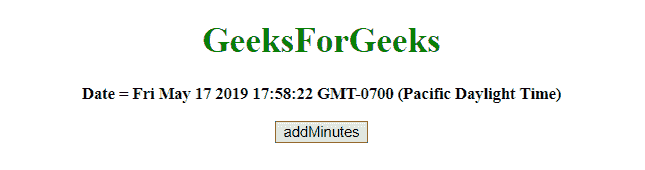
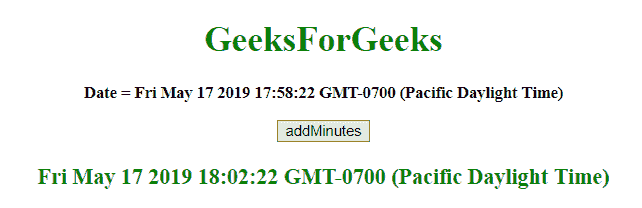
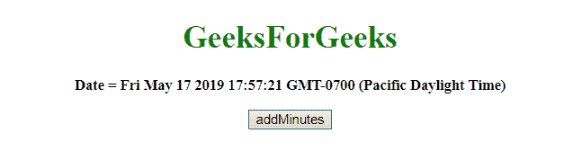
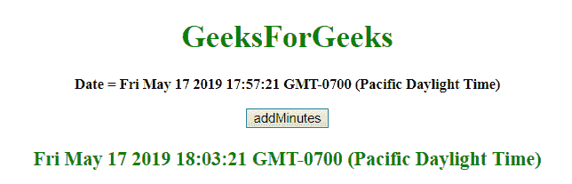

# JavaScript |向日期对象添加分钟数

> 原文:[https://www . geesforgeks . org/JavaScript-添加-分钟-最新-对象/](https://www.geeksforgeeks.org/javascript-adding-minutes-to-date-object/)

给定一个日期，任务是给它增加分钟。为了给 javascript 中的日期对象添加分钟，使用了下面列出的一些方法:

*   **JavaScript getMinutes() Method:** This method returns the Minutes (from 0 to 59) of the provided date and time.

    **语法:**

    ```
    Date.getMinutes()

    ```

    **返回值:**返回一个数字，从 0 到 59，代表分钟。

*   **JavaScript setMinutes()方法:**此方法设置日期对象的分钟数。这个方法也可以用来设置秒和毫秒。

    **语法:**

    ```
    Date.setMinutes(min, sec, millisec)

    ```

    **参数:**

    *   **min:** 为必输参数。它指定表示分钟的整数。预期值为 0-59，但也允许其他值。
    *   **秒:**可选参数。它指定表示秒的整数。预期值为 0-59，但也允许其他值。
    *   **毫秒:**为可选参数。它指定表示毫秒的整数。预期值为 0-999，但也允许其他值。

    **注意:**前面三个参数除了它们的范围外都接受值，这些值的调整方式如下:

    *   min = -1，表示前一小时的最后一分钟，其他参数相同。
    *   如果最小值传递到 60，则表示下一小时的第一分钟，其他参数也是如此。

    **返回值:**返回一个数字，表示日期对象和 1970 年 1 月 1 日午夜之间的毫秒数。

*   **JavaScript getTime() method:** This method returns the number of milliseconds between midnight of January 1, 1970, and the specified date.

    **语法:**

    ```
    Date.getTime()

    ```

    **返回值:**返回一个数字，代表 1970 年 1 月 1 日午夜以来的毫秒数。

*   **JavaScript setTime() method:** This method set the date and time by adding/subtracting a defined number of milliseconds to/from midnight January 1, 1970.

    **语法:**

    ```
    Date.setTime(millisec)

    ```

    **参数:**包含需要的单参数**毫秒**。它指定要加/减的毫秒数，1970 年 1 月 1 日午夜。

    **返回值:**返回，表示日期对象和 1970 年 1 月 1 日午夜之间的毫秒数。

    **示例 1:** 本示例通过使用 **setTime()和 getTime()方法**，将**今天的 var**增加了 4 分钟。

    ```
    <!DOCTYPE HTML>  
    <html>  
        <head> 
            <title> 
                JavaScript | Adding Minutes to  Date object.
            </title>
        </head> 

        <body style = "text-align:center;" id = "body">  

            <h1 style = "color:green;" >  
                GeeksForGeeks  
            </h1>

            <p id = "GFG_UP" style = "font-size:15px; font-weight:bold;">
            </p>

            <button onclick = "gfg_Run()"> 
                addMinutes
            </button>

            <p id = "GFG_DOWN" style = 
                "color:green; font-size: 20px; font-weight: bold;">
            </p>

            <script>
                var el_up = document.getElementById("GFG_UP");
                var el_down = document.getElementById("GFG_DOWN");
                var today = new Date();
                el_up.innerHTML = "Date = " + today;

                Date.prototype.addMins = function(m) {    
                   this.setTime(this.getTime() + (m*60*1000)); 
                   return this;   
                }

                function gfg_Run() {
                    var a = new Date();
                    a.addMins(4);
                    el_down.innerHTML = a;
                }         
            </script> 
        </body>  
    </html>
    ```

    **输出:**

    *   **点击按钮前:**
        
    *   **点击按钮后:**
        

    **示例 2:** 本示例通过使用 **setMinutes()和 getMinutes()方法**，为**今天的 var**增加 6 分钟。

    ```
    <!DOCTYPE HTML> 
    <html> 
        <head> 
            <title> 
                JavaScript | Adding Minutes to Date object.
            </title>
        </head> 

        <body style = "text-align:center;" id = "body"> 

            <h1 style = "color:green;" > 
                GeeksForGeeks 
            </h1>

            <p id = "GFG_UP" style = "font-size: 15px; font-weight: bold;">
            </p>

            <button onclick = "gfg_Run()"> 
                addMinutes
            </button>

            <p id = "GFG_DOWN" style =
                "color:green; font-size: 20px; font-weight: bold;">
            </p>

            <script>
                var el_up = document.getElementById("GFG_UP");
                var el_down = document.getElementById("GFG_DOWN");
                var today = new Date();
                el_up.innerHTML = "Date = " + today;

                Date.prototype.addMinutes= function(m) {
                    this.setMinutes(this.getMinutes() + m);
                    return this;
                }

                function gfg_Run() {
                    var a = new Date();
                    a.addMinutes(6);
                    el_down.innerHTML = a;
                }
            </script> 
        </body> 
    </html>                    
    ```

    **输出:**

    *   **点击按钮前:**
        
    *   **点击按钮后:**
        