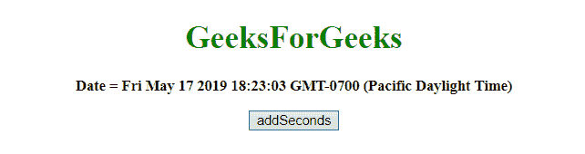
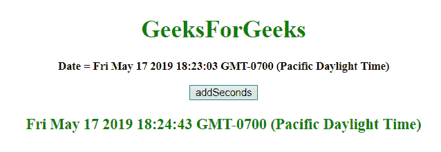
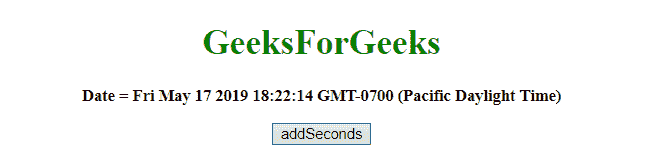
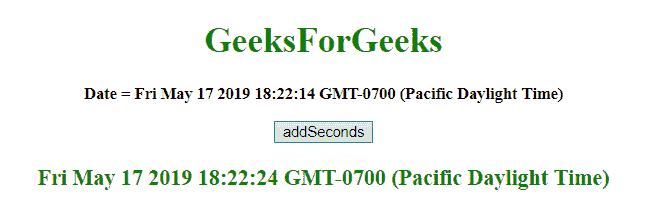

# JavaScript |向日期对象添加秒

> 原文:[https://www . geesforgeks . org/JavaScript-添加-秒更新-对象/](https://www.geeksforgeeks.org/javascript-adding-seconds-to-date-object/)

给定一个日期，任务是给它增加秒。为了在 javascript 中添加秒到日期，我们将讨论一些技术。首先要知道的几个方法。

*   **JavaScript getSeconds() Method**
    This method returns the Seconds(from 0 to 59) of the provided date and time.
    **Syntax:**

    ```
    Date.getSeconds()

    ```

    **返回值:**
    返回一个数字，从 0 到 59，代表秒。

*   **JavaScript setSeconds()方法**
    这个方法设置一个日期对象的秒数。
    这个方法也可以用来设置毫秒。
    **语法:**

    ```
    Date.setSeconds(sec, millisec)

    ```

    **参数:**

    *   **秒:**此参数可选。它指定表示秒的整数。预期值为 0-59，但也允许其他值。
    *   **毫秒:**此参数为可选。它指定表示毫秒的整数。预期值为 0-999，但也允许其他值。

    **注意:**
    之前的 2 个参数都接受除了它们的范围之外的值，这些值像这样调整。

    *   sec = -1，表示前一分钟的最后一秒，其他参数也是如此。
    *   如果 sec passed 为 60，则表示下一分钟的第一秒，其他参数也是如此。

    **返回值:**
    返回一个数字，表示日期对象到 1970 年 1 月 1 日午夜之间的毫秒数。

*   **JavaScript getTime() method**
    This method returns the number of milliseconds between midnight of January 1, 1970, and the specified date.
    **Syntax:**

    ```
    Date.getTime()

    ```

    **返回值:**
    返回一个数字，代表 1970 年 1 月 1 日午夜以来的毫秒数。

*   **JavaScript setTime()方法**
    该方法通过在 1970 年 1 月 1 日午夜前后加上/减去一个定义的毫秒数来设置日期和时间。
    **语法:**

    ```
    Date.setTime(millisec)

    ```

    **参数:**

    *   **毫秒:**这个参数是必需的。它指定要加/减的毫秒数，1970 年 1 月 1 日午夜

    **返回值:**
    返回，表示日期对象和 1970 年 1 月 1 日午夜之间的毫秒数。

    **示例 1:** 本示例通过使用 **setTime()和 getTime()方法**，将**今天的 var**增加 100 秒。

    ```
    <!DOCTYPE HTML>
    <html>

    <head>
        <title>
            JavaScript 
          | Adding Seconds to Date object.
        </title>
    </head>

    <body style="text-align:center;" 
          id="body">
        <h1 style="color:green;">  
                GeeksForGeeks  
            </h1>
        <p id="GFG_UP" 
           style="font-size: 15px;
                  font-weight: bold;">
        </p>
        <button onclick="gfg_Run()">
            addSeconds
        </button>
        <p id="GFG_DOWN" 
           style="color:green; 
                  font-size: 20px; 
                  font-weight: bold;">
        </p>
        <script>
            var el_up = 
                document.getElementById("GFG_UP");
            var el_down = 
                document.getElementById("GFG_DOWN");
            var today = new Date();
            el_up.innerHTML = "Date = " + today;
            Date.prototype.addSecs = function(s) {
                this.setTime(this.getTime() + (s * 1000));
                return this;
            }

            function gfg_Run() {
                var a = new Date();
                a.addSecs(100);
                el_down.innerHTML = a;
            }
        </script>
    </body>

    </html>
    ```

    **输出:**

    *   **点击按钮前:**
        
    *   **点击按钮后:**
        

    **示例 2:** 本示例通过使用 **setSeconds()和 getSeconds()方法**，将**今天的 var**增加 10 秒。

    ```
    <!DOCTYPE HTML>
    <html>

    <head>
        <title>
            JavaScript 
          | Adding Seconds to Date object.
        </title>
    </head>

    <body style="text-align:center;" 
          id="body">
        <h1 style="color:green;">  
                GeeksForGeeks  
            </h1>
        <p id="GFG_UP"
           style="font-size: 15px;
                  font-weight: bold;">
        </p>
        <button onclick="gfg_Run()">
            addSeconds
        </button>
        <p id="GFG_DOWN" 
           style="color:green; 
                  font-size: 20px; 
                  font-weight: bold;">
        </p>
        <script>
            var el_up = 
                document.getElementById("GFG_UP");
            var el_down =
                document.getElementById("GFG_DOWN");
            var today = new Date();
            el_up.innerHTML = "Date = " + today;
            Date.prototype.addSecs = function(s) {
                this.setSeconds(this.getSeconds() + s);
                return this;
            }

            function gfg_Run() {
                var a = new Date();
                a.addSecs(10);
                el_down.innerHTML = a;
            }
        </script>
    </body>

    </html>
    ```

    **输出:**

    *   **点击按钮前:**
        
    *   **点击按钮后:**
        