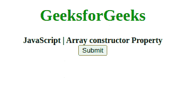

# JavaScript 数组构造器属性

> 原文:[https://www . geesforgeks . org/JavaScript-array-constructor-property/](https://www.geeksforgeeks.org/javascript-array-constructor-property/)

下面是**数组构造函数**属性的例子。

*   **例:**

## 超文本标记语言

```
<!DOCTYPE html>
<html>
    <head>
        <title>
            JavaScript Array constructor Property
        </title>
    </head>

    <body style="text-align: center;">
        <h1 style="color: green;">
            GeeksforGeeks
        </h1>

        <b>JavaScript | Array constructor Property</b>
        <br>
        <button onclick="myGeeks()">
            Submit
        </button>

        <p id="sudo"></p>

        <!-- Script for array constructor -->
        <script>
            function myGeeks() {
                var name = ["sahil", "Manas",
                            "Sagar", "Harshit"];
                document.getElementById("sudo").innerHTML =
                  name.constructor;
            }
        </script>
    </body>
</html>   
```

*   **输出:**



**JavaScript 数组构造函数属性**用于返回数组对象的构造函数。它只返回函数的引用，不返回函数的名称。因此，在 JavaScript 数组中，它返回**函数 Array(){[本机代码] }。**
**语法:**

```
array.constructor
```

**返回值:**返回函数引用即函数 Array(){[原生代码] }。
以上属性的更多示例代码如下:
**程序 1:**

## 超文本标记语言

```
<script type = "text/javascript">
        var arr = new Array( "Geeks", "for", "Geeks");
        document.write("arr.constructor:" + arr.constructor);
</script>   
```

**输出:**

```
arr.constructor:function Array() { [native code] }
```

**节目 2:**

## 超文本标记语言

```
<script type = "text/javascript">
        var arr = new Array( 5, 10, 15);
        document.write("arr.constructor:" + arr.constructor);
</script>   
```

**输出:**

```
arr.constructor:function Array() { [native code] }
```

**支持的浏览器:****JavaScript 数组构造器属性**支持的浏览器如下:

*   谷歌 Chrome 1 及以上版本
*   边缘 12 及以上
*   Firefox 1 及以上版本
*   Internet Explorer 4 及以上版本
*   歌剧 4 及以上
*   Safari 1 及以上