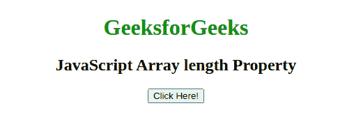

# JavaScript 数组长度属性

> 原文:[https://www . geesforgeks . org/JavaScript-array-length-property/](https://www.geeksforgeeks.org/javascript-array-length-property/)

下面是**数组长度**属性的例子。

*   **示例:**本示例返回数组的长度。

    ```
    <!DOCTYPE html>
    <html>
    <head>
        <title>
            JavaScript Array length Property
        </title>
        <style>
            body {
                text-align: center;
            }
            h1 {
                color: green;
            }
        </style>
    </head>
    <body>
        <h1>GeeksforGeeks</h1>

        <h2>
            JavaScript Array length Property
        </h2>

        <button onclick="array()">
            Click Here!
        </button>

        <p id="gfg"></p>

        <!-- Script to return the length of array -->
        <script>
            function array() {
            var colors = ["green", "blue", "red", 
                        "yellow", "black", "white" ];

                document.getElementById("gfg").innerHTML
                        = colors.length;
            }
            </script>
    </body>

    </html>         
    ```

*   **输出:** 

JavaScript 中的**数组长度**属性用于设置或返回数组中的元素个数。

**语法:**

*   它用于设置数组长度。

    ```
    array.length = number
    ```

*   它返回数组的长度。

    ```
    array.length
    ```

**返回值:**返回一个数值，表示数组对象中的元素个数。

以上属性的更多示例代码如下:
**程序 1:**

```
<script type = "text/javascript"> 
    var arr = new Array( "Geeks", "for", "Geeks"); 
    document.write("arr.length:" + arr.length); 
</script>     
```

**输出:**

```
arr.length:3
```

**程序 1:**

```
<script type = "text/javascript"> 
    var arr = new Array( 5, 10, 15); 
    document.write("arr.length:" + arr.length); 
</script>     
```

**输出:**

```
arr.length:3
```

**支持的浏览器:**JavaScript**数组长度**属性支持的浏览器如下:

*   谷歌 Chrome 1 以上
*   边缘 12 及以上
*   Firefox 1 及以上版本
*   Internet Explorer 4 及以上版本
*   歌剧 4 及以上
*   Safari 1 及以上