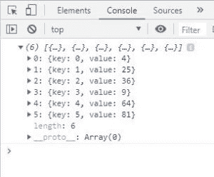
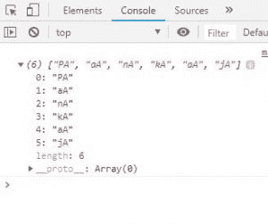

# JavaScript |数组映射()方法

> 原文:[https://www.geeksforgeeks.org/javascript-array-map-method/](https://www.geeksforgeeks.org/javascript-array-map-method/)

JavaScript 中的 **map()** 方法通过对父数组中的每个元素调用特定的函数来创建一个数组。这是一种非突变方法。一般来说 **map()** 方法用于迭代一个数组，并在数组的每个元素上调用函数。
**语法:**

```
array.map(function(currentValue, index, arr), thisValue)
```

**参数:**该方法接受两个参数，如上所述，如下所述:

*   **函数(currentValue，index，arr):** 它是必需的参数，在数组的每个元素上运行。它包含下列三个参数:
    *   **currentValue:** 必选参数，保存当前元素的值。
    *   **索引:**可选参数，保存当前元素的索引。
    *   **arr:** 可选参数，保存数组。
*   **该值:**为可选参数，用于保存传递给函数的值。

**返回值:**返回一个新数组，数组的元素是回调函数的结果。

以下示例说明了数组 map()方法在 JavaScript 中的使用:
**示例 1:** 本示例使用数组 map()方法并返回数组元素的平方。

```
<!DOCTYPE html>
<html>    
<head>
    <title>
        JavaScript Array map() Method
    </title>
</head>

<body>
    <div id="root"></div>

    <!-- Script to use Array map() Method -->
    <script>

        var el = document.getElementById('root');
        var arr = [2, 5, 6, 3, 8, 9];

        var newArr = arr.map(function(val, index){
            return {key:index, value:val*val};
        })

        console.log(newArr)

        el.innerHTML = JSON.stringify(newArr);
    </script>
</body>

</html>            
```

**输出:**


**示例 2:** 本示例使用数组 map()方法将字符“A”与名称的每个字符连接起来。

```
<!DOCTYPE html>
<html>

<head>
    <title>
        JavaScript Array map() Method
    </title>
</head>

<body>
    <div id="root"></div>

    <script>

        var el = document.getElementById('root');
        var name = "Pankaj";

        // New array of character and names 
        // concatenated with 'A' 
        var newName = Array.prototype.map.call(name, function(item) {
            return item + 'A';
        })

        console.log(newName)
    </script>
</body>

</html>                    
```

**输出:**


**例 3:** 本例使用 array map()方法返回数组元素的平方。

```
<!DOCTYPE html>
<html>
<head>
    <title>
        JavaScript Array map() Method
    </title>
</head>

<body>
    <div id="root"></div>

    <script>
        var el = document.getElementById('root');

        // Map is being called directly on an array
        // Arrow function is used
        el.innerHTML = [6, 7, 4, 5].map((val)=>{ 
            return val*val;
        })
    </script>
</body>

</html>
```

**输出:**

```
36, 49, 16, 25
```

JavaScript 最出名的是网页开发，但它也用于各种非浏览器环境。您可以通过以下 [JavaScript 教程](https://www.geeksforgeeks.org/javascript-tutorial/)和 [JavaScript 示例](https://www.geeksforgeeks.org/javascript-examples/)从头开始学习 JavaScript。