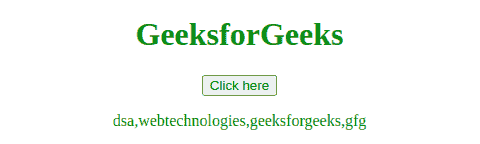
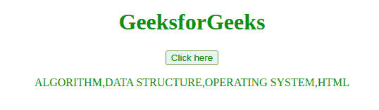
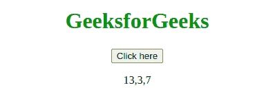

# JavaScript 数组原型构造器

> 原文:[https://www . geesforgeks . org/JavaScript-数组-原型-构造函数/](https://www.geeksforgeeks.org/javascript-array-prototype-constructor/)

下面是**数组原型构造器**的例子，使它们小写。

*   **例:**

## 超文本标记语言

```
<!DOCTYPE html>
<html>
<head>
    <title>
        JavaScript Array prototype Constructor
    </title>
</head>

<body style = "text-align:center;">

    <h1 style = "color:green;" >
        GeeksforGeeks
    </h1>

    <button onclick="myGeeks()">
        Click here
    </button>

    <p id="GFG" style = "color:Green;"></p>

    <!-- Script to use JavaScript Array prototype
        Constructor -->
    <script>
        Array.prototype.upperCase = function() {
            var i;
            for (i = 0; i < this.length; i++) {
                this[i] = this[i].toLowerCase();
            }
        };

        function myGeeks() {
            var sub = ["DSA", "WEBTEchnologies",
                            "GeeksforGeeks", "gfg"];
            sub.upperCase();

            document.getElementById("GFG").innerHTML= sub;
        }
    </script>
</body>

</html>
```

*   **输出:**



**JavaScript 数组原型构造函数**用于允许向 array()对象添加新的方法和属性。如果构造了方法，那么它将可用于每个数组。构造属性时，所有数组都将被赋予属性及其值，作为默认值。
**语法:**

```
Array.prototype.name = value
```

**注意:**不是指单个数组，而是指 array()对象本身，意思是 **Array.prototype** 本身就是一个 Array。
以上方法的更多示例代码如下:
**程序 1:** 本示例使用 JavaScript 数组原型构造函数，将字符串转换为大写字符。

## 超文本标记语言

```
<!DOCTYPE html>
<html>
<head>
    <title>
        JavaScript Array prototype Constructor
    </title>
</head>

<body style = "text-align:center;">

    <h1 style = "color:green;" >
        GeeksforGeeks
    </h1>

    <button onclick="myGeeks()">
        Click here
    </button>

    <p id="GFG" style = "color:Green;"></p>

    <!-- Script to use JavaScript Array prototype
        Constructor -->
    <script>
        Array.prototype.upperCase = function() {
            var i;
            for (i = 0; i < this.length; i++) {
                this[i] = this[i].toUpperCase();
            }
        };

        function myGeeks() {
            var sub = ["Algorithm", "Data Structure",
                            "Operating System", "html"];
            sub.upperCase();

            document.getElementById("GFG").innerHTML= sub;
        }
    </script>
</body>

</html>
```

**输出:**



**程序 2:** 本例使用 JavaScript 数组原型构造函数对字符串长度进行计数。

## 超文本标记语言

```
<!DOCTYPE html>
<html>

<head>
    <title>
        JavaScript Array prototype Constructor
    </title>
</head>

<body style = "text-align:center;">

    <h1 style = "color:green;" >
        GeeksforGeeks
    </h1>

    <button onclick="lengthFunction()">
        Click here
    </button>

    <p id="GFG"></p>

    <!-- Script to use Array prototype Constructor
         and count length of string -->
    <script>
        Array.prototype.stringLength = function() {
            var i;
            for (i = 0; i < this.length; i++) {
                this[i] = this[i].length;
            }
        };

        function lengthFunction() {

            // Declare an array
            var str = ["GeeksforGeeks", "GFG", "myGeeks"];

            str.stringLength();
            document.getElementById("GFG").innerHTML = str;
        }
    </script>
</body>

</html>                   
```

**输出:**



**支持的浏览器:**JavaScript**数组原型构造器**支持的浏览器如下:

*   谷歌 Chrome
*   微软公司出品的 web 浏览器
*   Mozilla Firefox
*   旅行队
*   歌剧