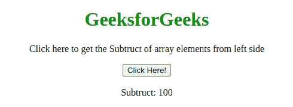
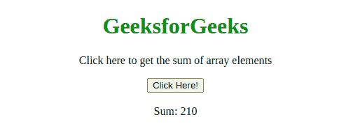
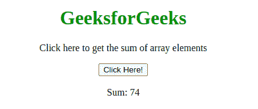

# JavaScript 数组 reduce()方法

> 原文:[https://www . geesforgeks . org/JavaScript-array-reduce-method/](https://www.geeksforgeeks.org/javascript-array-reduce-method/)

下面是**数组 reduce()** 方法的例子。

*   **例:**

    ```
    <!DOCTYPE html>
    <html>

    <head>
        <title>
            JavaScript Array reduce() Method
        </title>
    </head>

    <body style="text-align:center;">

        <h1 style="color: green;">GeeksforGeeks</h1>

        <p>
            Click here to get the Subtract
            of array elements from the left side
        </p>

        <button onclick="myGeeks()">
            Click Here!
        </button>

        <br><br>

        Subtract: <span id="GFG"></span>

        <!-- Script to use reduce method -->
        <script>
            var arr = [175, 50, 25];

            function subofArray(total, num) {
                return total - num;
            }
            function myGeeks(item) {
                document.getElementById("GFG").innerHTML
                        = arr.reduce(subofArray);
            }
        </script>
    </body>

    </html>          
    ```

*   **输出:**
    

JavaScript 中的 **arr.reduce()** 方法用于将数组缩减为单个值，并为数组的每个值(从左到右)执行一个提供的函数，该函数的返回值存储在累加器中。

**语法:**

```
array.reduce( function(total, currentValue, currentIndex, arr), 
initialValue )
```

**参数:**该方法接受五个参数，如上所述，如下所述:

*   **函数(total，currentValue，index，arr):** 它是必需的参数，用于运行数组的每个元素。它包含下列四个参数:
    *   **total:** 必选参数，用于指定 initialValue，或函数之前返回的值。
    *   **currentValue:** 必选参数，用于指定当前元素的值。
    *   **currentIndex:** 可选参数，用于指定当前元素的数组索引。
    *   **arr:** 可选参数，用于指定当前元素所属的数组对象。
*   **initialValue:** 是可选参数，用于指定作为初始值传递给函数的值。

**示例 1:** 本示例使用 reduce()方法返回所有数组元素的总和。

```
<!DOCTYPE html>
<html>

<head>
    <title>
        JavaScript Array reduce() Method
    </title>
</head>

<body style="text-align:center;">

    <h1 style="color: green;">GeeksforGeeks</h1>

    <p>
        Click here to get the sum
        of array elements
    </p>

    <button onclick="myGeeks()">
        Click Here!
    </button>

    <br><br>

    Sum: <span id="GFG"></span>

    <!-- Script to use reduce method -->
    <script>
        var arr = [10, 20, 30, 40, 50, 60];

        function sumofArray(sum, num) {
            return sum + num;
        }
        function myGeeks(item) {
            document.getElementById("GFG").innerHTML
                    = arr.reduce(sumofArray);
        }
    </script>
</body>

</html>                    
```

**输出:**


**示例 2:** 本示例使用 reduce()方法返回所有数组元素的舍入和。

```
<!DOCTYPE html>
<html>

<head>
    <title>
        JavaScript Array reduce() Method
    </title>
</head>

<body style="text-align:center;">

    <h1 style="color: green;">GeeksforGeeks</h1>

    <p>
        Click here to get the sum
        of array elements
    </p>

    <button onclick="myGeeks()">
        Click Here!
    </button>

    <br><br>

    Sum: <span id="GFG"></span>

    <!-- Script to use reduce method -->
    <script>
        var arr = [1.5, 20.3, 11.1, 40.7];

        function sumofArray(sum, num) {
            return sum + Math.round(num);
        }
        function myGeeks(item) {
            document.getElementById("GFG").innerHTML
                    = arr.reduce(sumofArray, 0);
        }
    </script>
</body>

</html>                    
```

**输出:**

**支持的浏览器:**JavaScript**Array reduce()**方法支持的浏览器如下:

*   谷歌 Chrome 3 及以上版本
*   微软 Edge 12 及以上版本
*   Mozilla Firefox 3.0 及以上版本
*   Safari 5 及以上
*   Opera 10.5 及以上