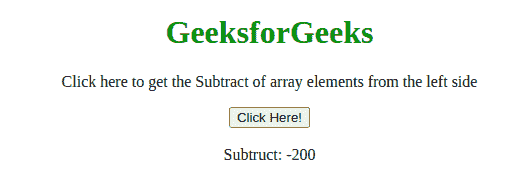
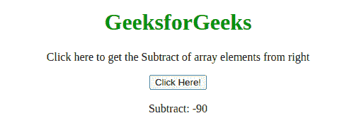

# JavaScript 数组 reduceRight()方法

> 原文:[https://www . geesforgeks . org/JavaScript-array-reduce right-method/](https://www.geeksforgeeks.org/javascript-array-reduceright-method/)

下面是**数组 reduceRight()** 方法的例子。

*   **示例:**

## 超文本标记语言

```
<!DOCTYPE html>
<html>

<head>
    <title>
        JavaScript Array reduceRight() Method
    </title>
</head>

<body style="text-align:center;">

    <h1 style="color: green;">GeeksforGeeks</h1>

<p>
        Click here to get the Subtract
        of array elements from the left side
    </p>

    <button onclick="myGeeks()">
        Click Here!
    </button>

    <br><br>

    Subtract: <span id="GFG"></span>

    <!-- Script to use reduceRight method -->
    <script>
        var arr = [175, 50, 25];

        function subofArray(total, num) {
            return total - num;
        }
        function myGeeks(item) {
            document.getElementById("GFG").innerHTML
                    = arr.reduceRight(subofArray);
        }
    </script>
</body>

</html>          
```

**输出:**



JavaScript 中的 **arr.reduceRight()** 方法用于将给定数组的元素从右向左转换为单个值。

**语法:**

```
array.reduceRight( function(total, currentValue, currentIndex, arr), 
initialValue )
```

**参数:**该方法接受五个参数，如上所述，如下所述:

*   **函数(total，currentValue，index，arr):** 它是必需的参数，用于运行数组的每个元素。它包含下列四个参数:
    *   **total:** 必选参数，用于指定 initialValue，或函数之前返回的值。
    *   **currentValue:** 必选参数，用于指定当前元素的值。
    *   **currentIndex:** 可选参数，用于指定当前元素的数组索引。
    *   **arr:** 可选参数，用于指定当前元素所属的数组对象。
*   **initialValue:** 是可选参数，用于指定作为初始值传递给函数的值。

**示例 1:** 本示例使用 reduceRight()方法返回所有数组元素从右减去的结果。

## 超文本标记语言

```
<!DOCTYPE html>
<html>

<head>
    <title>
        JavaScript Array reduceRight() Method
    </title>
</head>

<body style="text-align:center;">

    <h1 style="color: green;">GeeksforGeeks</h1>

<p>
        Click here to get the Subtract
        of array elements from right
    </p>

    <button onclick="myGeeks()">
        Click Here!
    </button>

    <br><br>

    Subtract: <span id="GFG"></span>

    <!-- Script to use reduceRight method -->
    <script>
        var arr = [10, 20, 30, 40, 50, 60];

        function subofArray(total, num) {
            return total - num;
        }
        function myGeeks(item) {
            document.getElementById("GFG").innerHTML
                    = arr.reduceRight(subofArray);
        }
    </script>
</body>

</html>                    
```

**输出:**



**示例 2:** 本示例使用 reduceRight()方法返回所有数组元素的舍入和。执行求和的代码不受 reduceRight()方法的影响。

## 超文本标记语言

```
<!DOCTYPE html>
<html>

<head>
    <title>
        JavaScript Array reduceRight() Method
    </title>
</head>

<body style="text-align:center;">

    <h1 style="color: green;">GeeksforGeeks</h1>

<p>
        Click here to get the sum
        of array elements
    </p>

    <button onclick="myGeeks()">
        Click Here!
    </button>

    <br><br>

    Sum: <span id="GFG"></span>

    <!-- Script to use reduceRight method -->
    <script>
        var arr = [1.5, 20.3, 11.1, 40.7];

        function sumofArray(sum, num) {
            return sum + Math.round(num);
        }
        function myGeeks(item) {
            document.getElementById("GFG").innerHTML
                    = arr.reduceRight(sumofArray, 0);
        }
    </script>
</body>

</html>                    
```

**输出:**


**支持的浏览器:**JavaScript**Array reduce right()**方法支持的浏览器如下:

*   谷歌 Chrome 3
*   微软边缘 12
*   Mozilla Firefox 3.0
*   Safari 5
*   歌剧 10.5
*   Internet Explorer 9