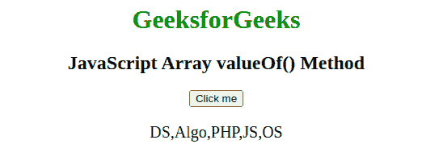

# JavaScript 数组值 Of()方法

> 原文:[https://www . geesforgeks . org/JavaScript-array-value of-method/](https://www.geeksforgeeks.org/javascript-array-valueof-method/)

下面是**数组 valueOf()** 方法的例子。

*   **例:**

    ```
    <script>
    function func() { 

        // Original array 
        var array = ["GFG", "Geeks", "for", "Geeks"]; 

        // Checking for condition in array 
        var value = array.valueOf(); 

        document.write(value);
    } 

    func();
    </script>
    ```

*   **输出:**

    ```
    GFG,Geeks,for,Geeks
    ```

JavaScript 中的 **arr.valueOf()** 方法用来返回数组。这是数组对象的默认方法。此方法返回同一数组中的所有项。它不会改变数组的原始内容。它不包含任何参数值。

**语法:**

```
array.valueOf()
```

**参数:**此方法不接受任何参数。

**返回值:**返回一个数组。

以下示例说明了 JavaScript 数组值()方法:

*   **Example:**

    ```
    var array = ["DS", "Algo", "PHP", "JS", "OS"]; 
    var value = array.valueOf(); 
    document.write(value);
    ```

    **输出:**

    ```
    DS,Algo,PHP,JS,OS
    ```

上述方法的示例代码如下:
**示例:**

```
<!DOCTYPE html>
<html>

<head>
    <title>
        JavaScript Array valueOf() Method
    </title>
</head>

<body style="text-align:center;">

    <h1 style="color:green"> 
        GeeksforGeeks
    </h1>

    <h2>JavaScript Array valueOf() Method</h2>

    <button onclick="myGeeks()">Click me</button>

    <p id="sudo" style="font-size:20px;"></p>

    <script>
        function myGeeks() {
            var sub = ["DS", "Algo", "PHP", "JS", "OS"];

            document.getElementById("sudo").innerHTML
                    = sub.valueOf();
        }
    </script>
</body>

</html>
```

**输出:**


**支持的浏览器:**JavaScript**数组 valueOf()** 方法支持的浏览器如下:

*   谷歌 Chrome
*   微软公司出品的 web 浏览器
*   火狐浏览器
*   旅行队
*   歌剧