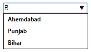
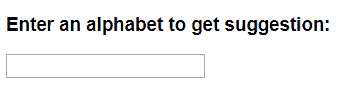
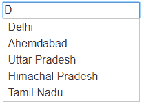

# JavaScript |自动完成/建议功能

> 原文:[https://www . geesforgeks . org/JavaScript-自动-完成-建议-功能/](https://www.geeksforgeeks.org/javascript-auto-complete-suggestion-feature/)

有很多方法可以在 javascript 中实现自动完成功能。我们将以其中两个为目标。一个使用纯 Javascript，另一个使用像 Jquery 这样的框架。
**先决条件:**

*   [Html](https://www.geeksforgeeks.org/html-basics/)*   [Javascript](https://www.geeksforgeeks.org/understanding-basic-javascript-codes/)*   [JQuery Basics](https://www.geeksforgeeks.org/jquery-introduction/)

    **1)使用纯 Javascript(无框架):**
    这种方法比使用框架的方法显示结果更快。

    **重要功能:**
    getElementsByTagName:用于从 html 中按类或 id 获取元素。
    createElement(“类型”):createElement 创建一个传递类型的元素
    appendChild(节点):将传递的节点追加到附加父节点的末尾。
    **代码#1:**

    ```
    <!DOCTYPE html>
    <html>
    <head>
        <title>Auto complete using Pure Javascript</title>
    </head>
    <body>
    <script type="text/javascript">
        var tags = [ 
        "Delhi",
        "Ahemdabad",
        "Punjab",
        "Uttar Pradesh",
        "Himachal Pradesh",
        "Karnatka",
        "Kerela",
        "Maharashtra",
        "Gujrat",
        "Rajasthan",
        "Bihar",
        "Tamil Nadu",
        "Haryana"
          ];

          /*list of available options*/
         var n= tags.length; //length of datalist tags    

         function ac(value) {
            document.getElementById('datalist').innerHTML = '';
             //setting datalist empty at the start of function
             //if we skip this step, same name will be repeated

             l=value.length;
             //input query length
         for (var i = 0; i<n; i++) {
             if(((tags[i].toLowerCase()).indexOf(value.toLowerCase()))>-1)
             {
                 //comparing if input string is existing in tags[i] string

                 var node = document.createElement("option");
                 var val = document.createTextNode(tags[i]);
                  node.appendChild(val);

                   document.getElementById("datalist").appendChild(node);
                       //creating and appending new elements in data list
                 }
             }
         }

    </script>

    <input type="text" list="datalist" onkeyup="ac(this.value)">
    <!-- On keyup calls the function everytime a key is released -->
    <datalist id="datalist">

    <option value="Delhi"></option>
    <option value="Ahemdabad"></option>
    <option value="Punjab"></option>
    <option value="Uttar Pradesh"></option>
    <option value="Himachal Pradesh"></option>
    <option value="Karnatka"></option>
    <option value="Kerela"></option>
    <option value="Maharashtra"></option>
    <option value="Gujrat"></option>
    <option value="Rajasthan"></option>
    <option value="Bihar"></option>
    <option value="Tamil Nadu"></option>
    <option value="Haryana"></option>

    <!-- This data list will be edited through javascript     -->
    </datalist>
    </body>
    </html>
    ```

    **输出:**
    刚开始输出会像下图-
    
    而当 B 放入框内之后输出就变成了下图-
    
    **2)USING JQUERY**
    JQUERY 是一个跨平台的 JavaScript 库，旨在简化 HTML 的客户端脚本。
    JQuery 有一个内置的自动完成功能，它接受 id 和可用标签列表。
    **代码#2:**

    ```
    <!doctype html>
    <html lang="en">
    <head>
      <meta charset="utf-8">
      <meta name="viewport" content="width=device-width, initial-scale=1">
      <title>Autocomplete using Jquery</title>
      <link rel="stylesheet" href="//code.jquery.com/ui/1.12.1/themes/base/jquery-ui.
    css">
      <link rel="stylesheet" href="/resources/demos/style.css">
      <script src="https://code.jquery.com/jquery-1.12.4.js"></script>
      <script src="https://code.jquery.com/ui/1.12.1/jquery-ui.js"></script>
      <script>
      $( function() {
        var tags = [
        "Delhi",
        "Ahemdabad",
        "Punjab",
        "Uttar Pradesh",
        "Himachal Pradesh",
        "Karnatka",
        "Kerela",
        "Maharashtra",
        "Gujrat",
        "Rajasthan",
        "Bihar",
        "Tamil Nadu",
        "Haryana"

          /* Making a list of available tags */

        ];
        $( "#tags" ).autocomplete({
          source: tags

    /* #tthe ags is the id of the input element
    source: tags is the list of available tags*/

        });
      } );
      </script>
    </head>
    <body>

    <div class="ui-widget">
     <H3>Enter an alphabet to get suggestion:</H3>
      <input id="tags">
    </div>

    </body>
    </html>
    ```

    键入一封信以查看建议，然后单击以自动完成文本。
    **输出:**
    起初，输出会像下图-
    
    当 D 被放入盒子内部时，输出会像下图-
    
    参考:[http://api.jqueryui.com/autocomplete/](http://api.jqueryui.com/autocomplete/)