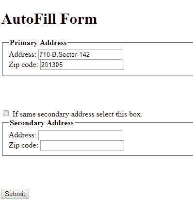

# JavaScript |自动填充一个字段与其他字段相同

> 原文:[https://www . geesforgeks . org/JavaScript-自动填充-一个字段/](https://www.geeksforgeeks.org/javascript-auto-filling-one-field/)

(本文利用了 HTML、CSS 和 JavaScript 的一些先验知识。)
你可能已经注意到了，有时候像电子商务这样的网站或者一些政府网站的表单中有两个地址字段。一个用于主要地址，另一个用于次要地址(或者一个用于账单地址，另一个用于送货地址等)。
大多数情况下，人们都有相同的主地址和次地址，为了避免我们再次重新输入相同数据的繁琐工作，他们有某种选项可以自动将一个字段的内容复制到另一个字段中。
我们将看到如何使用 JavaScript 制作这种自动完成的表单。
在我们将要讨论的表单中，有一个复选框，只要选中它，代码就会自动将主要地址和主要邮政编码的值分别复制到次要地址和次要邮政编码。如果未选中该复选框，这些字段将变为空白。
这是这种形式的简单代码:

```
<!DOCTYPE html>
<html lang="en">
    <head>
        <meta charset="UTF-8" />
        <title>Form Auto Fill</title>
        <style>
            fieldset {
                margin-bottom: 5%;
            }
        </style>
    </head>

    <body>
        <h1>AutoFill Form</h1>
        <form>
            //Fields for primary address
            <fieldset>
                <legend><b>Primary Address</b>
              </legend>
                <label for="primaryaddress">
                  Address:</label>
                <input type="text" 
                       name="Address" 
                       id="primaryaddress" 
                       required /><br />
                <label for="primaryzip">Zip code:</label>
                <input type="text" 
                       name="Zip code" 
                       id="primaryzip" 
                       pattern="[0-9]{6}" 
                       required /><br />
            </fieldset>

            <input type="checkbox" 
                   id="same" 
                   name="same" 
                   onchange="addressFunction()" />
            <label for="same">
              If same secondary address select this box.
          </label>

            // Fields for secondary address
            <fieldset>
                <legend><b>Secondary Address</b></legend>
                <label for="secondaryaddress">
                  Address:
              </label>
                <input type="text" 
                       name="Address" 
                       id="secondaryaddress" 
                       required /><br />
                <label for="secondaryzip">
                  Zip code:</label>
                <input type="text" 
                       name="Zip code" 
                       id="secondaryzip"
                       pattern="[0-9]{6}" 
                       required /><br />
            </fieldset>

            // Submit button in the form
            <input type="submit"
                   value="Submit" />
        </form>

        // JavaScript Code
        <script>
            function addressFunction() {
                if (document.getElementById(
                  "same").checked) {
                    document.getElementById(
                      "secondaryaddress").value = 
                    document.getElementById(
                      "primaryaddress").value;

                    document.getElementById(
                      "secondaryzip").value = 
                    document.getElementById(
                      "primaryzip").value;
                } else {
                    document.getElementById(
                      "secondaryaddress").value = "";
                    document.getElementById(
                      "secondaryzip").value = "";
                }
            }
        </script>
    </body>
</html>
```

**#这是勾选框前表单的样子:**


**#而这就是它勾选后的样子:**

**注:**特征像

*   必需'(第 18、20、29、31 行)-确保只有当这些字段非空时才会提交表单；
*   pattern = "[0-9]{6} " '(第 20、31 行)-确保邮政编码的格式正确，即六位数的邮政编码。

**解释:**
当复选框的选中状态改变时，将发生“onchange”(见第 23 行)事件，该事件将调用“addressFunction()”。
如果选中该框，主要地址和主要邮政编码的值将被复制到次要地址和次要邮政编码(通过使用“getElementById()”函数，我们指的是具有特定标识和的元素)。“值”来访问该特定标识元素的值)。
否则，这些字段将保持空白，以便用户填写(如果主地址和次地址不同)。