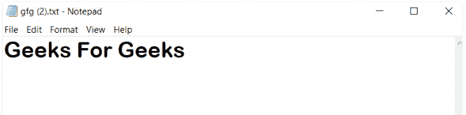

# JavaScript | Blob

> 原文:[https://www.geeksforgeeks.org/javascript-blob/](https://www.geeksforgeeks.org/javascript-blob/)

blob 对象只是保存文件中存储的数据的一组字节。看起来 blob 是对实际文件的引用，但实际上不是。一个斑点有它的大小和 MIME，就像一个简单的文件。blob 数据存储在用户的存储器或文件系统中，这取决于浏览器特征和 blob 的大小。一个简单的 blob 可以像文件一样用在任何我们想用的地方。
blob 的内容可以很容易地读取为 [ArrayBuffer](https://www.geeksforgeeks.org/javascript-arraybuffer-object/) ，这使得 blob 非常方便地存储二进制数据。

**创建斑点的语法:**

```
var abc = new Blob(["Blob Content"], 
    {type: Blob Property containing MIME property})

```

除了将数据直接插入到 Blob 中，我们还可以使用 FileReader 类从这个 Blob 中读取数据:

```
var abc = new Blob(["GeeksForGeeks"], 
                {type : "text/plain"});
var def = new FileReader();
def.addEventListener("loadend", function(e) {
    document.getElementById("para").innerHTML
                     = e.srcElement.result;
});

def.readAsText(abc);
```

在 HTML 文件中，我们只是创建了一个简单的

元素，id="para ":

```
<p id="para"></p>
```

您将获得以下输出:

```
GeeksForGeeks
```

**Blob URL:**就像我们有引用本地文件系统中一些真实文件的文件 URL 一样，我们也有引用 Blob 的 Blob URL。Blob URL 与任何常规 URL 都非常相似，因此几乎可以在我们可以使用常规 URL 的任何地方使用。斑点可以很容易地用作<>或其他标签的网址，以显示其内容。指向斑点的斑点网址可以使用 createObjectURL 对象获得:

```
<!DOCTYPE html>
<html>

<head>
    <title>
        JavaScript Blob
    </title>
</head>

<body>
    <a download="gfg.txt" href='#'
        id="link">Download</a>

    <script>
        let abc = new Blob(["Geeks For Geeks"],
                { type: 'text/plain' });

        link.href = URL.createObjectURL(abc);
    </script>
</body>

</html>
```

**输出:**
你将获得一个下载的动态生成的 Blob，以极客为极客的内容:


**Blob 到 ArrayBuffer:**Blob 构造函数可以用来从任何东西创建 Blob，包括任何类型的 BufferSource。对于低级处理，我们可以使用文件阅读器从 blob 中使用最低级别的数组缓冲区:

```
let def = new FileReader();

def.readAsArrayBuffer(abc);

def.onload = function(event) {
    let res = def.result;
};
```

**使用斑点的正点:**

*   Blobs 是将大型二进制数据文件添加到数据库中的一个很好的选择，并且很容易被引用。
*   使用 Blobs 时，使用权限管理设置访问权限很容易。
*   Blobs 的数据库备份包含所有数据。

**使用斑点的负分:**

*   并非所有的数据库都允许使用 Blobs。
*   由于需要大量的磁盘空间和访问时间，Blobs 的效率很低。
*   由于 Blobs 的文件大小，创建备份非常耗时。