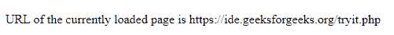

# JavaScript BOM |位置对象

> 原文:[https://www . geesforgeks . org/JavaScript-BOM-location-object/](https://www.geeksforgeeks.org/javascript-bom-location-object/)

浏览器对象模型为 JavaScript 提供了与浏览器交互的属性和方法。物料清单允许通过物料清单对象执行操作来操作浏览器窗口，而不会影响页面(即文档)的内容。物料清单对象是全局对象。
用于操纵浏览器窗口的物料清单对象是:

*   **位置***   **历史***   **领航员***   **屏幕***   **document

    这些对象是**窗口**对象的子对象。窗口对象表示浏览器窗口。因此，它们可以使用前缀: **window.object_name** 或者不使用前缀 **object_name**

    *   **location.href** 返回浏览器窗口中当前加载的网页的网址。
        **语法:**

        ```html
        console.log("URL of the web page " + location.href)
        ```

    *   **location.hostname** 返回当前主机的域名(不包括端口号)。
        **语法:**

    ```html
    console.log("Domain name of current host page is " + location.hostname)
    ```** *   ****location.protocol** 返回当前网页正在使用的网络协议(http:，file:或 https:
    **语法:**

    ```html
    console.log("Protocol used by the current page is " + location.protocol)
    ```** *   **当指定了完整的地址时， **location.assign** 返回一个新的加载到窗口中的网页。
    **语法:**

    ```html
    location.assign("http://www.google.com")
    ```** *   ****location.reload** reloads the current page. Its function is the same as that of reload button in the browser window.
    **Syntax:**

    ```html
    location.reload();
    ```

    **示例:**本示例使用位置对象的 location.href 属性。

    ```html
    <!DOCTYPE html>
    <html>

    <body>
        <p id="a"></p>

        <script>
            document.getElementById("a").innerHTML
                 = "  URL of the currently loaded page is "
                  + location.href; 
        </script>
    </body>

    </html>
    ```

    **输出:**
    **