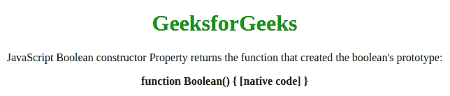
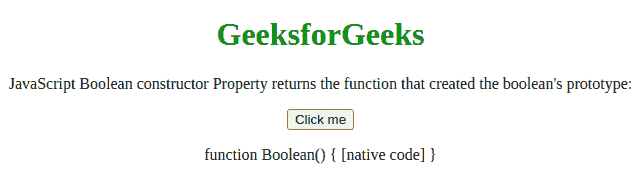

# JavaScript 布尔构造函数属性

> 原文:[https://www . geesforgeks . org/JavaScript-boolean-constructor-property/](https://www.geeksforgeeks.org/javascript-boolean-constructor-property/)

下面是**布尔构造函数**属性的例子。

*   **例:**

## java 描述语言

```
<script type = "text/javascript">
        var bool = false;
        document.write("bool.constructor:"
                + bool.constructor);
</script>    
```

*   **输出:**

```
bool.constructor:function Boolean() { [native code] }
```

在 JavaScript 中，**布尔构造函数属性**返回对象的构造函数。对于 JavaScript Boolean，构造函数属性返回**函数 Boolean(){[本机代码] }** 。
**语法:**

```
boolean.constructor
```

**返回值:**返回函数 Boolean(){[原生代码] }。
上述属性的更多示例代码如下:
**示例 1:** 本示例说明布尔构造函数属性。

## 超文本标记语言

```
<!DOCTYPE html>
<html>

<head>
    <title>
        JavaScript Boolean constructor Property
    </title>
</head>

<body style="text-align:center;">

    <div>

        <h1 style="color: green;">GeeksforGeeks</h1>

<p>
            JavaScript Boolean constructor Property
            returns the function that created
            the boolean's prototype:
        </p>

        <b id="GFG"></b>

    </div>

    <!-- Script to use boolean constructor -->
    <script>
        var bool = false;
        document.getElementById("GFG").innerHTML
                = bool.constructor;
    </script>
</body>

</html>                    
```

**输出:**



**示例 2:** 此示例说明布尔构造函数属性。

## 超文本标记语言

```
<!DOCTYPE html>
<html>

<head>
    <title>
        JavaScript Boolean constructor Property
    </title>
</head>

<body style="text-align:center;">

    <div>

        <h1 style="color: green;">GeeksforGeeks</h1>

<p>
            JavaScript Boolean constructor Property
            returns the function that created
            the boolean's prototype:
        </p>

        <button onclick="gfg()">Click me</button>
        <p id="name"></p>

    </div>

    <!-- Script to use Boolean constructor Property -->
    <script>
    function gfg(){
        var bool = false;
        document.getElementById("name").innerHTML
                = bool.constructor;
    }
    </script>
</body>

</html>        
```

**输出:**



**支持的浏览器:**JavaScript 布尔构造函数属性支持的浏览器如下:

*   谷歌 Chrome 1 及以上版本
*   Internet Explorer 3 及以上版本
*   Mozilla Firefox 1 及以上版本
*   Safari 1 及以上
*   歌剧 4 及以上