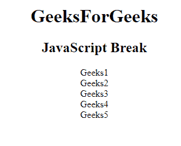
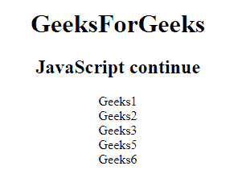
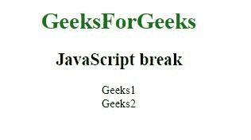
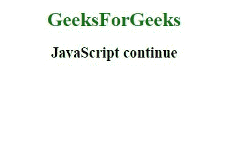
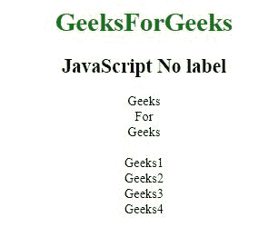

# JavaScript |中断并继续

> 原文:[https://www . geesforgeks . org/JavaScript-中断并继续/](https://www.geeksforgeeks.org/javascript-break-and-continue/)

**Break 语句:**Break 语句用于跳出一个循环。它可以用来“跳出”switch()语句。它中断循环，并在循环后继续执行代码。

**示例:**

```
<!DOCTYPE html>
<html>
    <head> 
        <title>
            JavaScript Break statement
        </title>
    </head> 

    <body style="text-align:center;">
        <div>
            <h1>GeeksForGeeks</h1>
            <h2>JavaScript Break</h2>
        </div>

        <p id="GFG"></p>

        <script>
            var content = "";
            var i;
            for (i = 1; i < 1000; i++) {
                if (i === 6) { 
                    break; 
                }
                content += "Geeks" + i + "<br>";
            }
            document.getElementById("GFG").innerHTML = content;
        </script>
    </body>
</html>                                
```

**输出:**


**Continue 语句:**Continue 语句在循环中“跳过”一次迭代。它中断循环中的迭代，并继续执行循环中的下一个迭代。

**示例:**

```
<!DOCTYPE html>
<html>
    <head> 
        <title>
            JavaScript continue statement
        </title>
    </head> 

    <body style="text-align:center;">

        <div>
            <h1>GeeksForGeeks</h1>
            <h2>JavaScript continue</h2>
        </div>

        <p id="GFG"></p>

        <script>
            var content = "";
            var i;
            for (i = 1; i < 7; i++) {
                if (i === 4) { 
                    continue; 
                }
                content += "Geeks" + i + "<br>";
            }
            document.getElementById("GFG").innerHTML = content;
        </script>
    </center>
</body>
</html>                    
```

**输出:**


**JavaScript 标签:**在 JavaScript 中，标签语句被写成带有标签名和冒号的语句。

**语法:**

*   **break 语句:**用于跳出没有标签引用的循环或开关，而有标签引用时，用于跳出任意代码块。

    ```
    break labelname; 
    ```

*   **continue 语句:**它用于跳过一个有或没有标签引用的循环迭代。

    ```
    continue labelname;
    ```

**示例:**此示例使用了 break label 语句。

```
<!DOCTYPE html>
<html>
    <head> 
        <title>
            JavaScript continue statement
        </title>
    </head> 

    <body style="text-align:center;">

        <div>
            <h1 style="color:green;">
                GeeksForGeeks
            </h1>

            <h2>JavaScript break</h2>
        </div>

        <p id="GFG"></p>

        <!-- Script to use break label -->
        <script>
            var val = ["Geeks1", "Geeks2", "Geeks3",
                                 "Geeks4", "Geeks5"];
            var print = "";

            breaklabel: {
                print += val[0] + "<br>" + val[1] + "<br>"; 
                break breaklabel;
                print += val[2] + "<br>"+ val[3] + "<br>" + val[4]; 
            }

            document.getElementById("GFG").innerHTML = print;
        </script>

    </body>
</html>                    
```

**输出:**


**示例:**本示例使用 continue 标签。

```
<!DOCTYPE html>
<html>
    <head> 
        <title>
            JavaScript continue label
        </title>
    </head> 

    <body style="text-align:center">

        <div>
            <h1 style="color:green;">
                GeeksForGeeks
            </h1>

            <h2>JavaScript continue</h2>
        </div>

        <p id="GFG"></p>

        <!-- Script to use continue label -->
        <script>
            var val = ["Geeks1", "Geeks2", "Geeks3", "Geeks4"];
            var val1=["Geeks","For","Geeks"]

            var print = "";

            print += val1[0] + "<br>";
            print += val1[1] + "<br>";
            print += val1[2] + "<br>";

            continuelabel: {
                print += val[0] + "<br>"; 
                print += val[1] + "<br>"; 
                continue continuelabel;
                print += val[2] + "<br>"; 
                print += val[3] + "<br>"; 
            }

            document.getElementById("GFG").innerHTML = print;
        </script>
    </body>
</html>                    
```

**输出:**


**示例:**此示例说明了不使用任何标签的情况。

```
<!DOCTYPE html>
<html>
    <head> 
        <title>
            No label in JavaScript
        </title>
    </head> 

    <body style="text-align:center;">

        <div>
            <h1 style="color:green;">
                GeeksForGeeks
            </h1>

            <h2>JavaScript No label</h2>
        </div>

        <p id="GFG"></p>

        <script>
            var val = ["Geeks1", "Geeks2", "Geeks3", "Geeks4"];
            var val1=["Geeks","For","Geeks"]

            var print = "";

            labelloop:{
                print += val1[0] + "<br>";
                print += val1[1] + "<br>";
                print += val1[2] + "<br>";
            }

            print+="<br>";

            labelloop1: {
                print += val[0] + "<br>"; 
                print += val[1] + "<br>"; 
                print += val[2] + "<br>"; 
                print += val[3] + "<br>"; 
            }

            document.getElementById("GFG").innerHTML
                    = print;
        </script>
    </body>
</html>                    
```

**输出:**
