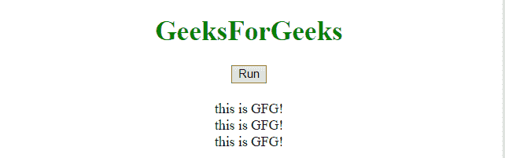
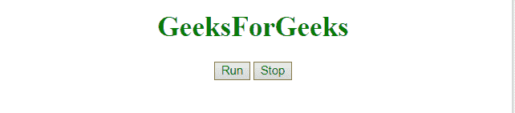
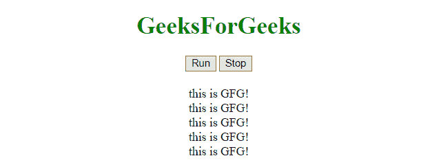

# JavaScript |固定时间后调用函数

> 原文:[https://www . geesforgeks . org/JavaScript-固定时间后调用函数/](https://www.geeksforgeeks.org/javascript-call-a-function-after-a-fixed-time/)

为了在固定时间后多次运行一个函数，我们使用的函数很少。
**setInterval()方法:**该方法以指定的时间间隔(毫秒)调用一个函数。此方法将连续调用函数，直到运行 clearInterval()或关闭窗口。

**语法:**

```
setInterval(fun, msec, p1, p2, ...)
```

**参数:**

*   **好玩:**是必选参数。它保存要执行的函数。
*   **毫秒:**是必需参数。多长时间后执行代码的时间间隔(毫秒)。如果该值小于 10，则使用 10。
*   **p1，p1，…:** 为可选参数。参数作为参数传递给函数。(IE9 及更早版本不支持)。

**清除间隔()方法:**该方法清除由设置间隔()方法设置的定时器。setInterval()方法返回的标识值用作该方法的参数。

**语法:**

```
clearInterval(varSetInt)
```

**参数:**

*   **varSetInt:** 必选参数。这是 setInterval()方法返回的计时器的名称。

**示例 1:** 本示例设置一个函数，该函数在 2 秒钟后将一个< div >元素连续追加到<主体>中。

## 超文本标记语言

```
<!DOCTYPE html>
<html>
    <head>
        <title>
            JavaScript | Call a function
            after a fixed time.
        </title>
    </head>

    <body style = "text-align:center;" id = "body">

        <h1 style = "color:green;" >
            GeeksForGeeks
        </h1>

        <p id = "GFG_UP" style = "color:green;"></p>

        <button onclick = "gfg_Run()">
            Run
        </button>

        <p id="GFG_DOWN" style="color:green;font-size:20px;"></p>

        <script>
            var el_up = document.getElementById("GFG_UP");
            var el_down = document.getElementById("GFG_DOWN");
            var el_body = document.getElementById("body");
            el_up.innerHTML = JSON.stringify(GFG_object);

            function gfg_Run() {
                setInterval(function() {
                    var node = document.createElement("DIV");        
                    var textnode = document.createTextNode("this is GFG!");
                    node.appendChild(textnode);
                    el_body.appendChild(node);
                }, 2000);
            }
        </script>
    </body>
</html>                   
```

**输出:**

*   **点击按钮前:**


*   **点击** ***后运行*** **按钮:**



**示例 2:** 本示例设置一个函数，该函数在 2 秒钟后连续向<体>追加一个< div >元素，并在点击**停止**按钮时停止追加。

## 超文本标记语言

```
<!DOCTYPE html>
<html>
    <head>
        <title>
            JavaScript | Call a function after a fixed time.
        </title>
    </head>

    <body style = "text-align:center;" id = "body">

        <h1 style = "color:green;" >
            GeeksForGeeks
        </h1>

        <p id = "GFG_UP" style = "color:green;"></p>

        <button onclick = "gfg_Run()">
            Run
        </button>

        <button onclick = "gfg_Stop()">
            Stop
        </button>

        <p id="GFG_DOWN" style="color:green;font-size:20px;"></p>

        <script>
            var el_up = document.getElementById("GFG_UP");
            var el_down = document.getElementById("GFG_DOWN");
            var el_body = document.getElementById("body");
            el_up.innerHTML = JSON.stringify(GFG_object);
            var timer;
            function gfg_Run() {
                timer = setInterval(function() {
                    var node = document.createElement("DIV");        
                    var textnode = document.createTextNode("this is GFG!");
                    node.appendChild(textnode);
                    el_body.appendChild(node);
                }, 2000);
            }
            function gfg_Stop() {
                clearInterval(timer);

            }
        </script>
    </body>
</html>                   
```

**输出:**

*   **点击按钮前:**



*   **点击** ***后运行*** **按钮:**



**示例 3:** 本示例设置一个函数，该函数在 1 秒钟后以与前一个不同的方式将< div >元素连续追加到<主体>中，并在点击**停止**按钮时停止追加。

## 超文本标记语言

```
                        <!DOCTYPE html>
<html>
    <head>
        <title>
            JavaScript | Call a function after a fixed time.
        </title>
    </head>

    <body style = "text-align:center;" id = "body">

        <h1 style = "color:green;" >
            GeeksForGeeks
        </h1>

        <p id = "GFG_UP" style = "color:green;"></p>

        <button onclick = "gfg_Run()">
            Run
        </button>

        <button onclick = "gfg_Stop()">
            Stop
        </button>

        <p id="GFG_DOWN" style="color:green;font-size:20px;"></p>

        <script>
            var el_up = document.getElementById("GFG_UP");
            var el_down = document.getElementById("GFG_DOWN");
            var el_body = document.getElementById("body");
            el_up.innerHTML = JSON.stringify(GFG_object);
            var timer;

            function gfg_Run() {
                function gfg_function() {
                    var node = document.createElement("DIV");        
                    var textnode = document.createTextNode("this is GFG!");
                    node.appendChild(textnode);
                    el_body.appendChild(node);
                }
                timer = setInterval(gfg_function, 1000);
            }
            function gfg_Stop() {
                clearInterval(timer);

            }
        </script>
    </body>
</html>                   
```

**输出:**

*   **点击按钮前:**


*   **点击** ***后运行*** **按钮:**

