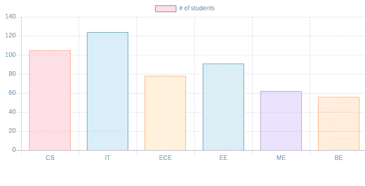

# JavaScript | Chart.js

> 原文:[https://www.geeksforgeeks.org/javascript-chart-js/](https://www.geeksforgeeks.org/javascript-chart-js/)

Chart.js 是 [Github](https://github.com/chartjs/Chart.js) 上的一个开源 JavaScript 库，可以使用 HTML5 画布元素绘制不同类型的图表。由于它使用 canvas，您必须包含一个 polyfill 来支持旧的浏览器。

**那么，什么是 HTML5 画布元素？**

HTML5 元素为使用 JavaScript 绘制图形提供了一种简单而强大的方法。它可以用来绘制图表，制作照片合成或做简单(不那么简单)的动画。
它本质上是响应性的，这意味着它会在调整窗口大小时重新绘制图表，以获得完美的缩放粒度。

该库支持 **8 种不同类型的图形**:

1.  线条
2.  酒吧
3.  甜甜圈
4.  馅饼
5.  雷达
6.  极区
7.  泡泡
8.  分散

**安装:**最新版本的 Chart.js 可以从 Github 下载或者使用一个 Chart.js CDN。

**Steps to create a chart:**

*   首先在 HTML 中包含 **chart.js** 。

    ```
    <head>
    <script src=
    "https://cdnjs.cloudflare.com/ajax/libs/Chart.js/2.7.2/Chart.bundle.js">
    </script>
    <link rel="stylesheet" type="text/css" href="style.css">
    </head>
    ```

    *   **Create canvas:** To create a chart we need to represent the Chart class. In order to do this, we need to pass jQuery instance or 2d context of the canvas of where we want the place or draw the chart.

    例如:

    ```
    <canvas id = ”chart” width=”900” height = “900”> </canvas>
    ```

    *   **Type of Chart and Data:** Decide what type of chart is required and prepare the data accordingly. Data requires labels, datasets, data values, backgroundColor,borderColor, borderWidth and various other options.

    例如:

    ```
    labels:[“CS”, “IT” , “ECE” , “EE”, ”ME”, “BE”],
    And datasets: 
        Label: ‘# of students’,
        Data : [105,124,78,91,62,56],
        backgroundColor :['rgba(255, 99, 132, 0.2)',
                    'rgba(54, 162, 235, 0.2)',
                    'rgba(255, 206, 86, 0.2)',
                    'rgba(75, 192, 192, 0.2)',
                    'rgba(153, 102, 255, 0.2)',
                    'rgba(255, 159, 64, 0.2)'
    ],

    borderColor: [
                    'rgba(255,99,132,1)',
                    'rgba(54, 162, 235, 1)',
                    'rgba(255, 206, 86, 1)',
                    'rgba(75, 192, 192, 1)',
                    'rgba(153, 102, 255, 1)',
                    'rgba(255, 159, 64, 1)'
                ]
    ```

    最后，我们应该从线条、条形图、雷达图、饼图、甜甜圈图、极坐标图、气泡图和散点图来决定图表的类型。

    *   **Create a graph:** After defining what type of graph is to be drawn, pass the data to that graph that we want to visualize. Below is an example:

    ```
    var ctx = document.getElementById("chart");
    var myChart = new Chart(ctx, {
      type: 'bar',
      data: {
        Labels: [“CS”, “IT” , “ECE” , “EE”, ”ME”, “BE”],
        datasets: [
          {
           label: ‘# of students’,
        data : [105,124,78,91,62,56],
        backgroundColor :['rgba(255, 99, 132, 0.2)',
                    'rgba(54, 162, 235, 0.2)',
                    'rgba(255, 206, 86, 0.2)',
                    'rgba(75, 192, 192, 0.2)',
                    'rgba(153, 102, 255, 0.2)',
                    'rgba(255, 159, 64, 0.2)'
    ],

    borderColor: [
                    'rgba(255,99,132,1)',
                    'rgba(54, 162, 235, 1)',
                    'rgba(255, 206, 86, 1)',
                    'rgba(75, 192, 192, 1)',
                    'rgba(153, 102, 255, 1)',
                    'rgba(255, 159, 64, 1)'
                ],
    borderWidth : 1

    }
          }
        ]
    ```

    **完成创建图表的代码:**

    ```
    <!DOCTYPE html>
    <html>
    <head>
    <script 
    src="https://cdnjs.cloudflare.com/ajax/libs/Chart.js/2.7.2/Chart.bundle.js">
    </script>
    </head>
    <body>

    <canvas id="myChart" width="900" height="400"></canvas>
    <script type="text/javascript">

    var ctx = document.getElementById("myChart");
    var myChart = new Chart(ctx, {
      type: 'bar',
      data: {
        labels: ["CS", "IT" , "ECE" , "EE", "ME", "BE"],
        datasets: [
          { label: '# of students',
            data: [105,124,78,91,62,56],
            backgroundColor :['rgba(255, 99, 132, 0.2)',
                    'rgba(54, 162, 235, 0.2)',
                    'rgba(255, 206, 86, 0.2)',
                    'rgba(75, 192, 192, 0.2)',
                    'rgba(153, 102, 255, 0.2)',
                    'rgba(255, 159, 64, 0.2)'
    ],

    borderColor: [
                    'rgba(255,99,132,1)',
                    'rgba(54, 162, 235, 1)',
                    'rgba(255, 206, 86, 1)',
                    'rgba(75, 192, 192, 1)',
                    'rgba(153, 102, 255, 1)',
                    'rgba(255, 159, 64, 1)'
                ],
    borderWidth : 1
          }
        ]
      },
      options: {
            scales: {
                yAxes: [{
                    ticks: {
                        beginAtZero:true
                    }
                }]
            }
        }
    });

        </script>

    </body>
    </html>
    ```

    **输出:**
    