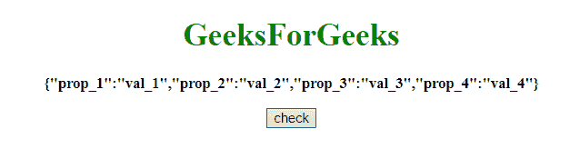
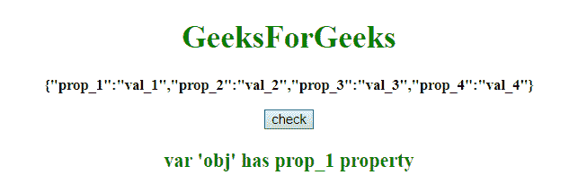
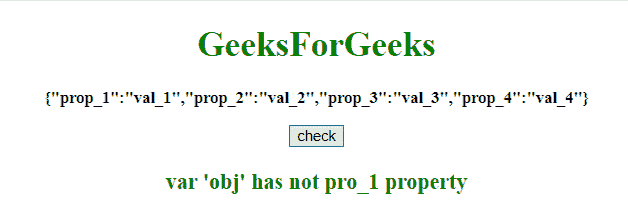

# JavaScript |检查 JSON 对象内部是否存在密钥

> 原文:[https://www . geesforgeks . org/JavaScript-check-if-a-key-exists-in-a-JSON-object/](https://www.geeksforgeeks.org/javascript-check-if-a-key-exists-inside-a-json-object/)

给定一个 JSON 对象，任务是使用 JavaScript 检查对象中是否存在一个键。我们将讨论几个方法。

*   **hasOwnProperty()**
    This method returns a boolean denoting whether the object has the defined property as its own property (as opposed to inheriting it).
    **Syntax:**

    ```
    obj.hasOwnProperty(prop)

    ```

    **参数:**

    *   **道具:**此参数为必填项。它指定要检查的属性的字符串名称或符号。

    **返回值:**
    返回一个布尔值，表示对象是否有指定的属性作为自己的属性。

**示例 1:** 本示例使用 **hasOwnProperty 属性**检查**对象**的**道具 _1** 。

```
<!DOCTYPE HTML>
<html>

<head>
    <title>
        JavaScript 
      | Check if a key exists inside a JSON object.
    </title>
</head>

<body style="text-align:center;" 
      id="body">
    <h1 style="color:green;">  
            GeeksForGeeks  
        </h1>
    <p id="GFG_UP" 
       style="font-size: 15px; 
              font-weight: bold;">
    </p>
    <button onclick="gfg_Run()">
        check
    </button>
    <p id="GFG_DOWN"
       style="color:green; 
              font-size: 20px;
              font-weight: bold;">
    </p>
    <script>
        var el_up = 
            document.getElementById("GFG_UP");
        var el_down =
            document.getElementById("GFG_DOWN");

        var obj = {
            prop_1: "val_1",
            prop_2: "val_2",
            prop_3: "val_3",
            prop_4: "val_4",
        };
        el_up.innerHTML = JSON.stringify(obj);

        function gfg_Run() {
            ans = "";
            var prop = 'prop_1';
            if (obj.hasOwnProperty(prop)) {
                ans = "var 'obj' has " + prop + " property";
            } else {
                ans = "var 'obj' has not " + prop + " property";
            }
            el_down.innerHTML = ans;
        }
    </script>
</body>

</html>
```

**输出:**

*   **点击按钮前:**
    
*   **点击按钮后:**
    

**示例 2:** 本示例通过简单的数组访问来检查**对象**的 **pro_1** 。

```
<!DOCTYPE HTML>
<html>

<head>
    <title>
        JavaScript 
      | Check if a key exists inside a JSON object.
    </title>
</head>

<body style="text-align:center;"
      id="body">
    <h1 style="color:green;">  
            GeeksForGeeks  
        </h1>
    <p id="GFG_UP" 
       style="font-size: 15px;
              font-weight: bold;">
    </p>
    <button onclick="gfg_Run()">
        check
    </button>
    <p id="GFG_DOWN"
       style="color:green;
              font-size: 20px;
              font-weight: bold;">
    </p>
    <script>
        var el_up = 
            document.getElementById("GFG_UP");
        var el_down = 
            document.getElementById("GFG_DOWN");
        var obj = {
            prop_1: "val_1",
            prop_2: "val_2",
            prop_3: "val_3",
            prop_4: "val_4",
        };
        el_up.innerHTML = 
          JSON.stringify(obj);

        function gfg_Run() {
            ans = "";
            var prop = 'pro_1';
            if (obj[prop]) {
                ans = "var 'obj' has " + prop + " property";
            } else {
                ans = "var 'obj' has not " + prop + " property";
            }
            el_down.innerHTML = ans;
        }
    </script>
</body>

</html>
```

**输出:**

*   **点击按钮前:**
    
*   **点击按钮后:**
    