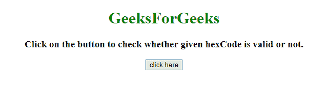
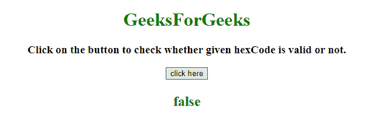
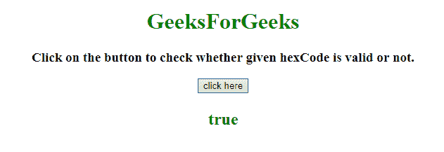

# JavaScript |检查字符串是否是有效的十六进制颜色表示

> 原文:[https://www . geesforgeks . org/JavaScript-check-if-a-string-valid-hex-color-presentation/](https://www.geeksforgeeks.org/javascript-check-if-a-string-is-a-valid-hex-color-representation/)

给定一个十六进制代码，任务是使用 JavaScript 知道给定的十六进制代码是否有效。我们将讨论一些技巧。

**进场:**

*   有效的十六进制代码包含字母(A-F)和整数(0-9)，长度为 3 或 6。
*   正则表达式用于检查字母的范围是从 0 到 9 的整数，长度是 3 还是 6。

**例 1:** 在本例中，通过正则表达式检查六进制代码的有效性。

```
<!DOCTYPE HTML>
<html>

<head>
    <title>
        JavaScript 
      | Check if a string is a valid hex color representation.
    </title>
</head>

<body style="text-align:center;" 
      id="body">
    <h1 style="color:green;">  
            GeeksForGeeks
        </h1>
    <p id="GFG_UP" 
       style="font-size: 19px;
              font-weight: bold;">
    </p>
    <button onclick="GFG_Fun()">
        click here
    </button>
    <p id="GFG_DOWN" 
       style="color: green;
              font-size: 24px;
              font-weight: bold;">
    </p>
    <script>
        var el_up = 
            document.getElementById("GFG_UP");
        var el_down = 
            document.getElementById("GFG_DOWN");
        var colorCode = '#zabbcc';
        el_up.innerHTML = "Click on the button to check whether '"
                          + colorCode + 
                          "' hexCode is valid or not.";

        var RegExp = /^#[0-9A-F]{6}$/i;

        function GFG_Fun() {
            el_down.innerHTML = RegExp.test(colorCode);
        }
    </script>
</body>

</html>
```

**输出:**

*   **点击按钮前:**
    
*   **点击按钮后:**
    

**示例 2:** 这个示例比前面的示例进行了更高级的检查。在这个例子中，也检查了六进制代码的有效性。

```
<!DOCTYPE HTML>
<html>

<head>
    <title>
        JavaScript |
      Check if a string is a valid hex color representation.
    </title>
</head>

<body style="text-align:center;"
      id="body">
    <h1 style="color:green;">  
            GeeksForGeeks
        </h1>
    <p id="GFG_UP" 
       style="font-size: 19px;
              font-weight: bold;">
    </p>
    <button onclick="GFG_Fun()">
        click here
    </button>
    <p id="GFG_DOWN" 
       style="color: green; 
              font-size: 24px; 
              font-weight: bold;">
    </p>
    <script>
        var el_up = 
            document.getElementById("GFG_UP");
        var el_down = 
            document.getElementById("GFG_DOWN");
        var colorCode = '#aabbcc';
        el_up.innerHTML = "Click on the button to check"+
          " whether given hexCode is valid or not.";
        var RegExp = /(^#[0-9A-F]{6}$)|(^#[0-9A-F]{3}$)/i;

        function GFG_Fun() {
            el_down.innerHTML = RegExp.test(colorCode);
        }
    </script>
</body>

</html>
```

**输出:**

*   **点击按钮前:**
    
*   **点击按钮后:**
    