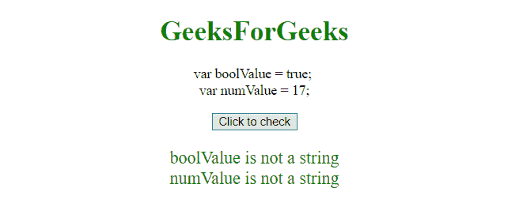
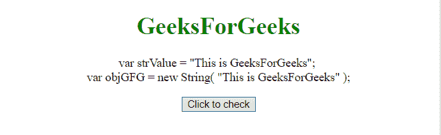
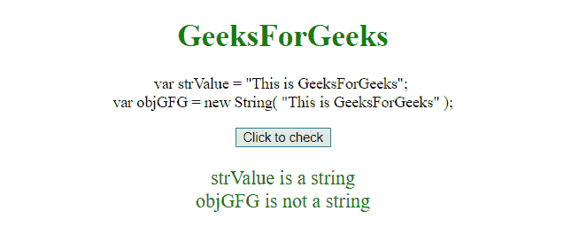

# JavaScript |检查变量是否为字符串

> 原文:[https://www . geesforgeks . org/JavaScript-check-if-a-variable-is-string/](https://www.geeksforgeeks.org/javascript-check-if-a-variable-is-a-string/)

使用运算符的**类型可以检查变量的类型。它直接应用于变量名或变量。**

**语法:**

```
typeof varName;

```

*   **varName:** 是变量的名称。

**示例-1:** 本示例检查变量**布尔值**和**数值**是否为字符串。

```
<!DOCTYPE html>
<html>

<head>
    <title>
        Javascript | Check if a variable is a string
    </title>
</head>

<body style="text-align:center;">

    <h1 style="color:green;">  
            GeeksForGeeks  
        </h1>
    <p>
        var boolValue = true;
        <br> var numValue = 17;
    </p>

    <button onclick="Geeks()">
        Click to check
    </button>
    <p id="GFG_P" style="color:green; font-size: 20px;">
    </p>
    <script>
        function Geeks() {

            <!-- "boolean" value. -->
            var boolValue = true;

            <!-- "integer " value. -->
            var numValue = 17;
            var el = 
                document.getElementById("GFG_P");
            var bool, num;

            if (typeof boolValue == "string") {
                bool = "is a string";
            } else {
                bool = "is not a string";
            }
            if (typeof numValue == "string") {
                num = "is a string";
            } else {
                num = "is not a string";
            }
            el.innerHTML = "boolValue " + bool 
            + "<br>numValue " + num;

        }
    </script>
</body>

</html>
```

**输出:**

*   **点击按钮前:**
    
*   **点击按钮后:**
    

**示例-2:** 本示例检查变量 **strValue** 和 **objGFG** 是否为字符串。

```
<!DOCTYPE html>
<html>

<head>
    <title>
        Javascript | Check if a variable is a string
    </title>
</head>

<body style="text-align:center;">

    <h1 style="color:green;">  
            GeeksForGeeks  
        </h1>
    <p>
        <!-- "String" value. -->
        var strValue = 
      "This is GeeksForGeeks";
        <br> 
      <!-- "Object" value. -->
      var objGFG = new String( 
      "This is GeeksForGeeks" );
    </p>

    <button onclick="Geeks()">
        Click to check
    </button>
    <p id="GFG_P" style="color:green; font-size: 20px;">
    </p>
    <script>
        function Geeks() {
            var strValue = "This is GeeksForGeeks";
            var objGFG = new String("This is GeeksForGeeks");
            var el = document.getElementById("GFG_P");
            var str, obj;
            if (typeof strValue == 'string') {
                str = "is a string";
            } else {
                str = "is not a string";
            }
            if (typeof objGFG == "string") {
                obj = "is a string";
            } else {
                obj = "is not a string";
            }
            el.innerHTML = "strValue " + str + "<br>objGFG " + obj;

        }
    </script>
</body>

</html>
```

**输出:**

*   **点击按钮前:**
    
*   **点击按钮后:**
    