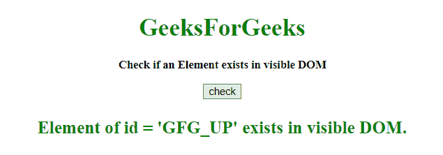
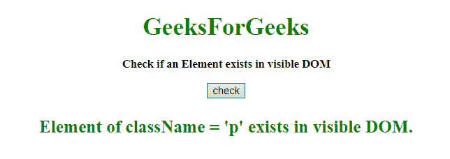

# JavaScript |检查可见 DOM 中是否存在元素

> 原文:[https://www . geesforgeks . org/JavaScript-check-if-element-exists-in-the-visible-DOM/](https://www.geeksforgeeks.org/javascript-check-if-element-exists-in-the-visible-dom/)

任务是找出一个元素是否存在于可见的 DOM 中。为此，我们使用了许多方法，但我们只看其中的几个。

**示例-1:** 在此示例中，元素通过**文档进行搜索。getElementById('Id')** 和**！！**用在选择器之前，得到布尔结果。

```
<!DOCTYPE HTML>
<html>

<head>
    <title>
        JavaScript 
      | Check if element exists in the visible DOM.
    </title>
</head>

<body style="text-align:center;"
      id="body">
    <h1 style="color:green;">  
            GeeksForGeeks  
        </h1>
    <p id="GFG_UP" 
       style="font-size: 15px;
              font-weight: bold;"> 
      Check if an Element exists in visible DOM
    </p>
    <button onclick="gfg_Run()">
        check
    </button>
    <p id="GFG_DOWN" 
       style="color:green; 
              font-size: 23px;
              font-weight: bold;">
    </p>
    <script>
        var el_down = 
            document.getElementById("GFG_DOWN");
        var id = 'GFG_UP';

        function gfg_Run() {
            var element =
                !!document.getElementById(id);
            var ans = '';
            if (element) {
                ans = "Element of id = '" + id + 
                  "' exists in visible DOM.";
            } else {
                ans = "Element of id = '" + id + 
                  "' not exists in visible DOM.";
            }
            el_down.innerHTML = ans;
        }
    </script>
</body>

</html>
```

**输出:**

*   **点击按钮前:**
    
*   **点击按钮后:**
    

**示例-2:** 在本例中，元素通过**document . getelementsbyclassname(' class name ')**进行搜索， **length 属性**用于检查变量是否包含结果。

```
<!DOCTYPE HTML>
<html>

<head>
    <title>
        JavaScript 
      | Check if element exists in the visible DOM.
    </title>
</head>

<body style="text-align:center;" 
      id="body">
    <h1 style="color:green;">  
            GeeksForGeeks  
        </h1>
    <p id="GFG_UP" 
       class="p" 
       style="font-size: 15px; 
              font-weight: bold;"> 
      Check if an Element exists in visible DOM
    </p>
    <button onclick="gfg_Run()">
        check
    </button>
    <p id="GFG_DOWN"
       class="p"
       style="color:green; 
              font-size: 23px;
              font-weight: bold;">
    </p>
    <script>
        var el_down = 
            document.getElementById("GFG_DOWN");
        var className = 'p';

        function gfg_Run() {
            var element = 
                document.getElementsByClassName(className);
            var ans = '';
            if (element.length > 0) {
                ans = "Element of className = '" + className +
                  "' exists in visible DOM.";
            } else {
                ans = "Element of className = '" + className +
                  "' not exists in visible DOM.";
            }
            el_down.innerHTML = ans;
        }
    </script>
</body>

</html>
```

**输出:**

*   **点击按钮前:**
    
*   **点击按钮后:**
    