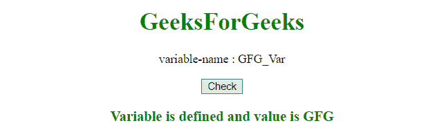

# JavaScript |检查变量的存在

> 原文:[https://www . geesforgeks . org/JavaScript-检查变量的存在/](https://www.geeksforgeeks.org/javascript-check-the-existence-of-variable/)

JavaScript 有一个内置函数来检查变量是定义/初始化的还是未定义的。
**注:**

*   运算符的**类型将检查是否定义了变量。**
*   当与未声明的变量一起使用时，运算符的**类型不会引发 ReferenceError 异常。**
*   空的**类型将返回一个对象。所以，也检查 null。**

**示例 1:** 本示例检查是否定义了变量。

## 超文本标记语言

```
<!DOCTYPE html>
<html>

<head>
    <title>
        JavaScript to check existence of variable
    </title>
</head>

<body style = "text-align:center;">

    <h1 style = "color:green;" >
        GeeksForGeeks
    </h1>

<p>
        variable-name : GFG_Var
    </p>

    <button onclick="myGeeks()">
        Check
    </button>

    <h3 id = "div" style="color:green;"></h3>

    <!-- Script to check existence of variable -->
    <script>
        function myGeeks() {

            var GFG_Var;
            var h3 = document.getElementById("div");

            if (typeof GFG_Var === 'undefined') {
                h3.innerHTML = "Variable is Undefined";
            }
            else {
                h3.innerHTML = "Variable is defined and"
                    + " value is " + GFG_Var;
            }
        }
    </script>
</body>

</html>                   
```

**输出:**

*   **点击按钮前:**


*   **点击按钮后:**


**示例 2:** 本示例还检查是否定义了变量。

## 超文本标记语言

```
<!DOCTYPE html>
<html>

<head>
    <title>
        JavaScript to check existence of variable
    </title>
</head>

<body style = "text-align:center;">

    <h1 style = "color:green;" >
        GeeksForGeeks
    </h1>

<p>
        variable-name : GFG_Var
    </p>

    <button onclick="myGeeks()">
        Check
    </button>

    <h3 id = "div" style="color:green;"></h3>

    <!-- Script to check existence of variable -->
    <script>
        function myGeeks() {

            var GFG_Var = "GFG";
            var h3 = document.getElementById("div");

            if (typeof GFG_Var === 'undefined') {
                h3.innerHTML = "Variable is Undefined";
            }
            else {
                h3.innerHTML = "Variable is defined and"
                    + " value is " + GFG_Var;
            }
        }
    </script>
</body>

</html>                   
```

**输出:**

*   **点击按钮前:**


*   **点击按钮后:**



**示例 3:** 前面的示例没有检查变量的空值。本示例还检查变量是否为空。

## 超文本标记语言

```
<!DOCTYPE html>
<html>

<head>
    <title>
        JavaScript to check existence of variable
    </title>
</head>

<body style = "text-align:center;">

    <h1 style = "color:green;" >
        GeeksForGeeks
    </h1>

<p>
        variable-name : GFG_Var
    </p>

    <button onclick="myGeeks()">
        Check
    </button>

    <h3 id = "div" style="color:green;"></h3>

    <!-- Script to check existence of variable -->
    <script>
        function myGeeks() {

            var GFG_Var = null;
            var h3 = document.getElementById("div");

            if (typeof GFG_Var === 'undefined' || GFG_Var === null ) {
                h3.innerHTML = "Variable is Undefined";
            }
            else {
                h3.innerHTML = "Variable is defined and value is "
                        + GFG_Var;
            }
        }
    </script>
</body>

</html>                   
```

**输出:**

*   **点击按钮前:**


*   **点击按钮后:**

