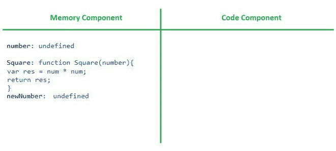
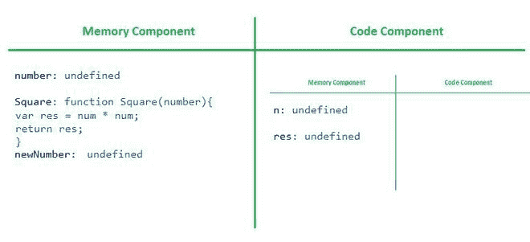
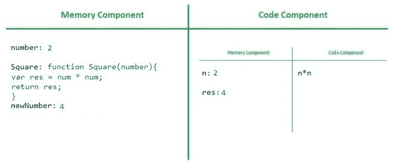

# JavaScript 代码执行

> 原文:[https://www.geeksforgeeks.org/javascript-code-execution/](https://www.geeksforgeeks.org/javascript-code-execution/)

JavaScript 是一种*同步*(仅当当前行的执行完成时才移动到下一行)和*单线程*(以特定的顺序一个接一个地串行执行一个命令)的语言。要了解 JavaScript 代码如何在内部执行的幕后，我们必须知道一个叫做**执行上下文**的东西，以及它在 JavaScript 代码执行中的角色。

**执行上下文:**JavaScript 中的一切都被包装在 Execution Context 内部，Execution Context 是一个抽象的概念(可以被当作一个容器)，保存着当前 JavaScript 代码正在其中执行的环境的全部信息。

现在，执行上下文有两个组件，JavaScript 代码分两个阶段执行。

*   **内存分配阶段:**在这个阶段，JavaScript 代码的所有函数和变量都作为键值对存储在执行上下文的内存组件中。对于函数，JavaScript 将整个函数复制到内存块中，但是对于变量，它将*未定义的*指定为占位符。
*   **代码执行阶段:**在这个阶段，JavaScript 代码在执行上下文的代码组件(也称为执行线程)中一次执行一行。

让我们通过一个例子来看看整个过程。

## java 描述语言

```
var number = 2;
function Square (n) {
    var res = n * n;
    return res;
}
var newNumber = Square(3);
```

在上面的 JavaScript 代码中，有两个名为 *number* 和 *newNumber* 的变量和一个名为 *Square* 的函数，该函数返回数字的平方。因此，当我们运行这个程序时，就创建了全局执行上下文。

因此，在内存分配阶段，内存将像这样分配给这些变量和函数。



全局执行上下文

在代码执行阶段，作为单线程语言的 JavaScript 再次逐行运行代码，并更新存储在内存组件的内存分配阶段的函数值和变量值。

因此在代码执行阶段，每当调用一个新函数时，就会创建一个新的执行上下文。因此，每次在代码组件中调用函数时，都会在前一个全局执行上下文中创建一个新的执行上下文。



全局执行上下文

同样，在新执行上下文的内存组件中完成内存分配之前。然后，在新创建的执行上下文的代码执行阶段，全局执行上下文将如下所示。



全局执行上下文

如我们所见，在逐行执行代码后，在内存组件中赋值，即 *number: 2，res: 4，newNumber: 4。*

在被调用函数的 *return* 语句之后，返回值被赋值来代替先前执行上下文的内存分配中的 undefined。返回值后，新的执行上下文(临时)将被完全删除。每当执行遇到 return 语句时，它会将控制返回到调用函数的执行上下文。


全局执行上下文

当我们再次调用函数时，在执行完第一个函数调用后，JavaScript 会再次创建另一个临时上下文，在其中相同的过程会相应地重复(内存执行和代码执行)。最后，全局执行上下文被删除，就像子执行上下文一样。该函数实例的整个执行上下文将被删除

**调用栈:**当一个程序开始执行时，JavaScript 将整个程序作为全局上下文推入一个名为**调用栈**的栈中，并继续执行。每当 JavaScript 执行一个新的上下文并遵循相同的过程并推进到堆栈时。当上下文结束时，JavaScript 会相应地弹出堆栈的顶部。


调用栈

当 JavaScript 完成整个代码的执行时，全局执行上下文被删除，并从调用堆栈中弹出，使调用堆栈为空。