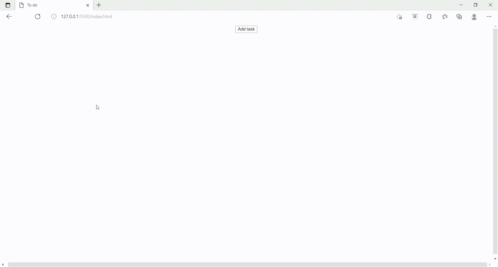

# 动态添加新元素的 JavaScript 代码

> 原文:[https://www . geesforgeks . org/JavaScript-动态添加新元素代码/](https://www.geeksforgeeks.org/javascript-code-for-adding-new-elements-in-a-dynamic-way/)

在学习浏览器如何工作时，Javascript 是一种非常重要的语言。我们经常希望在网页中添加动态元素/内容。这篇文章讨论了所有这些。

**新元素的创建:**可以使用 **createElement()** 方法在 JS 中创建新元素。

**语法:**

```html
document.createElement("<*tagName*>");  
// Where <*tagName*> can be any HTML 
// tagName like div, ul, button, etc.

// newDiv element has been created
For Eg: let newDiv = document.createElement("div");
```

创建好元素后，让我们继续设置新创建的元素的属性。

**设置创建元素的属性:**属性可以使用 **setAttribute()** 方法设置。

语法和示例如下:

```html
Element.setAttribute(*name*, *value*);
// Where Element is the name of web element. 
// Here, we have created newDiv.
// Where name is the attribute name and 
// value is the value that needs to be set

For Eg: newDiv.setAttribute("class","container");
```

**示例:**元素可以基于点击等事件来创建。下面是一个如何使用 onclick 事件动态创建元素的示例。这段代码可以进一步做成待办事项列表！

## 超文本标记语言

```html
<!DOCTYPE html>
<html lang="en">

<head>
    <meta charset="UTF-8">
    <meta http-equiv="X-UA-Compatible" content="IE=edge">
    <meta name="viewport" content=
        "width=device-width, initial-scale=1.0">

    <style>
        html,
        body {
            height: 100%;
            width: 100%;
        }

        .button {
            display: flex;
            align-items: center;
            justify-content: center;
        }

        .tasks {
            display: flex;
            justify-content: center;
            align-items: center;
            flex-direction: column;
            margin-top: 20px;
        }
    </style>
</head>

<body>
    <div class="button">
        <button id="addTask">Add task</button>
    </div>
    <div class="tasks"></div>
    <script type="text/javascript">

        // Getting the parent element in which
        // the new div will be created
        let task = document.getElementsByClassName("tasks");

        // Getting the addTask button element
        let addTask = document.getElementById("addTask");

        // Adding onclick event to the button
        addTask.addEventListener('click', function () {

            // Traversing through collection of HTML
            // elements (tasks here)
            for (let i = 0; i < task.length; i++) {

                // New div element is created  
                let newDiv = document.createElement("div");

                // Setting the attribute of class type to newDiv 
                newDiv.setAttribute("class", "list");

                // innerText used to write the text in newDiv 
                newDiv.innerText = "New Div created";

                // Finally append the newDiv to the
                // parent i.e. tasks   
                task[i].append(newDiv);
            }
        })
    </script>
</body>

</html>
```

**输出:**

