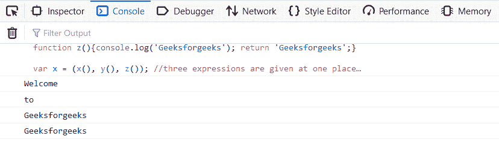
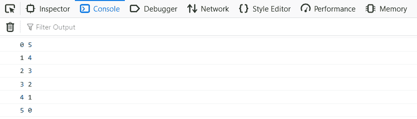

# JavaScript 逗号运算符

> 原文:[https://www.geeksforgeeks.org/javascript-comma-operator/](https://www.geeksforgeeks.org/javascript-comma-operator/)

下面是逗号运算符的示例。

*   **示例:**

    ```
    <script> 
        function x() { 
            document.write('one'+"</br>"); 
            return 'one'; 
        } 
        function y() { 
            document.write('two'+"</br>"); 
            return 'two'; 
        } 
        function z() { 
            document.write('three'+"</br>"); 
            return 'three'; 
        } 

        // Three expressions are 
        // given at one place 
        var x = (x(), y(), z()); 

        document.write(x); 
    </script> 
    ```

*   **输出:**

    ```
    one
    two
    three
    three
    ```

JavaScript 中的逗号运算符(，)的用法与 C、C++、Java 等许多编程语言中的用法相同。该运算符主要从左到右依次计算其操作数，并返回最右边操作数的值。逗号运算符在需要单个表达式的地方用作多个表达式的分隔符。当逗号运算符放在表达式中时，它会执行每个表达式并返回最右边的表达式。

**语法:**

```
Expression1, Expression2, Expression3, ....so on
```

在上面的语法中，使用逗号运算符分隔多个表达式。在执行过程中，将从左到右执行每个表达式，并返回最右边的表达式。

**示例:**

```
<script>
    function x() {
        document.write('Welcome');
        return 'Welcome';
    }
    function y() {
        document.write('to');
        return 'to';
    }
    function z() {
        document.write('Geeksforgeeks');
        return 'Geeksforgeeks';
    }

    // Three expressions are 
    // given at one place
    var x = (x(), y(), z());

    document.write(x);
</script>
```

**输出:**



在输出中，首先执行函数 x()，然后执行 y()，最后执行 z()。最后，逗号运算符返回最右边的表达式。

逗号运算符最有用的应用是在循环中。在循环中，它用于更新同一表达式中的多个变量。

**示例:**

```
<script> 
for (var a = 0, b =5; a <= 5; a++, b--) {
  document.write(a, b);
}
</script> 
```

**输出:**



**支持的浏览器:**

*   谷歌 Chrome
*   微软公司出品的 web 浏览器
*   火狐浏览器
*   苹果 Safari
*   歌剧