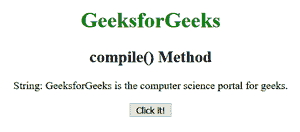
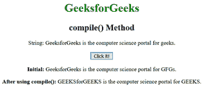

# JavaScript |编译()方法

> 原文:[https://www.geeksforgeeks.org/javascript-compile-method/](https://www.geeksforgeeks.org/javascript-compile-method/)

JavaScript 中的**编译()方法**用于在脚本执行时编译正则表达式，即编译正则表达式。它也用于重新编译和更改正则表达式。
**语法:**

```
RegExpObject.compile(RegExp, modifier)
```

其中**rexep**指正则表达式，**修饰符**用于指定匹配的类型。
**示例:**本示例更改初始字符串，然后使用 compile()方法再次更改。

## 超文本标记语言

```
<!DOCTYPE html>
<html>

<body style="text-align:center">
    <h1 style="color:green">
      GeeksforGeeks
  </h1>
    <h2>
      compile() Method
  </h2>

<p>
        String: GeeksforGeeks is the
      computer science portal for geeks.
    </p>

    <button onclick="geek()">
        Click it!
    </button>
    <p id="app"></p>

    <p id="app1"></p>

    <script>
        function geek() {
            var str =
                "GeeksforGeeks is the computer"
            + " science portal for geeks.";

            var patt = /geek/g;
            var str2 = str.replace(patt, "GFG");

            document.getElementById("app").innerHTML =
                " <b>Initial:</b> " + str2;

            patt = /(Geeks)/gi;
            patt.compile(patt);

            str2 = str.replace(patt, "GEEKS");
            document.getElementById("app1").innerHTML =
                " <b>After using compile():</b> " + str2;
        }
    </script>
</body>

</html>
```

**输出:**
**点击按钮前:**



**点击按钮后:**



**支持的浏览器:****JavaScript 编译()方法**支持的浏览器如下:

*   谷歌 Chrome

*   苹果 Safari

*   Mozilla Firefox

*   歌剧

*   互联网浏览器