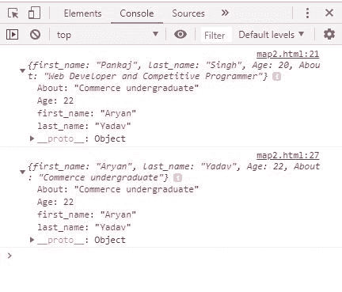

# JavaScript | Const

> 原文:[https://www.geeksforgeeks.org/javascript-const/](https://www.geeksforgeeks.org/javascript-const/)

ES2015 (ES6)引入了 const 关键字来定义一个新的变量。const 变量声明与其他声明的区别在于它不能被重新分配。

**属性:**

*   无法重新分配。
*   块范围
*   它可以在声明行的变量上赋值。
*   原始值。
*   一个常量对象的属性可以被改变，但是它不能被改变以引用新的对象
*   const 数组中的值可以更改，它可以向 const 数组中添加新项，但不能引用新数组。
*   允许在不同的块范围内重新声明常量变量。
*   无法提升。
*   创建对值的只读引用。

**示例 1:** 描述了常量变量不能被重新分配。

```
<script type="text/javascript">
    const x = 12;
    x = 13;
    x += 1;
</script>                    
```

**输出:**

```
Uncaught TypeError: Assignment to constant variable.

```

**示例 2:** 描述了包含块范围的常量变量。

```
<script type="text/javascript">
    const x = 22;
    {
        const x = 90;
        console.log(x);

        {
            const x = 77;
            console.log(x);
        }
        {
            const x = 45;
            console.log(x);
        }
    }
    console.log(x);
</script>
```

**输出:**

```
90
77
45
22

```

**例 3:** 描述了 const 变量，并在声明后赋值。

```
<script type="text/javascript">
    const x;
    x = 12;
</script>
```

**输出:**

```
Uncaught SyntaxError: Missing initializer in const declaration

```

**例 4:** 描述了常量变量不能被提升。

```
<script type="text/javascript">
    x = 3;
    console.log(x);
    const x;
</script>
```

**输出:**

```
Uncaught SyntaxError: Missing initializer in const declaration

```

**例 5:** 说明数组值只能修改，引用数组不能改变。

```
<script type="text/javascript">

    // Changing the content of array is
    // possible in cost array
    const arr1 = ["pankaj", "sumit", "chandan", "ajay"];

    console.log(arr1.toString());

    arr1[2] = "Narayan"; // possible

    console.log(arr1.toString());
</script>
```

**输出:**

```
pankaj, sumit, chandan, ajay
pankaj, sumit, Narayan, ajay

```

**例 6:** 描述了只能参照不能改变的对象修改对象属性。

```
<script type="text/javascript">

    const person = {
        first_name: "Pankaj",
        last_name: "Singh",
        Age: 20,
        About: "Web Developer and Competitive Programmer"
    };

    console.log(person);

    // It is possible
    person.first_name = "Aryan";
    person.last_name = "Yadav";
    person.Age = 22;
    person.About = "Commerce undergraduate";

    console.log(person);

    // it is not possible
    // const person={
    //     "first_name":"Aryan",
    //     "last_name":"Yadav",
    //     "Age":22,
    //     "About":"Commerce undergraduate"
    // }
</script>
```

**输出:**


**支持的浏览器:**

*   chrome 21 及以上
*   边缘 12 及以上
*   Firefox 36 及以上版本
*   Internet Explorer 11 及以上版本
*   歌剧 9 及以上
*   Safari 5.1 及以上版本