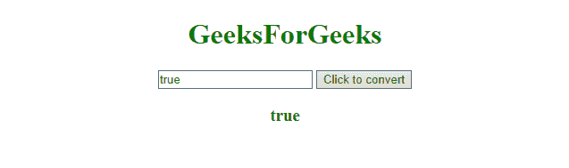

# JavaScript |将字符串转换为布尔值

> 原文:[https://www . geesforgeks . org/JavaScript-convert-a-string-to-boolean/](https://www.geeksforgeeks.org/javascript-convert-a-string-to-boolean/)

有时需要将代表布尔值**“真”、“假”**的字符串转换为 JavaScript 的固有类型。给定一个字符串，任务是将给定的字符串转换为它的布尔值。

**示例 1:** 本示例使用 **==** 运算符将字符串转换为其布尔值。

```
<!DOCTYPE html> 
<html> 

<head> 
    <title> 
        Convert string to boolean
    </title>
</head> 

<body style = "text-align:center;"> 

    <h1 style = "color:green;" > 
        GeeksForGeeks 
    </h1> 

    <input id = "input" type="text" name="input"/> 

    <button onclick="convertToBoolean()"> 
        Click to convert
    </button> 

    <h3 id = "div" style="color: green"></h3>

    <!-- Script to convert string to its
        boolean value -->    
    <script> 
        function convertToBoolean() {
            var input = document.getElementById("input");
            var x = document.getElementById("div");
            var str = input.value;
            x.innerHTML = str == 'true';
        }
    </script> 
</body> 

</html>                    
```

**输出:**

*   **之前点击按钮:**
    
*   **点击按钮后:**
    

**示例 2:** 本示例使用 **===** 运算符将字符串转换为其布尔值。

```
<!DOCTYPE html> 
<html> 

<head> 
    <title> 
        Convert string to boolean
    </title>
</head> 

<body style = "text-align:center;"> 

    <h1 style = "color:green;" > 
        GeeksForGeeks 
    </h1> 

    <input id = "input" type="text" name="input"/> 

    <button onclick="convertToBoolean()"> 
        Click to convert
    </button> 

    <h3 id = "div" style="color: green"></h3>

    <!-- Script to convert string to its
        boolean value -->
    <script> 
        function convertToBoolean() {
            var input = document.getElementById("input");
            var x = document.getElementById("div");
            var str = input.value;
            x.innerHTML = str === 'true';
        }
    </script> 
</body> 

</html>                    
```

**输出:**

*   **之前点击按钮:**
    
*   **点击按钮后:**
    