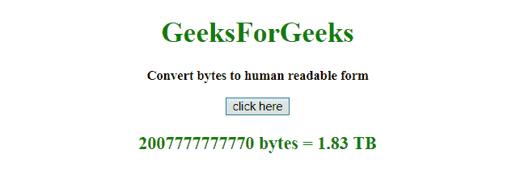
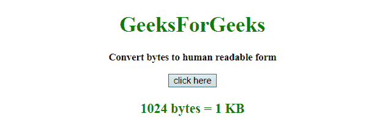

# JavaScript |将字节转换为人类可读的字符串

> 原文:[https://www . geesforgeks . org/JavaScript-convert-bytes-to-human-read-string/](https://www.geeksforgeeks.org/javascript-convert-bytes-to-human-readable-string/)

给定文件的大小(以字节为单位)，任务是使用 JavaScript 将其转换为人类可读的形式。这里讨论几个方法。

**示例 1:** 本示例将文件大小(以字节为单位)转换为人类可读的形式。它以十进制显示值，对于小于 1024 字节的值，它仍以字节为单位。

```
<!DOCTYPE HTML>
<html>

<head>
    <title>
        JavaScript 
      | Converting bytes to human-readable string.
    </title>
</head>

<body style="text-align:center;" 
      id="body">
    <h1 style="color:green;">  
            GeeksForGeeks  
        </h1>
    <p id="GFG_UP" 
       style="font-size: 15px;
              font-weight: bold;">
    </p>
    <button onclick="GFG_Fun()">
        click here
    </button>

    <p id="GFG_DOWN" 
       style="color:green; 
              font-size: 20px; 
              font-weight: bold;">
    </p>
    <script>
        var up = document.getElementById('GFG_UP');
        up.innerHTML = 'Convert bytes to human readable form';
        var down = document.getElementById('GFG_DOWN');
        size = function(bytes) {
            if (bytes == 0) {
                return "0.00 B";
            }
            var e = Math.floor(Math.log(bytes) / Math.log(1024));
            return (bytes / Math.pow(1024, e)).toFixed(2) +
              ' ' + ' KMGTP'.charAt(e) + 'B';
        }

        function GFG_Fun() {
            var bytes = 2007777777770;
            down.innerHTML = bytes + " bytes = " + size(bytes);
        }
    </script>
</body>

</html>
```

**输出:**

*   **点击按钮前:**
    
*   **点击按钮后:**
    

**示例 2:** 本示例将文件大小(以字节为单位)转换为人类可读的形式。它以十进制显示值，对于小于 1024 字节的值，它仍以字节为单位。但是，用不同的方法。

```
<!DOCTYPE HTML>
<html>

<head>
    <title>
        JavaScript 
      | Converting bytes to human-readable string.
    </title>
</head>

<body style="text-align:center;"
      id="body">
    <h1 style="color:green;">  
            GeeksForGeeks  
        </h1>
    <p id="GFG_UP"
       style="font-size: 15px;
              font-weight: bold;">
    </p>
    <button onclick="GFG_Fun()">
        click here
    </button>
    <p id="GFG_DOWN" 
       style="color:green; 
              font-size: 20px;
              font-weight: bold;">
    </p>
    <script>
        var up = document.getElementById('GFG_UP');
        up.innerHTML = 'Convert bytes to human readable form';
        var down = document.getElementById('GFG_DOWN');

        function getSize(size) {
            var sizes = [' Bytes', ' KB', ' MB', ' GB', 
                         ' TB', ' PB', ' EB', ' ZB', ' YB'];

            for (var i = 1; i < sizes.length; i++) {
                if (size < Math.pow(1024, i)) 
                  return (Math.round((size / Math.pow(
                    1024, i - 1)) * 100) / 100) + sizes[i - 1];
            }
            return size;
        }

        function GFG_Fun() {
            var bytes = 1024;
            down.innerHTML = bytes + " bytes = " + getSize(bytes);
        }
    </script>
</body>

</html>
```

**输出:**

*   **点击按钮前:**
    
*   **点击按钮后:**
    