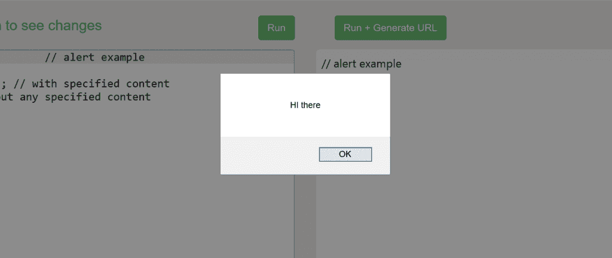
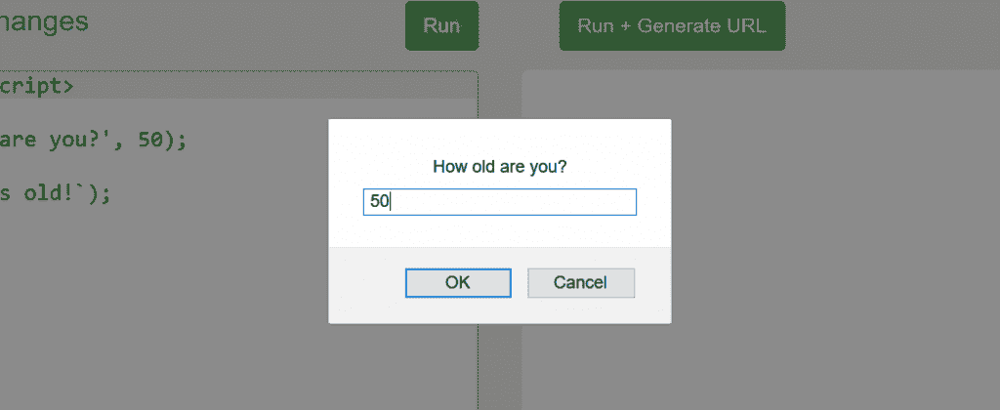
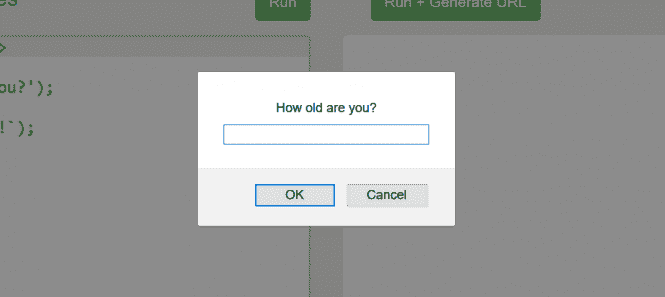
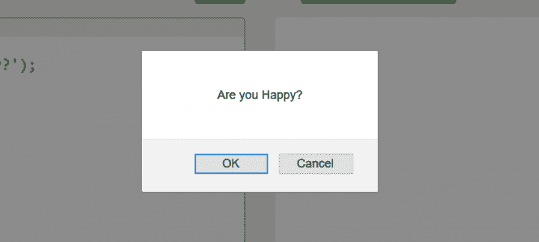

# JavaScript 课程|与用户的交互

> 原文:[https://www . geesforgeks . org/JavaScript-课程-与用户互动/](https://www.geeksforgeeks.org/javascript-course-interaction-with-user/)

**上一篇文章:** [JavaScript 课程|练习小测验-1](https://www.geeksforgeeks.org/javascript-course-quiz-1/)
Javascript 让我们拥有了与用户交互并做出相应响应的特权。它包括几个有助于交互的用户界面功能。让我们一个接一个地看一看。

*   **alert**
    simply creates an alert box which may or may not have specified content inside it, but it always comes with the ‘OK’ button. It simply shows a message and pauses the execution of the script until you press the ‘OK’ button. The mini-window that pops-up is called the ‘modal window’.

    ```
    alert('text');

    ```

    **示例:**

    ```
    // alert example
    <script>
     alert('HI there'); // with specified content
     alert(); // without any specified content
    </script>
    ```

    **输出:**
    
    可以用来调试，也可以简单的给用户弹出一些东西。

*   **prompt**
    Prompt is another user-interface function which normally contains two arguments.

    ```
    prompt('text', default value);

    ```

    文本基本上是您想要向用户显示的内容，默认值参数是可选的，尽管它在文本字段中充当占位符。这是最常用的界面，因为有了它，你可以要求用户输入一些东西，然后使用这些输入来构建一些东西。
    **例:(带默认参数)**

    ```
    <script>
    // prompt example
    let age = prompt('How old are you?', 50);

    alert(`You are ${age} years old!`); 
    </script>
    ```

    **输出:**
    
    你可以输入任何东西，它会打印出来，不一定是数字。如果没有默认值，您必须在文本字段中输入一些内容，否则它将只打印一个空格。
    **例:**

    ```
    <script>
    // prompt example
    let age = prompt('How old are you?');

    alert(`You are ${age} years old!`); 
    </script>
    ```

    **输出:**
    

*   **confirm**
    The confirm function basically outputs a modal window with a question and two button ‘OK’ and ‘CANCEL’.

    ```
    confirm('question');

    ```

    **示例:**

    ```
    <script>
    // confirm example 
    let isHappy  = confirm('Are you Happy?');
    alert(`You are ${isHappy}`); 
    </script>
    ```

    **输出:**
    
    分别根据点击“确定”按钮或“取消”按钮的选择打印真假。

**下一篇:** [JavaScript 教程| JavaScript 中的逻辑运算符](https://www.geeksforgeeks.org/javascript-course-logical-operators-in-javascript/)