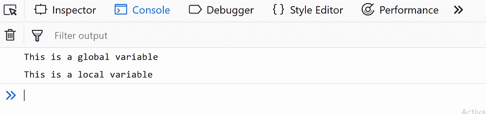
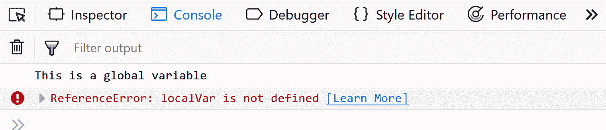

# JavaScript 课程| JavaScript 中的变量

> 原文:[https://www . geesforgeks . org/JavaScript-课程-javascript 中的变量/](https://www.geeksforgeeks.org/javascript-course-variables-in-javascript/)

**前题:** [JavaScript 教程|理解 JavaScript 中的代码结构](https://www.geeksforgeeks.org/javascript-course-understanding-code-structure-in-javascript/)

**JavaScript 中的变量:**

JavaScript 中的变量是保存可重用数据的容器。它是程序中的基本存储单元。

*   存储在变量中的值可以在程序执行过程中更改。
*   变量只是给一个内存位置起的名字，所有对变量的操作都会影响这个内存位置。
*   在 JavaScript 中，所有的变量都必须先声明，然后才能使用。

**在 ES2015** 之前，JavaScript 变量仅使用 *var* 关键字后跟变量名称和分号来声明。下面是用 JavaScript 创建变量的语法:

```
*var* var_name;
*var x;*
```

var_name 是变量的名称，应该由用户定义，并且应该是唯一的。这些类型的名称也被称为**标识符**。在 JavaScript 中创建标识符的规则是，标识符的名称不应是任何预定义的单词(称为关键字)，第一个字符必须是字母、下划线(_)或美元符号($)。后续字符可以是任何字母、数字、下划线或美元符号。
注意在上面的代码示例中，我们没有给变量赋值。我们只是说它们存在。如果您查看上述代码示例中每个变量的值，它将是*未定义的。*
我们可以在声明时初始化变量，也可以在以后想要使用它们时初始化。下面是一些在 JavaScript 中声明和初始化变量的例子:

```
// declaring single variable
var name;

// declaring multiple variables
var name, title, num;

// initializing variables
var name = "Harsh";
name = "Rakesh";
```

Javascript 也被称为**非类型化**语言。这意味着，一旦使用关键字 var 在 javascript 中创建了一个变量，我们就可以在 javascript 支持的变量中存储任何类型的值。下面是这个例子:

```
// creating variable to store a number
var num = 5;

// store string in the variable num
num = "GeeksforGeeks";
```

与其他编程语言不同，上面的示例在 JavaScript 中执行良好，没有任何错误。
JavaScript 中的变量也可以对简单的数学表达式求值并假设其值。

```
// storing a mathematical expression
var x = 5 + 10 + 1;
console.log(x); // 16
```

**在 ES2015** 之后，我们现在有了两个新的变量容器:let 和 const。现在我们将逐一研究这两个问题。变量类型**让**与 var 有许多相似之处，但与 var 不同的是，它有范围限制。要了解更多关于他们的信息，请访问 [let vs var](https://www.geeksforgeeks.org/difference-between-var-and-let-in-javascript/) 。让我们利用 Let 变量:

```
// let variable
let x; // undefined
let name = 'Mukul';

// can also declare multiple values
let a=1, b=2, c=3;

// assignment
let a = 3;
a = 4; // works same as var.
```

**常量**是分配给数据的另一个变量类型，其值不能也不会通过脚本改变。

```
// const variable
const name = 'Mukul';
name = 'Mayank'; // will give Assignment to constant variable error.
```

**Javascript 中的可变范围**

变量的作用域是程序中可以直接访问变量的部分。
在 JavaScript 中，有两种范围:

1.  **全局范围**–附加到窗口的最外层功能之外的范围。
2.  **本地范围**–正在执行的功能内部。

让我们看看下面的代码。我们在全局范围的第一行定义了一个全局变量。然后我们在 fun()函数中定义了一个局部变量。

## Java Script 语言

```
let globalVar = "This is a global variable";

function fun() {
  let localVar = "This is a local variable";

  console.log(globalVar);
  console.log(localVar);
}

fun();
```

**输出:**



当我们执行 fun()函数时，输出显示全局变量和局部变量都可以在函数内部访问，因为我们能够对它们进行控制台记录。这表明在函数内部，我们可以访问全局变量(在函数外部声明)和局部变量(在函数内部声明)。让我们将 console.log 语句移到函数之外，并在调用函数后立即放置它们。

## Java Script 语言

```
let globalVar = "This is a global variable";

function fun() {
  let localVar = "This is a local variable";
}

fun();

console.log(globalVar);
console.log(localVar);
```

**输出:**



我们仍然能够看到全局变量的值，但是对于局部变量 console.log 抛出了一个错误。这是因为现在 console.log 语句出现在全局范围内，它们可以访问全局变量，但不能访问局部变量。
同样，在函数中定义的任何与全局变量同名的变量优先于全局变量，隐藏它。要详细了解 Javascript 中的变量作用域，请参考[了解 JavaScript 中的变量作用域一文。](https://www.geeksforgeeks.org/understanding-variable-scopes-in-javascript/)
**下一个主题:** [JavaScript 课程| JavaScript 中的数据类型](https://www.geeksforgeeks.org/javascript-course-data-types-in-javascript/)