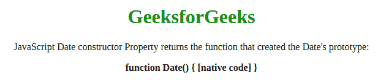
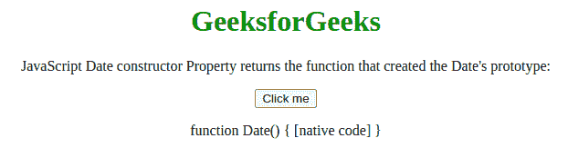

# JavaScript 日期构造器属性

> 原文:[https://www . geesforgeks . org/JavaScript-date-constructor-property/](https://www.geeksforgeeks.org/javascript-date-constructor-property/)

下面是**日期构造函数**属性的例子。

*   **示例:**

## Java Script 语言

```
<script type = "text/javascript">
    var date = new Date();
    document.write("Date.constructor:"
            + date.constructor);
</script>    
```

*   **输出:**

```
Date.constructor:function Date() { [native code] }
```

在 JavaScript 中，**日期构造函数属性**返回对象的构造函数。对于 JavaScript，日期构造器属性返回**函数日期(){[本机代码] }** 。
**语法:**

```
Date.constructor
```

**返回值:**返回函数 Date(){[本机代码] }。
上述属性的更多示例代码如下:
**示例 1:** 本示例使用构造函数属性并返回日期构造函数。

## 超文本标记语言

```
<!DOCTYPE html>
<html>

<head>
    <title>
        JavaScript Date constructor Property
    </title>
</head>

<body style="text-align:center;">

    <div>

        <h1 style="color: green;">GeeksforGeeks</h1>

<p>
            JavaScript Date constructor Property
            returns the function that created the
            Date's prototype:
        </p>

        <b id="GFG"></b>

    </div>

    <!-- Script to use date constructor -->
    <script>
        var dy = new Date();
        document.getElementById("GFG").innerHTML
                = dy.constructor;
    </script>
</body>

</html>                
```

**输出:**



**示例 2:** 本示例使用构造函数属性并返回日期构造函数。

## 超文本标记语言

```
<!DOCTYPE html>
<html>

<head>
    <title>
        JavaScript Date constructor Property
    </title>
</head>

<body style="text-align:center;">

    <div>

        <h1 style="color: green;">GeeksforGeeks</h1>

<p>
            JavaScript Date constructor Property
            returns the function that created
            the Date's prototype:
        </p>

        <button onclick="gfg()">Click me</button>
        <p id="GFG"></p>

    </div>

    <!-- Script to use Date constructor Property -->
    <script>
    function gfg(){
        var dy = new Date();
        document.getElementById("GFG").innerHTML
                = dy.constructor;
    }
    </script>
</body>

</html>    
```

**输出:**



**支持的浏览器:**JavaScript 日期构造器属性支持的浏览器如下:

*   谷歌 Chrome 1 及以上版本
*   边缘 12 及以上
*   Firefox 1 及以上版本
*   Internet Explorer 8 及更高版本
*   歌剧 3 及以上
*   Safari 1 及以上