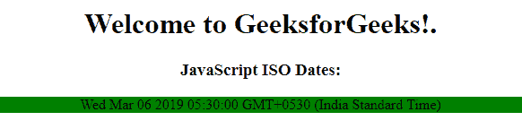
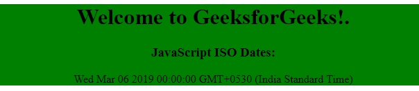
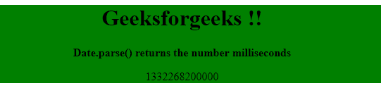

# JavaScript |日期格式

> 原文:[https://www.geeksforgeeks.org/javascript-date-formats/](https://www.geeksforgeeks.org/javascript-date-formats/)

**JavaScript 日期输入:**可以通过多种方式在 JavaScript 中格式化日期。

**格式:**

*   **ISO 日期**

    ```
    "2019-03-06" (The International Standard)
    ```

*   **短日期**T0】
*   **长日期**T0】

**示例 1:** 本示例使用 ISO 日期格式显示日期。

```
<!DOCTYPE html>
<html>
    <head>
        <title>Date format</title>
    </head>
    <body>
        <center>
            <div style="background-color: white;">
                <h1>Welcome to GeeksforGeeks!.</h1>
                <h3>JavaScript ISO Dates:</h3>
                <p id="name" style="background-color: green;"></p>
            </div>
        </center>
        <script>
            let dat = new Date("2015-03-25");
            document.getElementById("name").innerHTML = dat;
        </script>
    </body>
</html>                    
```

**输出:**


**JavaScript ISO 日期格式输出:**

*   **完成日期(日期(“2019-03-06”):**

    ```
    Wed Mar 06 2019 02:07:00 GMT+0530 (India Standard Time)
    ```

*   **年月(日期(“2019-03”):**

    ```
    Fri Mar 01 2019 02:07:00 GMT+0530 (India Standard Time)
    ```

*   **仅年份(日期(“2019”):**

    ```
    Tue Jan 01 2019 02:07:00 GMT+0530 (India Standard Time)
    ```

*   **仅年份(日期(“2019-03-06t 12:00:00Z”):**

    ```
    Wed Mar 06 2019 02:07:00 GMT+0530 (India Standard Time)
    ```

**JavaScript 短日期:**JavaScript 短日期采用 MM/DD/YYYY 格式编写。
**语法:**

```
"MM/DD/YYYY"
```

**JavaScript 长日期:**JavaScript 长日期采用 MMM DD YYYY 格式编写。
**语法:**

```
"MMM DD YYYY"
```

**示例 2:** 本示例使用短日期格式。

```
<!DOCTYPE html>
<html>
    <head>
        <title>Date format</title>
    </head>
    <body>
        <center>
            <div style="background-color: green;">
                <h1>Welcome to GeeksforGeeks!.</h1>
                <h3>JavaScript ISO Dates:</h3>
                <p id="name"></p>
            </div>
        </center>
        <script>
            var x = new Date("03/06/2019");
            document.getElementById("name").innerHTML = x;
        </script>
    </body>
</html>
```

**输出:**


**toTimeString()方法:**用于以英文返回给定日期对象的时间部分。日期对象是通过使用 date()构造函数创建的。此方法将中日期的时间部分转换为字符串。

**语法:**

```
var string_name = date_variable.toTimeString
```

**示例:**

```
<!DOCTYPE html>
<html>
    <body onload="myFunction()">
        <center>
        <div style="background-color: green;">
            <h1>Geeksforgeeks !!</h1>
            <p id="geek"></p>
        </div>
        <script>
            function myFunction() {
              let dt = new Date();
              let s = dt.toTimeString();
              document.getElementById("geek").innerHTML = s;
            }
        </script>
    </body>
</html>
```

**输出:**


**Date.parse()方法:**date . parse()函数用于帮助计算从 1970 年 1 月 1 日午夜到我们提供的日期之间的确切毫秒数。它以毫秒为单位转换给它的有效日期字符串。

**语法:**

```
var var_name = Date.parse(valid_date_string)
```

**示例:**

```
<!DOCTYPE html>
<html>
    <body>
        <center>
        <div style="background-color: green;">
            <h1>Geeksforgeeks !!</h1>
            <b>Date.parse() returns the number milliseconds</b>
            <p id="geek"></p>
        </div>
        <script>
            let msec = Date.parse("March 21, 2012");
            document.getElementById("geek").innerHTML = msec;
        </script>
    </body>
</html>
```

**输出:**
