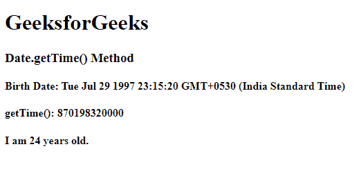

# JavaScript Date getTime()方法

> 原文:[https://www . geesforgeks . org/JavaScript-date-gettime-method/](https://www.geeksforgeeks.org/javascript-date-gettime-method/)

在本文中，我们将学习 Javascript 中的 getTime()方法，并通过示例了解它们的实现。

**date.getTime()方法**用于返回自 1970 年 1 月 1 日以来的毫秒数。创建新的日期对象时，它会存储创建时的日期和时间数据。当在这个日期对象上调用 getTime()方法时，它返回自 1970 年 1 月 1 日(Unix Epoch)以来的毫秒数。getTime()总是使用世界协调时来表示时间。

**语法:**

```
Date.getTime()
```

**参数:**此方法不接受任何参数。

**返回类型:**自 Unix Epoch 以来等于毫秒数的数值。

详情请参考 [JavaScript 获取日期方法](https://www.geeksforgeeks.org/javascript-get-date-methods/)一文。

**示例:**下面是 **Date getTime()** 方法的示例。

## java 描述语言

```
<script> 
   // Here a date has been assigned 
   // While creating Date object 
   var A = new Date('October 15, 1996 05:35:32'); 

  // Hour from above is being 
  // extracted using getTime() 
  var B = A.getTime(); 

  // Printing time in milliseconds. 
  document.write(B); 
</script>
```

**输出:**

```
845337932000
```

以上方法的更多示例如下:

**例 1:** 这里，月份的日期必须在 1 到 31 之间，因为没有日期可以有大于 31 的月份。这就是为什么如果 Date 对象中的月份大于 31，它会返回 NaN，即 Not Number。当月份日期为 33，即大于 31 时，小时数将不存在。

## java 描述语言

```
<script>

   // Creating a Date object 
   var A = new Date('October 35, 1996 12:35:32'); 
   var B = A.getTime();

   // Printing hour. 
   document.write(B); 
</script>
```

**输出:**

```
NaN
```

**例 2:** 这里，我们将通过提供用户的出生日期来计算用户的年龄。

## 超文本标记语言

```
<!DOCTYPE html>
<html lang="en">

<head>
    <meta charset="UTF-8">
    <meta name="viewport" content="width=device-width, 
                initial-scale=1.0">
    <meta http-equiv="X-UA-Compatible" content="ie=edge">
    <title>Document</title>
</head>

<body>
    <h1>GeeksforGeeks</h1>
    <h3>Date.getTime() Method</h3>
    <div>
        <h4>Birth Date:
            <span class="date"></span>
        </h4> </div>
    <div>
        <h4>getTime():
            <span class="time"></span>
        </h4> </div>
    <div>
        <h4>I am 
            <span class="years"></span> 
            years old.
        </h4>
</div>
    <script>
        var BD = new Date("July 29, 1997 23:15:20");
        var date = document.querySelector(".date");
        var time = document.querySelector(".time");
        var Today = new Date();
        var today = Today.getTime();
        var bd = BD.getTime();
        var year = 1000 * 60 * 60 * 24 * 365;
        var years = (today - bd) / year;
        date.innerHTML = BD;
        time.innerHTML = BD.getTime();
        var y = document.querySelector(".years");
        y.innerHTML = Math.round(years);
    </script>
</body>

</html>
```

**输出:**



date.getTime()方法

**支持的浏览器:**JavaScript Date getTime()方法支持的浏览器如下:

*   谷歌 Chrome 1.0
*   微软边缘 12.0
*   Firefox 1.0
*   Internet Explorer 4.0
*   Opera 3.0
*   Safari 1.0