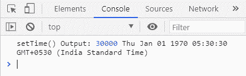
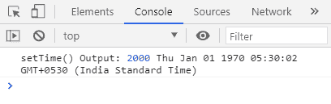

# JavaScript 日期设置时间()函数

> 原文:[https://www . geesforgeks . org/JavaScript-date-set time-function/](https://www.geeksforgeeks.org/javascript-date-settime-function/)

**setTime()** 函数是 Javascript 中的一个内置函数，用于通过给日期 01/01/1970 加上给定的毫秒来获取日期对象

**语法**:

```
date.setTime(milliseconds)
```

**参数** : setTime()函数取参数如下。

*   **毫秒**:添加到给定日期的毫秒数

**返回值:**setTime()函数返回您在参数中传递的毫秒数。

**例 1:**1970 年 1 月 1 日增加 30000 毫秒

## java 描述语言

```
<!DOCTYPE html>
<html lang="en">
<body>
    <script>
        // Initialization
        let date = new Date();

        // Execution
        let output = date.setTime(30000);

        // Display Output
        console.log(`setTime() Output:`, output, date);
    </script>
</body>
</html>
```

**输出:**



**例 2:**1970 年 1 月 1 日增加 2000 毫秒

## java 描述语言

```
<!DOCTYPE html>
<html lang="en">
<body>
    <script>
        // Initialization
        let date = new Date('6-29-2000 03:15:10:50');

        // Execution
        let output = date.setTime(2000);

        // Display Output
        console.log(`setTime() Output:`, output, date);
    </script>
</body>
</html>
```

**输出**:

