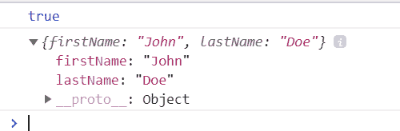
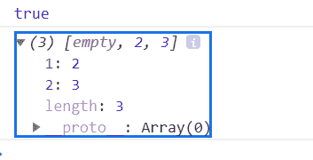

# JavaScript 删除操作符

> 原文:[https://www.geeksforgeeks.org/javascript-delete-operator/](https://www.geeksforgeeks.org/javascript-delete-operator/)

下面是删除运算符的示例。

*   **例:**

    ```
    <script> 
        let emp = { 
            firstName: "Raj", 
            lastName: "Kumar", 
            salary: 40000 
        } 

        console.log(delete emp.salary);
        console.log(emp);
    </script> 
    ```

*   **输出:**

    ```
    true
    {"firstName":"Raj","lastName":"Kumar"}
    ```

本文将讨论 JavaScript 中可用的删除操作符。在 JavaScript 中，Delete 是一个相对不太为人所知的操作符。该操作符更具体地用于删除 JavaScript 对象属性。

JavaScript **pop()、shift()** 或 **splice()** 方法可用于从数组中删除元素。但是由于对象中的键值对，删除更加复杂。请注意，delete 运算符仅适用于对象，而不适用于变量或函数。

**语法:**

```
delete object
// or
delete object.property
// or
delete object['property']
```

如果该运算符删除了一个属性，则返回 *true* 。删除一个不存在的对象属性会返回一个*真*，但不会影响对象。虽然试图删除一个变量或函数会返回一个*假*。

**示例:**假设一个名为*的对象，人*有三个键值对(即*名字、姓氏*和*电话*)。现在，使用*删除*操作符删除电话属性将返回*真*。

```
<script>
    let person = {
        firstName: "John",
        lastName: "Doe",
        phone: 12345
    }

    console.log(delete person.phone);
    console.log(person);
</script>
```

**输出:**


如上图所示，*删除 person.phone* 返回 *true* ，登录 *person* 对象表明 *phone* 属性已经不存在了。

让我们尝试应用 *delete* 运算符来删除一个变量和一个函数。

```
<script>
    let num = 5;
    let sum = (a, b) => {
        return a + b;
    }

    console.log(delete num); //false
    console.log(delete sum); //false
</script>
```

**输出:**

```
false
false
```

因为*删除*操作符对变量或函数不起作用，所以返回*假*，实际变量和函数保持不变。

另一件需要记住的事情是，这个操作符不删除属性值，而是删除属性本身。

**示例:**

```
<script>
    let person = {
        firstName: "John",
        lastName: "Doe",
        phone: 12345
    }

    let phone = person.phone;

    console.log(delete person.phone); //true
    console.log(phone); //12345
</script>
```

由于对象是引用类型，所以 person.phone 和 phone 变量将引用相同的内存地址。

**输出:**

```
true
12345
```

输出显示*删除*操作符已经删除了属性，但是该值仍然存在于内存中。

**异常:**可以使用*删除*操作符删除全局变量。因为全局变量是*窗口*对象的属性，当*删除*处理对象时，它会删除变量。

**示例:**

```
<script>
    toDelete = 5;

    // true
    console.log(delete toDelete);

    // toDelete is not defined
    console.log(toDelete);
</script>
```

不使用 *var，让*或 *const* 关键字将变量设置为全局变量，它将作为对象属性工作。

**输出:**

```
true
Uncaught ReferenceError: toDelete is not defined
```

删除*到删除*返回*真*，删除变量后试图访问该变量会抛出引用错误，因为该变量不再被定义。

**使用 delete 删除数组值:** JavaScript 数组毕竟是对象。所以，*删除*符即可使用。但是这会导致一个问题，因为从数组中删除元素后，这个操作符会将位置显示为空，并且不会更新数组长度。

**示例:**

```
<script>
    let arr = [1, 2, 3]

    console.log(delete arr[0]); //true
    console.log(arr); //[empty, 2, 3]
</script>
```

**输出:**


因此，使用 *pop()，shift()* 或 *splice()* 方法显然是删除数组元素的更好方法。

**结论:**开发者还有其他的方法，比如将对象属性的值设置为 *null* 或者 *undefined* 。但是该属性将仍然存在于对象上，并且一些像 *for in* 循环这样的操作符将仍然显示存在 *null* 或*未定义的*属性。

在循环中使用*删除*属性会显著降低程序速度。因此，只有在绝对有必要删除对象属性时，才应该使用此方法。