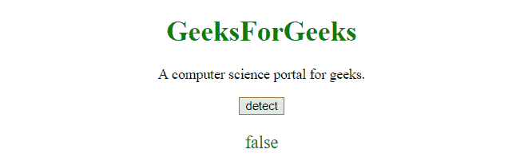

# JavaScript |检测移动浏览器

> 原文:[https://www . geesforgeks . org/JavaScript-detection-a-mobile-browser/](https://www.geeksforgeeks.org/javascript-detecting-a-mobile-browser/)

为了检测用户是否正在使用手机浏览器，我们有许多方法。
最优选的是它们中的少数。

**示例-1:** 本示例查看设备列表，并检查**用户代理**是否与任何设备匹配。

```
<!DOCTYPE html>
<html>

<head>
    <title>
        javaScript | Detecting a mobile browser
    </title>

</head>

<body style="text-align:center;">

    <h1 style="color:green;">  
            GeeksForGeeks  
        </h1>

    <button id="GFG_Button" 
            onclick="detec()">
      detect
  </button>
    <p id="GFG_P"
       style="color:green;
              font-size: 20px;">
    </p>
    <script>
        var a = '';
        var up = document.getElementById("GFG_P");

        function detec() {

            if (navigator.userAgent.match(/Android/i)
                || navigator.userAgent.match(/webOS/i)
                || navigator.userAgent.match(/iPhone/i) 
                || navigator.userAgent.match(/iPad/i) 
                || navigator.userAgent.match(/iPod/i)
                || navigator.userAgent.match(/BlackBerry/i)
                || navigator.userAgent.match(/Windows Phone/i)) {
                a = true;
            } else {
                a = false;
            }
            up.innerHTML = a;
        }
    </script>
</body>

</html>
```

**输出:**

*   **点击按钮前:**
    
*   **点击按钮后:**
    

**示例-2:** 使用**“窗口.方向”**

```
<!DOCTYPE html>
<html>

<head>
    <title>
        javaScript |
      Detecting a mobile browser
    </title>

</head>

<body style="text-align:center;">

    <h1 style="color:green;"> 
            GeeksForGeeks 
        </h1>

    <button id="GFG_Button" 
            onclick="detec()">
      detect
  </button>

    <p id="GFG_P" 
       style="color:green;
              font-size: 20px;">
    </p>
    <script>
        var a = '';
        var up = document.getElementById("GFG_P");

        function detec() {
            var isMobile = window.orientation > -1;
            alert(isMobile ? 'Mobile' : 'Not mobile');
        }
    </script>
</body>

</html>
```

**输出:**

*   **点击按钮前:**
    
*   **点击按钮后:**
    

**示例-3:** 本示例使用**正则表达式**来检查设备。如果是手机浏览器，返回 True。

```
<!DOCTYPE html>
<html>

<head>
    <title>
        javaScript | 
      Detecting a mobile browser
    </title>

</head>

<body style="text-align:center;">

    <h1 style="color:green;">  
            GeeksForGeeks  
        </h1>

    <button id="GFG_Button" 
            onclick="detec()">
      detect
  </button>
    <p id="GFG_P" 
       style="color:green; 
              font-size: 20px;">
    </p>
    <script>
        var a = '';
        var up = 
            document.getElementById(
              "GFG_P");

        function detec() {
            var ch = false;
            (function(a) {
                if (/(android|bb\d+|meego).+mobile|avantgo|bada\/|blackberry|blazer|compal|elaine|fennec|hiptop|iemobile|ip(hone|od)|iris|kindle|lge |maemo|midp|mmp|mobile.+firefox|netfront|opera m(ob|in)i|palm( os)?|phone|p(ixi|re)\/|plucker|pocket|psp|series(4|6)0|symbian|treo|up\.(browser|link)|vodafone|wap|windows ce|xda|xiino/i.test(a) || /1207|6310|6590|3gso|4thp|50[1-6]i|770s|802s|a wa|abac|ac(er|oo|s\-)|ai(ko|rn)|al(av|ca|co)|amoi|an(ex|ny|yw)|aptu|ar(ch|go)|as(te|us)|attw|au(di|\-m|r |s )|avan|be(ck|ll|nq)|bi(lb|rd)|bl(ac|az)|br(e|v)w|bumb|bw\-(n|u)|c55\/|capi|ccwa|cdm\-|cell|chtm|cldc|cmd\-|co(mp|nd)|craw|da(it|ll|ng)|dbte|dc\-s|devi|dica|dmob|do(c|p)o|ds(12|\-d)|el(49|ai)|em(l2|ul)|er(ic|k0)|esl8|ez([4-7]0|os|wa|ze)|fetc|fly(\-|_)|g1 u|g560|gene|gf\-5|g\-mo|go(\.w|od)|gr(ad|un)|haie|hcit|hd\-(m|p|t)|hei\-|hi(pt|ta)|hp( i|ip)|hs\-c|ht(c(\-| |_|a|g|p|s|t)|tp)|hu(aw|tc)|i\-(20|go|ma)|i230|iac( |\-|\/)|ibro|idea|ig01|ikom|im1k|inno|ipaq|iris|ja(t|v)a|jbro|jemu|jigs|kddi|keji|kgt( |\/)|klon|kpt |kwc\-|kyo(c|k)|le(no|xi)|lg( g|\/(k|l|u)|50|54|\-[a-w])|libw|lynx|m1\-w|m3ga|m50\/|ma(te|ui|xo)|mc(01|21|ca)|m\-cr|me(rc|ri)|mi(o8|oa|ts)|mmef|mo(01|02|bi|de|do|t(\-| |o|v)|zz)|mt(50|p1|v )|mwbp|mywa|n10[0-2]|n20[2-3]|n30(0|2)|n50(0|2|5)|n7(0(0|1)|10)|ne((c|m)\-|on|tf|wf|wg|wt)|nok(6|i)|nzph|o2im|op(ti|wv)|oran|owg1|p800|pan(a|d|t)|pdxg|pg(13|\-([1-8]|c))|phil|pire|pl(ay|uc)|pn\-2|po(ck|rt|se)|prox|psio|pt\-g|qa\-a|qc(07|12|21|32|60|\-[2-7]|i\-)|qtek|r380|r600|raks|rim9|ro(ve|zo)|s55\/|sa(ge|ma|mm|ms|ny|va)|sc(01|h\-|oo|p\-)|sdk\/|se(c(\-|0|1)|47|mc|nd|ri)|sgh\-|shar|sie(\-|m)|sk\-0|sl(45|id)|sm(al|ar|b3|it|t5)|so(ft|ny)|sp(01|h\-|v\-|v )|sy(01|mb)|t2(18|50)|t6(00|10|18)|ta(gt|lk)|tcl\-|tdg\-|tel(i|m)|tim\-|t\-mo|to(pl|sh)|ts(70|m\-|m3|m5)|tx\-9|up(\.b|g1|si)|utst|v400|v750|veri|vi(rg|te)|vk(40|5[0-3]|\-v)|vm40|voda|vulc|vx(52|53|60|61|70|80|81|83|85|98)|w3c(\-| )|webc|whit|wi(g |nc|nw)|wmlb|wonu|x700|yas\-|your|zeto|zte\-/i.test(a.substr(0, 4))) check = true;
            })(navigator.userAgent || navigator.vendor || window.opera);
            t = ch;
            up.innerHTML = t;
        }
    </script>
</body>

</html>
```

**输出:**

*   **点击按钮前:**
    
*   **点击按钮后:**
    