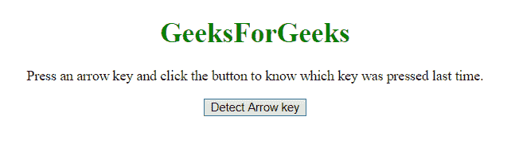
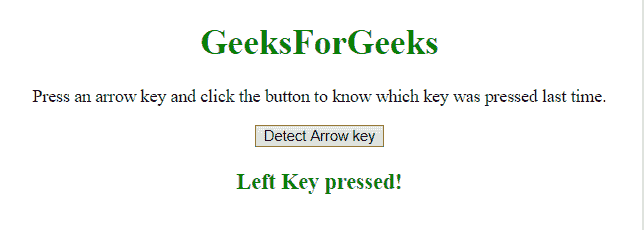
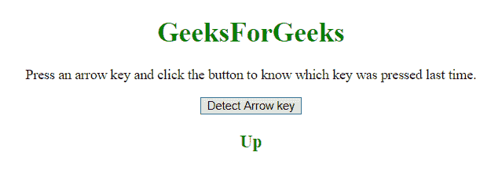

# JavaScript |检测按下的箭头键

> 原文:[https://www . geesforgeks . org/JavaScript-检测按下的箭头键/](https://www.geeksforgeeks.org/javascript-detecting-the-pressed-arrow-key/)

有时我们需要检测按键，有时甚至需要检测哪些按键被按下。为了检测哪个箭头键被按下，我们将看两个例子。

*   **onkeydown 事件:**
    当有人按下(键盘上的)某个键时，就会发生此事件。
    **语法:**
    *   **在 HTML 中:**

        ```
        <element onkeydown="newScript" >

        ```

    *   JavaScript 中的**:**

```
object.onkeydown = function(){newScript};

```

*   **在 JavaScript 中使用 addEventListener()方法:**

    ```
    object.addEventListener("keydown", newScript);

    ```

    *   **addEventListener() method:**
    This method attaches an event handler to the document.
    **Syntax:**

    ```
    document.addEventListener(event, function, captureBoolean)

    ```

    **参数:**

    *   **事件:**此参数为必填项。它以字符串格式指定事件的名称。
    *   **function:** This parameter is required. It specifies the function to run when the event happens.

        当事件发生时，事件对象作为第一个参数传递给函数。事件对象的类型取决于指定的事件。

    *   **采集布尔:**此参数为可选参数。它指定一个布尔值，该值指示事件应该在捕获阶段还是在冒泡阶段执行。默认值为 false，事件在冒泡阶段执行，对于 true，事件在捕获阶段执行。

**示例-1:** 本示例通过使用**事件.键码**通过**按下事件**来检测箭头键。

```
<!DOCTYPE html>
<html>

<head>
    <title>
        JavaScript
      | Detecting arrow key presses.
    </title>
</head>

<body style="text-align:center;" id="body">
    <h1 style="color:green;">  
            GeeksForGeeks  
        </h1>
    <p id="GFG_UP" style="font-size: 16px;">
        Press an arrow key and click the 
      button to know which key was pressed 
      last time.
    </p>
    <button onclick="gfg_Run()">
        Detect Arrow key
    </button>
    <p id="GFG_DOWN" 
       style="color:green; 
              font-size: 20px;
              font-weight: bold;">
    </p>
    <script>
        var el_up = document.getElementById("GFG_UP");
        var el_down = document.getElementById("GFG_DOWN");
        var str = 'No key pressed';

        function gfg_Run() {
            el_down.innerHTML = str;
        }
        document.onkeydown = function(e) {
            switch (e.keyCode) {
                case 37:
                    str = 'Left Key pressed!';
                    break;
                case 38:
                    str = 'Up Key pressed!';
                    break;
                case 39:
                    str = 'Right Key pressed!';
                    break;
                case 40:
                    str = 'Down Key pressed!';
                    break;
            }
        };
    </script>
</body>

</html>
```

**输出:**

*   **点击按钮前:**
    
*   **点击按钮后:**
    

**示例-2:** 本示例通过使用**事件.键**在正文中添加**事件侦听器(向下键)**来检测箭头键。

```
<!DOCTYPE html>
<html>

<head>
    <title>
        JavaScript |
      Detecting arrow key presses.
    </title>
</head>

<body style="text-align:center;" id="body">
    <h1 style="color:green;">  
            GeeksForGeeks  
        </h1>
    <p id="GFG_UP" style="font-size: 16px;">
        Press an arrow key and click the
      button to know which key was pressed
      last time.
    </p>
    <button onclick="gfg_Run()">
        Detect Arrow key
    </button>
    <p id="GFG_DOWN" 
       style="color:green;
              font-size: 20px;
              font-weight: bold;">
    </p>
    <script>
        var el_up = document.getElementById("GFG_UP");
        var el_down = document.getElementById("GFG_DOWN");
        var str = 'No key pressed';

        function gfg_Run() {
            el_down.innerHTML = str;
        }
        document.body.addEventListener('keydown', function(event)
                                       {
            const key = event.key;
            switch (key) {
                case "ArrowLeft":
                    str = 'Left';
                    break;
                case "ArrowRight":
                    str = 'Right';
                    break;
                case "ArrowUp":
                    str = 'Up';
                    break;
                case "ArrowDown":
                    str = 'Down';
                    break;
            }
        });
    </script>
</body>

</html>
```

**输出:**

*   **点击按钮前:**
    
*   **点击按钮后:**
    