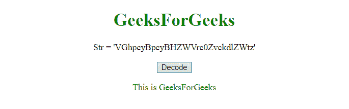
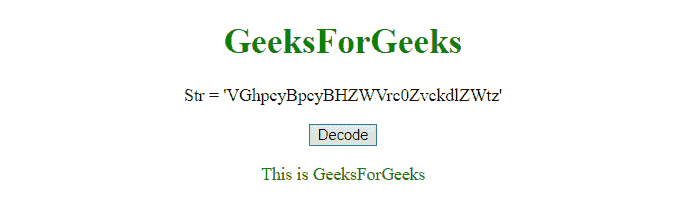

# JavaScript |将字符串编码/解码为 Base64。

> 原文:[https://www . geesforgeks . org/JavaScript-encode-decode-a-string-to-base64/](https://www.geeksforgeeks.org/javascript-encode-decode-a-string-to-base64/)

为了在 JavaScript 中编码/解码一个字符串，我们使用了 JavaScript 提供的内置函数。

**btoa():**
该方法以-64 为基数对字符串进行编码，并使用“a-z”、“A-Z”、“0-9”、“+”、“/”和“=”字符对提供的字符串进行编码。

*   **语法:**

    ```
    window.btoa(String)

    ```

*   **参数:**
    **字符串:**此参数为必选项。它指定要编码的字符串。

**atob():**
这个方法解码一个由 btoa()方法编码的 base-64 编码的字符串。

*   **语法:**

    ```
    window.atob(string)

    ```

*   **参数:**
    **字符串:**此参数为必选项。它指定已经由 btoa()方法编码的字符串。

以下是几个例子。
**示例-1:** 本示例通过 **btoa()** 函数对字符串**“这是 geeks forgeeks”**进行编码。

```
<!DOCTYPE html>
<html>

<head>
    <title>
        JavaScript | 
      encode/decode a string to Base64.
    </title>
</head>

<body style="text-align:center;">

    <h1 style="color:green;">  
            GeeksForGeeks  
        </h1>

    <p id="GFG_UP">
    </p>

    <button onclick="Geeks()">
        Encode
    </button>

    <p id="GFG_DOWN"
       style="color:green;">
    </p>

    <script>
        var str = "This is GeeksForGeeks";
        var up = document.getElementById("GFG_UP");
        var down = document.getElementById("GFG_DOWN");
        up.innerHTML = "Str = '" + str + "'";

        function Geeks() {
            down.innerHTML = window.btoa(str);
        }
    </script>
</body>

</html>
```

**输出:**

*   **点击按钮前:**
    
*   **点击按钮后:**
    

**示例-2:** 本示例借助 **atob()** 函数对由 **btoa()** 函数编码的字符串**【vghpcybcybhzwvrc 0 zvckdlzwtz】**进行解码。

```
<!DOCTYPE html>
<html>

<head>
    <title>
        JavaScript | encode/decode a string to Base64.
    </title>
</head>

<body style="text-align:center;">

    <h1 style="color:green;">  
            GeeksForGeeks  
        </h1>

    <p id="GFG_UP">
    </p>

    <button onclick="Geeks()">
        Decode
    </button>

    <p id="GFG_DOWN" style="color:green;">
    </p>

    <script>
        var str = "VGhpcyBpcyBHZWVrc0ZvckdlZWtz";
        var up = document.getElementById("GFG_UP");
        var down = document.getElementById("GFG_DOWN");
        up.innerHTML = "Str = '" + str + "'";

        function Geeks() {
            down.innerHTML = window.atob(str);
        }
    </script>
</body>

</html>
```

**输出:**

*   **点击按钮前:**
    
*   **点击按钮后:**
    

**跨浏览器方法**作为 **javascript 库**在任何浏览器中对字符串进行编码/解码。
**示例-3:** 本示例通过创建一个 **Base64** 对象来编码字符串**“这是 geeks forgeeks”**。

```
<!DOCTYPE html>
<html>

<head>
    <title>
        JavaScript | encode/decode a string to Base64.
    </title>
</head>

<body style="text-align:center;">

    <h1 style="color:green;">  
            GeeksForGeeks  
        </h1>

    <p id="GFG_UP">
    </p>

    <button onclick="Geeks()">
        Encode
    </button>

    <p id="GFG_DOWN" style="color:green;">
    </p>

    <script>
        var Base64 = {
            _keyStr: "ABCDEFGHIJKLMNOPQRSTUVWXYZ"+
          "abcdefghijklmnopqrstuvwxyz0123456789+/=",
            encode: function(e) {
                var t = "";
                var n, r, i, s, o, u, a;
                var f = 0;
                e = Base64._utf8_encode(e);
                while (f < e.length) {
                    n = e.charCodeAt(f++);
                    r = e.charCodeAt(f++);
                    i = e.charCodeAt(f++);
                    s = n >> 2;
                    o = (n & 3) << 4 | r >> 4;
                    u = (r & 15) << 2 | i >> 6;
                    a = i & 63;
                    if (isNaN(r)) {
                        u = a = 64
                    } else if (isNaN(i)) {
                        a = 64
                    }
                    t = t +
                      this._keyStr.charAt(s) +
                      this._keyStr.charAt(o) +
                      this._keyStr.charAt(u) +
                      this._keyStr.charAt(a)
                }
                return t
            },
            decode: function(e) {
                var t = "";
                var n, r, i;
                var s, o, u, a;
                var f = 0;
                e = e.replace(/[^A-Za-z0-9\+\/\=]/g, "");
                while (f < e.length) {
                    s = this._keyStr.indexOf(e.charAt(f++));
                    o = this._keyStr.indexOf(e.charAt(f++));
                    u = this._keyStr.indexOf(e.charAt(f++));
                    a = this._keyStr.indexOf(e.charAt(f++));
                    n = s << 2 | o >> 4;
                    r = (o & 15) << 4 | u >> 2;
                    i = (u & 3) << 6 | a;
                    t = t + String.fromCharCode(n);
                    if (u != 64) {
                        t = t + String.fromCharCode(r)
                    }
                    if (a != 64) {
                        t = t + String.fromCharCode(i)
                    }
                }
                t = Base64._utf8_decode(t);
                return t
            },
            _utf8_encode: function(e) {
                e = e.replace(/\r\n/g, "\n");
                var t = "";
                for (var n = 0; n < e.length; n++) {
                    var r = e.charCodeAt(n);
                    if (r < 128) {
                        t += String.fromCharCode(r)
                    } else if (r > 127 && r < 2048) {
                        t +=
                          String.fromCharCode(r >> 6 | 192);
                        t +=
                          String.fromCharCode(r & 63 | 128)
                    } else {
                        t +=
                          String.fromCharCode(r >> 12 | 224);
                        t +=
                          String.fromCharCode(r >> 6 & 63 | 128);
                        t +=
                          String.fromCharCode(r & 63 | 128)
                    }
                }
                return t
            },
            _utf8_decode: function(e) {
                var t = "";
                var n = 0;
                var r = c1 = c2 = 0;
                while (n < e.length) {
                    r = e.charCodeAt(n);
                    if (r < 128) {
                        t += String.fromCharCode(r);
                        n++
                    } else if (r > 191 && r < 224) {
                        c2 = e.charCodeAt(n + 1);
                        t += String.fromCharCode(
                          (r & 31) << 6 | c2 & 63);

                        n += 2
                    } else {
                        c2 = e.charCodeAt(n + 1);
                        c3 = e.charCodeAt(n + 2);
                        t += String.fromCharCode(
                          (r & 15) << 12 | (c2 & 63)
                          << 6 | c3 & 63);
                        n += 3
                    }
                }
                return t
            }
        }

        var str = "This is GeeksForGeeks";
        var up = document.getElementById("GFG_UP");
        var down = document.getElementById("GFG_DOWN");
        up.innerHTML = "Str = '" + str + "'";

        function Geeks() {
            down.innerHTML = Base64.encode(str);
        }
    </script>
</body>

</html>
```

**输出:**

*   **点击按钮前:**
    
*   **点击按钮后:**
    

**示例-4:** 本示例通过创建一个 **Base64** 对象来编码字符串**“vghpcybcybhzwvrc 0 zvckdlzwtz”**。

```
<!DOCTYPE html>
<html>

<head>
    <title>
        JavaScript | encode/decode a string to Base64.
    </title>
</head>

<body style="text-align:center;">

    <h1 style="color:green;">  
            GeeksForGeeks  
        </h1>

    <p id="GFG_UP">
    </p>

    <button onclick="Geeks()">
        Decode
    </button>

    <p id="GFG_DOWN" style="color:green;">
    </p>

    <script>
        var Base64 = {
            _keyStr: "ABCDEFGHIJKLMNOPQRSTUVWXYZabcdef"+
          "ghijklmnopqrstuvwxyz0123456789+/=",
            encode: function(e) {
                var t = "";
                var n, r, i, s, o, u, a;
                var f = 0;
                e = Base64._utf8_encode(e);
                while (f < e.length) {
                    n = e.charCodeAt(f++);
                    r = e.charCodeAt(f++);
                    i = e.charCodeAt(f++);
                    s = n >> 2;
                    o = (n & 3) << 4 | r >> 4;
                    u = (r & 15) << 2 | i >> 6;
                    a = i & 63;
                    if (isNaN(r)) {
                        u = a = 64
                    } else if (isNaN(i)) {
                        a = 64
                    }
                    t = t +
                      this._keyStr.charAt(s) + 
                      this._keyStr.charAt(o) +
                      this._keyStr.charAt(u) +
                      this._keyStr.charAt(a)
                }
                return t
            },
            decode: function(e) {
                var t = "";
                var n, r, i;
                var s, o, u, a;
                var f = 0;
                e = e.replace(/[^A-Za-z0-9\+\/\=]/g, "");
                while (f < e.length) {
                    s = this._keyStr.indexOf(e.charAt(f++));
                    o = this._keyStr.indexOf(e.charAt(f++));
                    u = this._keyStr.indexOf(e.charAt(f++));
                    a = this._keyStr.indexOf(e.charAt(f++));
                    n = s << 2 | o >> 4;
                    r = (o & 15) << 4 | u >> 2;
                    i = (u & 3) << 6 | a;
                    t = t + String.fromCharCode(n);
                    if (u != 64) {
                        t = t + String.fromCharCode(r)
                    }
                    if (a != 64) {
                        t = t + String.fromCharCode(i)
                    }
                }
                t = Base64._utf8_decode(t);
                return t
            },
            _utf8_encode: function(e) {
                e = e.replace(/\r\n/g, "\n");
                var t = "";
                for (var n = 0; n < e.length; n++) {
                    var r = e.charCodeAt(n);
                    if (r < 128) {
                        t += String.fromCharCode(r)
                    } else if (r > 127 && r < 2048) {
                        t += 
                          String.fromCharCode(r >> 6 | 192);
                        t += 
                          String.fromCharCode(r & 63 | 128)
                    } else {
                        t +=
                          String.fromCharCode(r >> 12 | 224);
                        t += 
                          String.fromCharCode(r >> 6 & 63 | 128);
                        t += 
                          String.fromCharCode(r & 63 | 128)
                    }
                }
                return t
            },
            _utf8_decode: function(e) {
                var t = "";
                var n = 0;
                var r = c1 = c2 = 0;
                while (n < e.length) {
                    r = e.charCodeAt(n);
                    if (r < 128) {
                        t += String.fromCharCode(r);
                        n++
                    } else if (r > 191 && r < 224) {
                        c2 = e.charCodeAt(n + 1);
                        t += 
                          String.fromCharCode(
                          (r & 31) << 6 | c2 & 63);
                        n += 2
                    } else {
                        c2 = e.charCodeAt(n + 1);
                        c3 = e.charCodeAt(n + 2);
                        t +=
                          String.fromCharCode(
                          (r & 15) << 12 | 
                          (c2 & 63) << 6 | c3 & 63);
                        n += 3
                    }
                }
                return t
            }
        }

        var str = "VGhpcyBpcyBHZWVrc0ZvckdlZWtz";
        var up = document.getElementById("GFG_UP");
        var down = document.getElementById("GFG_DOWN");
        up.innerHTML = "Str = '" + str + "'";

        function Geeks() {
            down.innerHTML = Base64.decode(str);
        }
    </script>
</body>

</html>
```

**输出:**

*   **点击按钮前:**
    
*   **点击按钮后:**
    