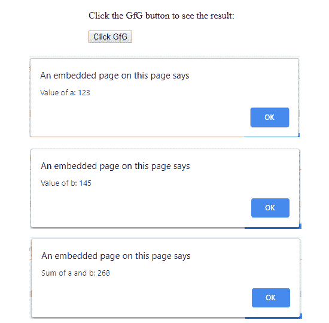
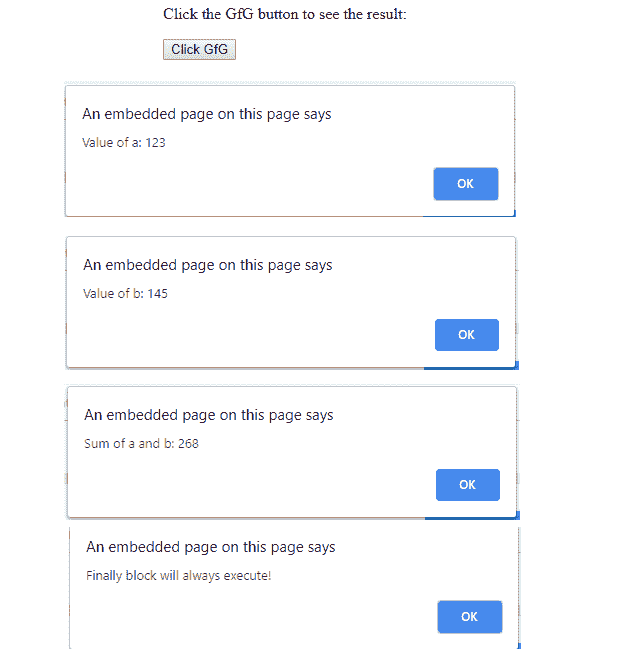

# Javascript |错误和异常处理示例

> 原文:[https://www . geeksforgeeks . org/JavaScript-错误和异常处理示例/](https://www.geeksforgeeks.org/javascript-error-and-exceptional-handling-with-examples/)

错误是不准确或不正确的行为。编程中有三种类型的错误，讨论如下:

*   语法错误
*   逻辑误差
*   运行时错误

**语法错误:**根据计算机科学，语法错误是打算用特定编程语言编写的字符或标记序列的语法错误，或者也是编译时错误。如果语法不正确，它将给出错误消息。

**示例:**

```
<script type="text/javascript">

      // Here the semicolon after the printing statement
      //  is missing and it is a syntax error
      window.print()  

</script>
```

由于 JavaScript 的语法不正确，它将只影响该 JavaScript 下的线程，其他线程中的其余代码将被执行，因为它们中没有任何内容依赖于包含错误的代码。

**逻辑错误:**这是最难追踪的错误，因为它是编码逻辑部分的错误，或者逻辑错误是程序中的一个错误，导致它运行不正确并异常终止(或崩溃)。

**运行时错误:**运行时错误是程序运行过程中发生的错误，也称为异常。在下面给出的例子中，语法是正确的，但是在运行时，它试图调用一个不存在的方法。

**示例:**

```
<script type="text/javascript">

      // An runtime error here 
      window.printme(); 

</script>
```

与运行时错误一样，也存在异常，这个异常在 try 和 catch 方法的帮助下是正确的

**try ___ catch 方法:** JavaScript 使用 try catch 和 finally 来处理异常，它还使用了 throw 运算符来处理异常。尝试运行主代码，在 catch 中，将与异常相关的所有内容都交给异常语句。

**语法:**

```
<script type="text/javascript">
   <!--
          try 
          {
            // Here the main Code run 
            [break;]
          } 

          catch ( exception e ) 
          {
             // The code will run when there is an exception 
             [break;]
         } 
   //-->
</script>
```

**例 1:**

```
<html>
    <head>
        <title>Error and Exception handling</title>
        <script type="text/javascript">
            function First() {
                var a = 123;
                var b = 145;
                var c = a + b;
                alert("Value of a: " + a );
                alert("Value of b: " + b );
                alert("Sum of a and b: " + c);
            }
        </script>
    </head>

    <body>
        <p>Click the GfG button to see the result:</p>

        <form>
            <input type="button" value="Click GfG" onclick="First();" />
        </form>

    </body>
</html>                    
```

**输出:**


在这个例子中，使用 finally 方法，它总是在 try/catch 之后无条件执行。

**例 2:**

```
<html>
    <head>
        <title>Error and Exception handling</title>
        <script type="text/javascript">
            function First() {
                var a = 123;
                var b = 145;
                var c = a + b;
                try {
                    alert("Value of a: " + a );
                    alert("Value of b: " + b );
                    alert("Sum of a and b: " + c);
                }
                catch ( e ) {
                    alert("Error: " + e.description );
                }
                finally {
                    alert("Finally block will always execute!" );
                }
            }
        </script>
    </head>

    <body>
        <p>Click the GfG button to see the result:</p>

        <form>
            <input type="button" value="Click GfG" onclick="First();" />
        </form>

    </body>
</html>                    
```

**输出:**
