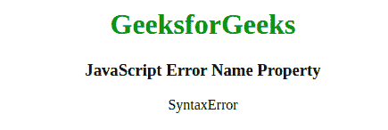
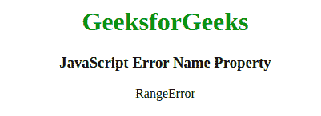
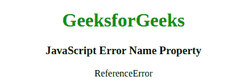
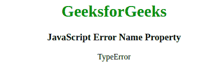

# JavaScript 错误名称属性

> 原文:[https://www . geesforgeks . org/JavaScript-error-name-property/](https://www.geeksforgeeks.org/javascript-error-name-property/)

以下是**错误名称属性的示例。**

*   **例:**

    ```
    <script>
        try {
                eval("alert('GeeksforGeeks)");
            } 
        catch (err) {
                document.write( err.name);
            }
    </script>
    ```

*   **输出:**

    ```
    SyntaxError
    ```

在 JavaScript 中，**错误名称属性**用于**设置**或**返回**错误的名称。

**语法:**

```
errorObj.name
```

**属性值:**该属性包含六个不同的值，如下所述:

*   **语法错误:**表示语法错误。
*   **范围误差:**表示范围内的误差。
*   **ReferenceError:** 表示非法引用。
*   **类型错误:**表示类型错误。
*   **EvalError:** 表示 eval()函数出现错误。
*   **URIError:** 它表示 encodeURI()中的一个错误。

**返回值:**返回一个字符串，代表错误的名称。

上述属性的更多示例代码如下:

**程序 1:** 本例显示语法错误。

```
<!DOCTYPE html>
<html>
    <body style="text-align: center;">
        <h1 style="color: green;">
            GeeksforGeeks
        </h1>

        <h3>
            JavaScript Error Name Property
        </h3>

        <p id="gfg"></p>

        <script>
            try {
                eval("alert('Geeks for Geeks)");
            } catch (err) {
                document.getElementById(
                  "gfg").innerHTML = err.name;
            }
        </script>
    </body>
</html>
```

**输出:**


**程序 2:** 本例显示范围误差。

```
<!DOCTYPE html>
<html>
    <body style="text-align: center;">
        <h1 style="color: green;">
            GeeksforGeeks
        </h1>

        <h3>
            JavaScript Error Name Property
        </h3>

        <p id="gfg"></p>

        <script>
            var num = 0;
            try {
                num.toPrecision(1000);
            } 
            catch (err) {
                document.getElementById(
              "gfg").innerHTML = err.name;
            }
    </script>
    </body>
</html>
```

**输出:**


**程序 3:** 本例显示参考误差。

```
<!DOCTYPE html>
<html>
    <body style="text-align: center;">
        <h1 style="color: green;">
            GeeksforGeeks
        </h1>

        <h3>
            JavaScript Error Name Property
        </h3>

        <p id="gfg"></p>

        <script>
            var y;
            try {
                y = x + y;
            } 
            catch (err) {
                document.getElementById(
                  "gfg").innerHTML = err.name;
            }
    </script>
    </body>
</html>
```

**输出:**


**程序 4:** 本例显示类型错误。

```
<!DOCTYPE html>
<html>
    <body style="text-align: center;">
        <h1 style="color: green;">
            GeeksforGeeks
        </h1>

        <h3>
            JavaScript Error Name Property
        </h3>

        <p id="gfg"></p>

        <script>
            var x = 1;
            try {
                x.toLowerCase();
            } catch (err) {
                document.getElementById(
                  "gfg").innerHTML = err.name;
            }
    </script>
    </body>
</html>
```

**输出:**


**浏览器支持:**T2 JavaScript 错误名称属性 y 支持的浏览器如下:

*   谷歌 Chrome
*   火狐浏览器
*   微软公司出品的 web 浏览器
*   歌剧
*   旅行队