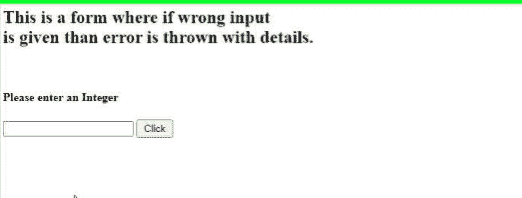
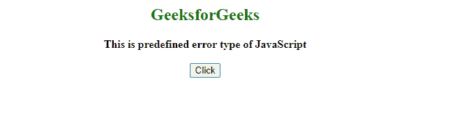
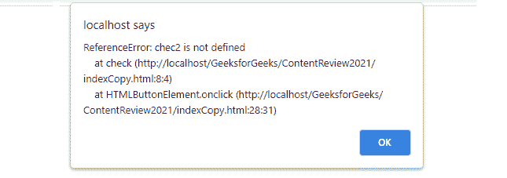

# JavaScript 错误.原型.堆栈属性

> 原文:[https://www . geesforgeks . org/JavaScript-error-prototype-stack-property/](https://www.geeksforgeeks.org/javascript-error-prototype-stack-property/)

为了处理执行过程中出现的任何错误，使用错误处理的[方法](https://www.geeksforgeeks.org/javascript-error-and-exceptional-handling-with-examples/)。

在这些方法中，出现错误的类型和原因是以确定的顺序给出的。堆栈结构用于存储这些序列。在 JavaScript 中，所有错误及其详细信息都存储在堆栈中，以及错误的来源和显示路径。

**Error.prototype.stack** 是 JavaScript 中 Error 类的一个属性，它代表一个非标准的堆栈，用来保存被调用函数的记录、顺序等等。

当发生错误时，这个堆栈的内容被打印为输出，使程序员能够向后跟踪函数调用，并找出错误的来源。它还告诉文件名和行号，由于某些特定的原因，错误发生在哪里。最好用于调试目的。

**示例 1:** 下面的代码创建了一个检查输入值是否为数字的函数。如果没有找到一个数字，它会抛出一个错误，其堆栈内容会打印在一个警告框中，如图所示。

通过跟踪堆栈来查找错误，从输出中可以清楚地看到，首先显示了发生错误的文件名，然后是该行以及错误发生的原因。我们还可以将此错误记录到我们的控制台中。

## 超文本标记语言

```
<!DOCTYPE html>
<html>

<head>
    <title>Error.prototype.stack</title>

    <script>
        function check() {
            var val = document.getElementById("inputID").value;
            try {
                if (isNaN(val)) throw new Error('Not a number!');
            }
            catch (e) {
                alert(e.stack);
            }
        }
    </script>
</head>

<body>
    <h2>
        This is a form where if wrong input is 
        given then error is thrown with details.
    </h2>

    <br />
    <h4> Please enter an integer:</h4>
    <input type="text" id="inputID">

    <button type="submit" value="Click" 
        onclick="check()" 
        style="width:50px;height:25px">
        Click
    </button>
    <br />
</body>

</html>
```

**输出:**



**例 2:** 我们正在尝试采用一种由系统而不是用户引发错误的方法。

我们可以看到 **Error.prototype.Stack** 对于所有类型的错误是如何工作的，不管它是否是用户定义的。我们还可以使用错误类的其他属性来研究更多关于它们的信息，它们的名称、消息等等。

## 超文本标记语言

```
<!DOCTYPE html>
<html>

<head>
    <title>Error.prototype.stack</title>

    <script>
        function check() {

            try {
                chec2();

                // Calling a wrong function name by mistake
                // it will raise error in runtime
            }
            catch (e) {
                alert(e.stack);

            }
        }
        function check2() {
            alert("Correct Function called");
        }
    </script>
</head>

<body>
    <center>
        <h2 style="color:green">GeeksforGeeks</h2>

        <b>This is predefined error type of JavaScript</b>
        <br /><br />
        <button onclick="check()">Click</button><br />
        <div id="errorResult"></div>
    </center>
</body>

</html>
```

**输出:**

*   **点击按钮前:**



*   **点击按钮后:**

