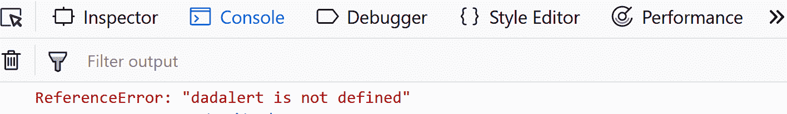
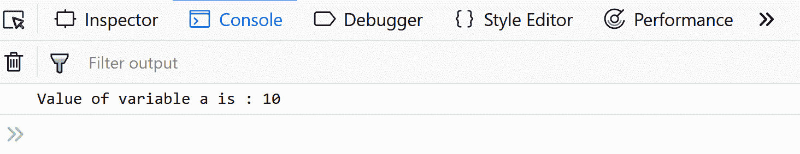
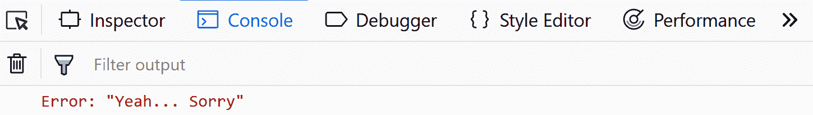
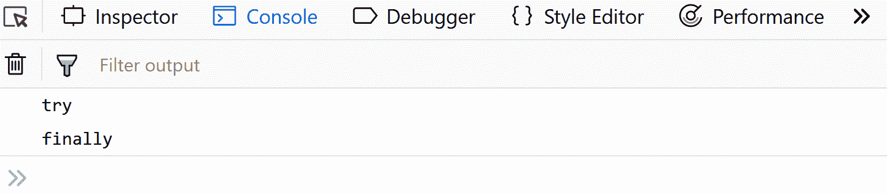

# JavaScript |错误–抛出并尝试捕捉

> 原文:[https://www . geesforgeks . org/JavaScript-错误-抛出并尝试捕获/](https://www.geeksforgeeks.org/javascript-errors-throw-and-try-to-catch/)

当执行 JavaScript 代码时，错误肯定会发生。这些错误可能是由于程序员方面的错误或者输入错误，或者即使程序的逻辑有问题。但是所有的错误都是可以解决的，为此，我们使用了下面将要解释的五个语句。

> **try** 语句允许您测试一段代码来检查错误。
> 
> 如果存在任何错误，可以使用 **catch** 语句来处理错误。
> 
> **throw** 语句让你自己犯错误。
> 
> 最后**语句让您在尝试和捕获之后执行代码。
> 不管试接球拦网的结果如何，最后一个拦网都会跑。**

 ****简单错误示例:****

```
try {
  dadalert("Welcome Fellow Geek!");
}
catch(err) {
  console.log(err);
}
```

**在上面的代码中，我们使用了“dadalert ”,这不是一个保留的关键字，也没有定义，因此我们得到了错误。
**输出:**
**

****另一个例子:****

```
function geekFunc() {
   let a = 10;
   try {
      alert("Value of variable a is : " + a );
   } 
   catch ( e ) {
      alert("Error: " + e.description );
   }
}
geekFunc();
```

**在上面的代码中，我们的 catch 块将不会运行，因为上面的代码中没有错误，因此我们得到了输出“变量 a 的值是:10”。
**输出:**

**试捕封锁:****

****try** 语句允许您检查特定代码块是否包含错误。**

**如果在 try 块中发现任何错误， **catch** 语句允许您显示错误。**

```
try {
 Try Block to check for errors.
}
catch(err) {
  Catch Block to display errors.
} 
```

****示例:****

```
try {
  dadalert("Welcome Fellow Geek!");
}
catch(err) {
  console.log(err);
}
```

****输出:**
**

****Javascript 抛出区块**
**抛出语句**。
当出现任何错误时，JavaScript 将停止并生成错误消息。throw 语句允许您创建自己的自定义错误。从技术上讲，您可以抛出您的自定义异常(抛出一个错误)。例外
可以是 JavaScript 数字、字符串、布尔值或对象。通过使用 throw 和 try and catch，您
可以轻松控制程序流并生成自定义错误消息。**

****示例:****

```
try {
    throw new Error('Yeah... Sorry');
}
catch(e) {
    console.log(e);
}
```

****输出:**

 **finally Block**
finally 语句在 try/catch block 执行后无条件运行。它的语法是**

```
 try {
 Try Block to check for errors.
}
catch(err) {
  Catch Block to display errors.
} 
finally {
  Finally Block executes regardless of the try / catch result.
} 
```

****示例:****

```
try {
  alert( 'try' );
} catch (e) {
  alert( 'catch' );
} finally {
  alert( 'finally' );
}             
```

****输出:**

**Finally Block 还可以覆盖 catch block 的消息，所以使用时要小心。****