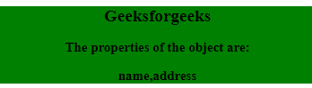

# JavaScript ES5 对象方法

> 原文:[https://www . geesforgeks . org/JavaScript-es5-object-methods/](https://www.geeksforgeeks.org/javascript-es5-object-methods/)

javascript 中的 **ES5 Object 方法**用来寻找更多与对象交互的方法。
ES5 对象方法可以做到:

*   防止枚举
*   操纵
*   删除
*   防止添加新功能
*   吸气剂和沉降剂

**语法:**

```
Object.defineProperty(object, property, {value : value})
```

**以下元数据值可以是真或假:**

*   可写的
*   可列举的
*   可配置的

**获取所有属性的示例:**

```
<!DOCTYPE html>
<html>

<body>
    <div style="background-color: green;">
        <center>
            <h2>Geeksforgeeks</h2>
            <h3>The properties of the object are:</h3>

            <h3 id="demo"></h3>
        </center>
    </div>

    <script>
        var person = {
            name: "xyz",
            address: "noida",
            language: "hindi"
        }
        // Change Property
        Object.defineProperty(person, 
            "language", { enumerable: false });

        document.getElementById("demo").innerHTML
            = Object.getOwnPropertyNames(person);
    </script>
</body>

</html>
```


**获取可枚举属性的示例:**

```
<!DOCTYPE html>
<html>

<body>
    <div style="background-color: green;">
        <center>
            <h2>Geeksforgeeks</h2>
            <h3>The properties of the object are:</h3>

            <h3 id="demo"></h3>
        </center>
    </div>

    <script type="text/javascript">
        var person = {
            name: "xyz",
            address: "noida",
            language: "hindi"
        }

        // Change Property
        Object.defineProperty(person, 
            "language", { enumerable: false });

        document.getElementById("demo")
            .innerHTML = Object.keys(person);
    </script>
</body>

</html>
```



**添加属性的示例:**

```
<!DOCTYPE html>
<html>

<body>
    <div style="background-color: green;">
        <center>
            <h2>Geeksforgeeks</h2>
            <h3>
                The mobno property is added and 
                the value of that property is:
            </h3>

            <h3 id="demo"></h3>
        </center>
    </div>

    <script>
        var person = {
            name: "xyz",
            address: "noida",
            language: "hindi"
        }

        Object.defineProperty(person, 
            "mobno", { value: "979889xxxx" });

        // Display Properties
        document.getElementById("demo")
            .innerHTML = person.mobno;
    </script>
</body>

</html>
```

