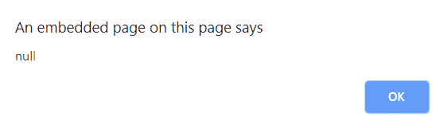

# JavaScript | exec()方法

> 原文:[https://www.geeksforgeeks.org/javascript-exec-method/](https://www.geeksforgeeks.org/javascript-exec-method/)

JavaScript 中的 **exec()方法**用于测试字符串中的匹配。如果匹配，这个方法返回第一个匹配，否则返回空值。
**语法:**

```
RegExpObject.exec(str)
```

其中**字符串**是要搜索的字符串。这是必填字段。
**示例-1:** 本示例在原始字符串中搜索字符串**【计算机】**。

## 超文本标记语言

```
<!DOCTYPE html>
<html>

<body style="text-align:center">
    <h1 style="color:green">
      GeeksforGeeks
  </h1>
    <h2>exec() Method</h2>

<p>
      String: GeeksforGeeks is the
      computer science portal for geeks.
  </p>

    <button onclick="geek()">
      Click it!
  </button>
    <p id="app"></p>

    <script>
        function geek() {
            var str =
                "GeeksforGeeks is the "+
                "computer science portal for geeks.";

            var regex = new RegExp("computer", );
            // match "computer" in string.                      
            var rex = regex.exec(str);
            document.getElementById("app").innerHTML =
                " Found " + rex.length + " match: " + rex;
        }
    </script>
</body>

</html>
```

**输出:**
**点击按钮前:**


**点击按钮后:**


**示例-2:** 本示例在原始字符串中搜索字符串**“rep”**。

## 超文本标记语言

```
<!DOCTYPE html>
<html>

<body style="text-align:center">
    <h1 style="color:green">
      GeeksforGeeks
  </h1>
    <h2>
      exec() Method
  </h2>

<p>
      String: GeeksforGeeks
      is the computer science
      portal for geeks.
  </p>

    <button onclick="geek()">
      Click it!
  </button>
    <p id="app"></p>

    <script>
        function geek() {
            var str =
                "GeeksforGeeks is the"+
                " computer science "+
                "portal for geeks.";
            var regex = new RegExp("rep");

            // Match "rep" in string.
            var rex = regex.exec(str);
            alert(rex);
        }
    </script>
</body>

</html>
```

**输出:**
**点击按钮前:**


**点击按钮后:**



**支持的浏览器:**JavaScript exec()方法支持的浏览器如下:

*   谷歌 Chrome
*   苹果 Safari
*   Mozilla Firefox
*   歌剧
*   微软公司出品的 web 浏览器