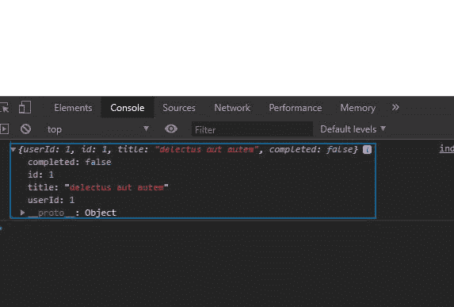
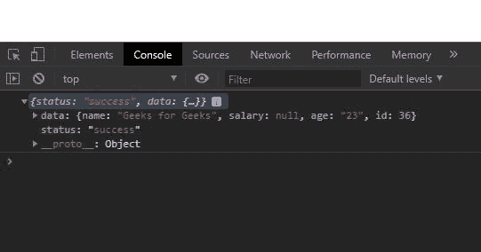

# JavaScript | fetch()方法

> 原文:[https://www.geeksforgeeks.org/javascript-fetch-method/](https://www.geeksforgeeks.org/javascript-fetch-method/)

JavaScript 中的 **fetch()** 方法用于向服务器请求并加载网页中的信息。该请求可以是任何以 JSON 或 XML 格式返回数据的应用编程接口。这个方法返回一个承诺。

**语法:**

```
fetch( url, options )

```

**参数:**该方法接受两个参数，如上所述，如下所述:

*   **URL:** 是请求要发往的 URL。
*   **选项:**是属性的数组。这是一个**可选的**参数。

**返回值:**无论是否解决，都返回一个承诺。返回数据的格式可以是 JSON 或 XML。
它可以是物体的阵列，也可以是单一物体。

**例 1:**

**注意:**如果没有选项，提取将始终作为获取请求。

## 超文本标记语言

```
<!DOCTYPE html>
<html lang="en">

<head>
    <meta charset="UTF-8">
    <meta name="viewport" content=
    "width=device-width, initial-scale=1.0">

    <title>JavaScript | fetch() Method</title>
</head>

<body>
    <script>

        // API for get requests
        let fetchRes = fetch(
"https://jsonplaceholder.typicode.com/todos/1");

        // fetchRes is the promise to resolve
        // it by using.then() method
        fetchRes.then(res =>
            res.json()).then(d => {
                console.log(d)
            })
    </script>
</body>

</html>
```

**输出:**



**使用提取发出发布请求:**通过提供如下选项，可以使用提取发出发布请求:

```
let options = {
  method: 'POST',
  headers: {
    'Content-Type': 'application/json;charset=utf-8'
  },
  body: JSON.stringify(data)
}

```

**例:2**

## 超文本标记语言

```
<!DOCTYPE html>
<html lang="en">

<head>
    <meta charset="UTF-8">
    <meta name="viewport" content=
        "width=device-width, initial-scale=1.0">

    <title>JavaScript | fetch() Method</title>
</head>

<body>
    <script>
        user = { 
            "name": "Geeks for Geeks", 
            "age": "23" 
        }

        // Options to be given as parameter 
        // in fetch for making requests
        // other then GET
        let options = {
            method: 'POST',
            headers: {
                'Content-Type': 
                    'application/json;charset=utf-8'
            },
            body: JSON.stringify(user)
        }

        // Fake api for making post requests
        let fetchRes = fetch(
"http://dummy.restapiexample.com/api/v1/create", 
                                        options);
        fetchRes.then(res =>
            res.json()).then(d => {
                console.log(d)
            })
    </script>
</body>

</html>
```

输出:

