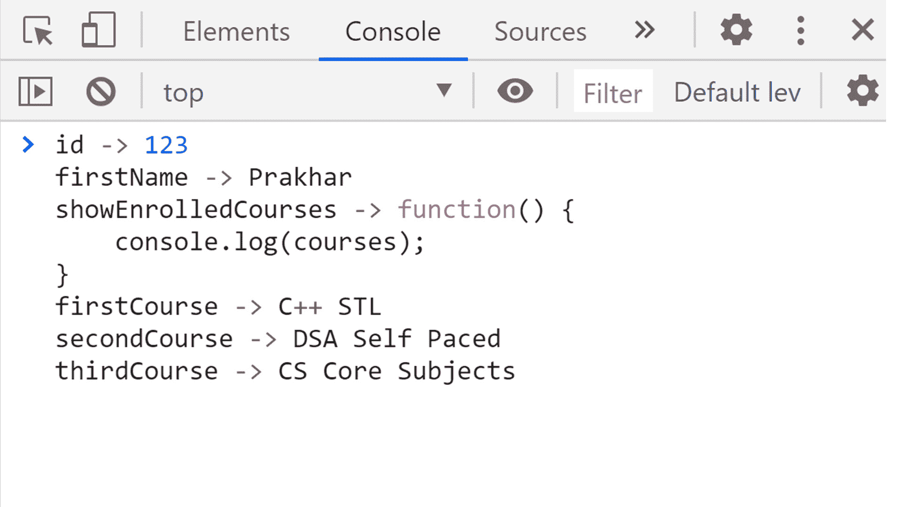
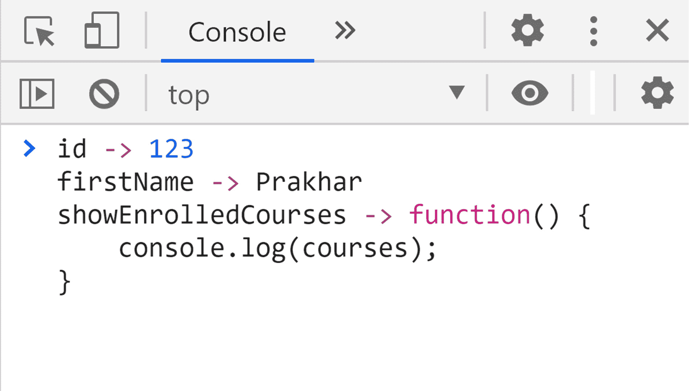

# 内循环的 JavaScript】

> 原文:[https://www.geeksforgeeks.org/javascript-for-in-loop/](https://www.geeksforgeeks.org/javascript-for-in-loop/)

JavaScript 中的 For-in 循环用于迭代对象的属性。如果我们想显示一个对象的内容，它可以是一个很好的调试工具。for-in 循环只迭代对象中那些可枚举属性设置为“true”的键。对象中的键值有四个属性(值、可写、可枚举、可配置)。当设置为“true”时，可枚举意味着我们可以迭代该属性。你可以在 JavaScript 中[对象的属性部分了解四个关键属性。阅读更多关于可枚举的内容](https://www.geeksforgeeks.org/objects-in-javascript/)[可枚举属性。](https://www.geeksforgeeks.org/what-does-enumerable-property-mean-in-javascript/)

**重要点:**

*   使用 *for-in* 循环迭代非数组对象。即使我们可以使用*进行-in* 循环进行数组，一般也不推荐使用。取而代之的是，使用*作为*循环来循环数组。
*   用*循环迭代的属性也包括在[原型链](https://www.geeksforgeeks.org/prototype-in-javascript/)中较高的对象的属性。*
*   迭代属性的顺序可能与对象中定义的属性不匹配。

**语法:**

```
for (let i in obj1) {

    // Prints all the keys in
    // obj1 on the console
    console.log(i);
}
```

**示例:**

```
<script>
    const courses = {

        // Declaring a courses object
        firstCourse: "C++ STL",
        secondCourse: "DSA Self Paced",
        thirdCourse: "CS Core Subjects"
    };

    // Creating a new empty object with
    // prototype set to courses object
    const student1 = Object.create(courses);

    // Defining student1 properties and methods
    student1.id = 123;
    student1.firstName = "Prakhar";
    student1.showEnrolledCourses = function () {
        console.log(courses);
    }

    // Iterating over all properties of
    // student1 object
    for (let prop in student1) {
        console.log(prop + " -> " 
            + student1[prop]);
    }
</script>
```

**控制台输出:**



*For-in* 循环迭代对象及其原型链的属性。
如果我们想只显示“student1”对象的属性，该对象只属于该对象，而不在原型链上，那么我们可以使用 [hasOwnProperty()方法](https://www.geeksforgeeks.org/javascript-hasownproperty-method/)执行“If”检查。

```
<script>

    // Iterating over only those properties
    // of student 1 object which is not on
    // its prototype chain
    for (let prop in student1) {
        if (student1.hasOwnProperty(prop)) {
            console.log(prop + " -> " 
                    + student1[prop]);
        }
    }

</script>
```

**控制台输出:**


对于带有 **hasOwnProperty** 检查的循环，迭代对象的属性。