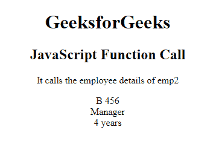

# JavaScript 函数调用

> 原文:[https://www.geeksforgeeks.org/javascript-function-call/](https://www.geeksforgeeks.org/javascript-function-call/)

**函数调用**是预定义的 javascript 方法，用于为不同的对象编写方法。它调用方法，将所有者对象作为参数。 [**这个**](https://www.geeksforgeeks.org/this-in-javascript/) 这个关键词是指该功能或其所属对象的“所有者”。javascript 中的所有函数都被认为是对象方法。如果一个函数不被认为是一个 JavaScript 对象的方法，那么这个函数就是全局对象。

**语法:**

```
call()
```

**返回值:**它调用并返回一个以所有者对象为参数的方法。

**示例 1:** 本示例描述了使用 call()方法调用员工作为参数。

## 超文本标记语言

```
<!DOCTYPE html>
<html>

<head>
    <title>JavaScript Function Call</title>
</head>

<body>
    <h1>GeeksforGeeks</h1>
    <h2>JavaScript Function Call</h2>
    <p> It calls the employee details of emp2 </p>

    <p id="GFG"></p>

    <!-- Script to use call() method and display
        the emp2 details -->
    <script>
    var employee = {
        details: function() {
            return this.name + " " + this.id;
        }
    }
    var emp1 = {
        name: "Geeks",
        id: "234412",
    }
    var emp2 = {
        name: "G4G",
        id: "434556",
    }
    var x = employee.details.call(emp2);
    document.getElementById("GFG").innerHTML = x;
    </script>
</body>

</html>
```

**输出:**


函数调用()方法

**示例 2:** 这个示例描述了带有参数的函数调用的使用。

## 超文本标记语言

```
<!DOCTYPE html>
<html>

<head>
    <title> The call() Method with Arguments </title>
</head>

<body>
    <h1>GeeksforGeeks</h1>
    <h2>JavaScript Function Call</h2>
    <p> It calls the employee details of emp2 </p>

    <p id="GFG"></p>

    <script>
    var employee = {
        details: function(designation, experience) {
            return this.name 
            + " " 
            + this.id + "<br>" 
            + designation 
            + "<br>" 
            + experience;
        }
    }
    var emp1 = {
        name: "A",
        id: "123",
    }
    var emp2 = {
        name: "B",
        id: "456",
    }
    var x = employee.details.call(emp2, "Manager", "4 years");
    document.getElementById("GFG").innerHTML = x;
    </script>
</body>

</html>
```

**输出:**



带参数的函数调用()方法

**支持的浏览器:**

*   谷歌 Chrome 1.0
*   Firefox 1.0
*   微软边缘 12.0
*   Internet Explorer 5.5
*   Opera 4.0
*   Safari 1.0